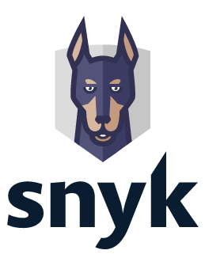

# Snyk User Documentation

* [Introducing Snyk](introducing-snyk/): read an [introduction to Snyk](introducing-snyk/introduction-to-snyk/) and explore [Snyk's core concepts](introducing-snyk/snyks-core-concepts/)
* [Getting started](getting-started/): learn how to [get started with a Snyk account](getting-started/getting-started-snyk-products/) and select a Snyk product.
* Snyk product docs: access information for:
  * [Snyk Open Source](products/snyk-open-source/)
  * [Snyk Code](products/snyk-code/)
  * [Snyk Container](products/snyk-container/)
  * [Snyk Infrastructure as Code](products/snyk-infrastructure-as-code/)
* [Snyk CLI](features/snyk-cli/): learn about the Snyk Command-Line interface 
* [Integrations](features/integrations/): information to integrate Snyk into your application development cycle


For details of Snyk data handling, see [How Snyk handles customer data](https://snyk.io/wp-content/uploads/Snyk-dataflows-How-Snyk-handles-customer-data.pdf).

