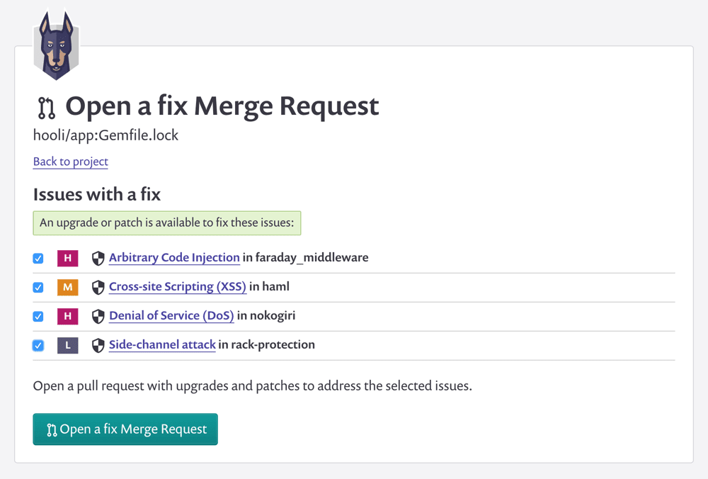
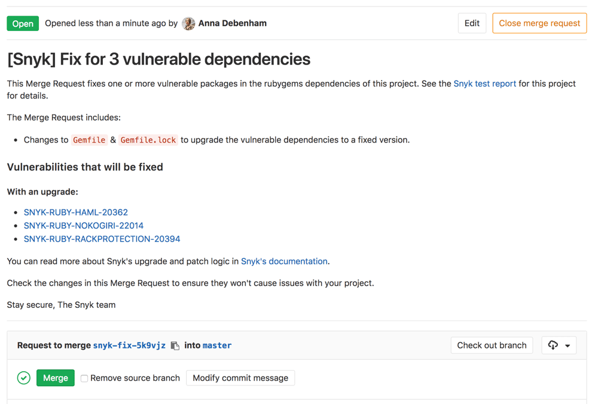

# GitLab integration

Snyk's GitLab integration supports GitLab versions 9.5 and above (API v4).

## Integration features

The integration allows you to:

1. See Snyk tests in your pull requests that check for vulnerabilities.
2. Get email alerts and a Snyk pull request with fixes when new vulnerabilities that affect your repo are disclosed.
3. Get email alerts and a Snyk pull request if a new upgrade or patch is available for a vulnerability that affects you.
4. Trigger a Snyk pull request with fixes yourself from the test report page or the project page for your repo on snyk.io.

## Set up GitLab integration

This integration only works with GitLab instances that are publicly reachable (not on a private network). A [Snyk Broker](https://docs.snyk.io/integrations/snyk-broker/set-up-snyk-broker) environment is required for private network instances.

**Steps:**

1. Generate a Personal Access Token in your GitLab. You’ll find this option in your user account settings area, in the **Access Tokens** section. Alternatively, a [Group Access Token](https://docs.gitlab.com/ee/user/group/settings/group\_access\_tokens.html) can be used to grant access to all projects within a GitLab group or subgroup, without contributing to GitLab's licensed user count.
2. Go to Snyk’s [integrations](https://app.snyk.io/integrations) page and click “Connect to GitLab”.
3. Add your account credentials and the token you just generated to the GitLab integration settings area in Snyk.

## Required permissions and roles

There are two ways to integrate Snyk with GitLab, either via our Broker or directly. Our Broker enables organizations to integrate from within their private network. This article describes the permissions needed for direct integration (when Broker is not implemented).

To integrate with GitLab, as a Snyk admin user or as a member of the organization:

### User with Personal Access Token

1. Generate a [personal access token](https://gitlab.com/-/profile/personal\_access\_tokens) enabling the **api** scope for access.
2. Ensure that the GitLab user that you've just generated the access token from, is either the **Owner** of the projects (repos) you'd like to monitor with Snyk or has **Maintainer** permissions to them.

### Group Access Token

1. Locate your group in GitLab, and select **Settings > Access Tokens**.
2. Enter a descriptive token name (such as 'Snyk token'), select the **Maintainer** role, and check the **api** scope.

**The 'api' scope with a Maintainer role enables:**

* Snyk to authenticate user accounts and to create webhooks, which are necessary for automating fix pull requests and Snyk test on your pull requests
* Continuous write access to enable the Snyk organization users to manually trigger the creation of fix pull requests
* Continuous read access enabling Snyk to monitor your projects and enabling you and the organization’s other members to manually re-trigger tests.

When the first user in a Snyk organization (a Snyk admin account user) sets up an integration with a GitLab personal access token or group access token, the token is authenticated with GitLab, enabling Snyk access to the repositories in that account. Thereafter, all users in that Snyk organization can add and work with any related projects, while the merge requests themselves will appear in GitLab as having been opened by the original GitLab user (the Snyk admin who set up the configuration)

## **Fix vulnerabilities with Snyk merge requests in GitLab**

When viewing a Snyk test report for a project that you own, or when looking at a project that you are watching with Snyk, you’ll see two options for fixing a vulnerability:

* **Open a fix Merge Request:** generate a Snyk merge request with the minimal changes needed to fix the vulnerabilities affecting the project.
* **Fix this vulnerability:** generate a Snyk merge request that fixes only this vulnerability.

You can review the vulnerabilities that will be fixed, change your selection, and choose to ignore any vulnerabilities that can’t be fixed right now before opening the merge request on the **Open a fix Merge Request** page.

When you open a merge request via snyk.io, we will give you a heads-up when this is the case.

Here’s an example for the merge request:

## Get a Snyk merge request for newly disclosed vulnerabilities that affect you

Whenever a vulnerability is disclosed that affects a project you’re watching, Snyk will not only email you about it but also generate a Snyk merge request that addresses the vulnerabilities. You’ll receive a merge request similar to the example above.

## Get a Snyk merge request when new upgrades or patches are available

When no upgrade is available, you can ignore or patch the vulnerability (patching is only available for Node.js projects). When a better fix option has become available, for example, an upgrade for a vulnerability you previously ignored, Snyk notifies you about this via email and also generates a merge request with the new fix.

## Disable the GitLab integration

> **WARNING:**
>
> Disabling a GitLab integration effectively removes all Snyk integrations, webhooks, as well as removal of the Snyk credentials and deactivation of the GitLab projects in the Snyk app.

The project will be set to inactive and you’ll no longer get alerts, pull requests or Snyk tests on your pull requests. Again, the webhook that enables the integration for this repo will be removed.

You can restart watching at any time; however, re-initiating GitLab projects for monitoring would require setting up the integration again.
