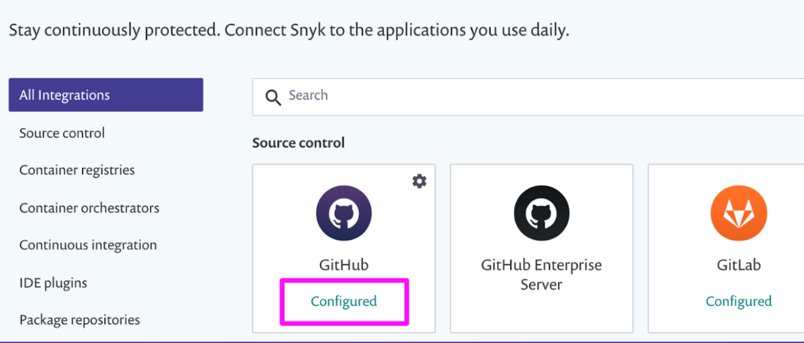
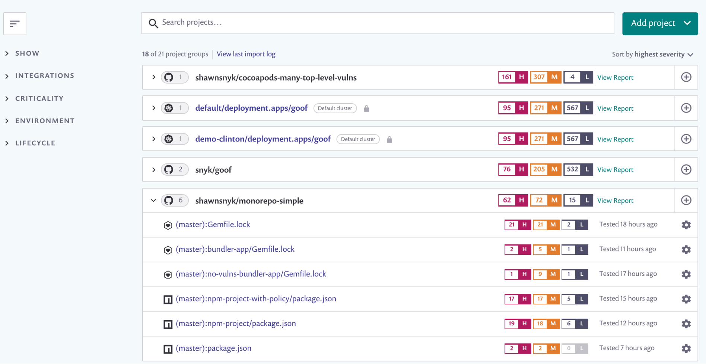
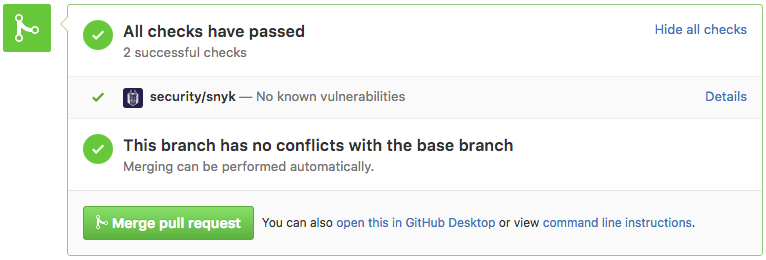
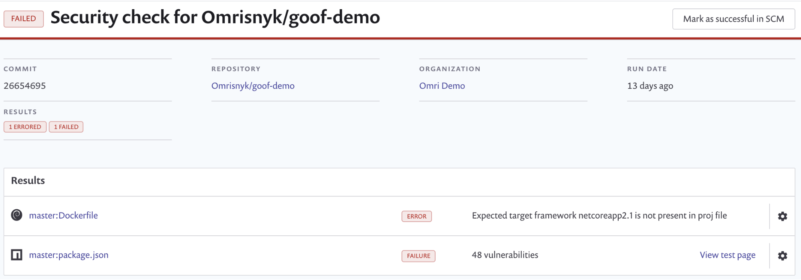
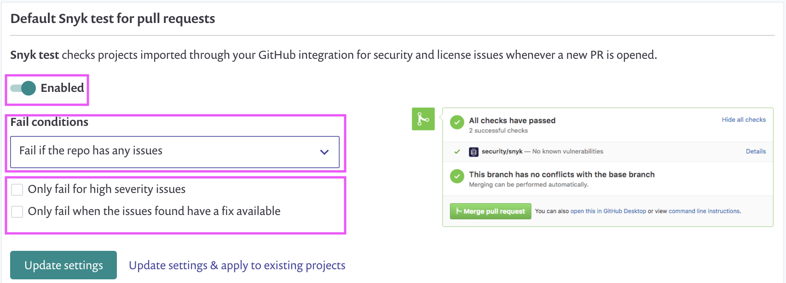
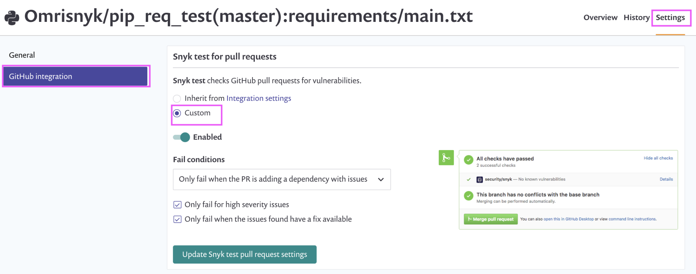
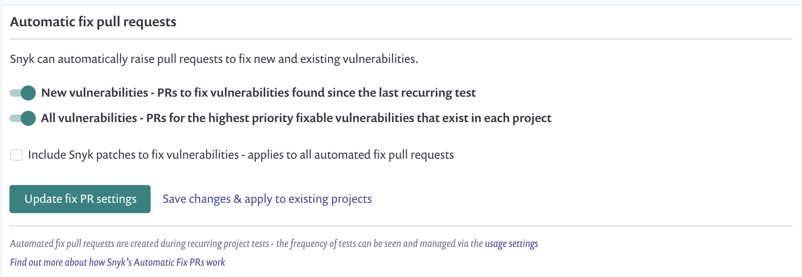
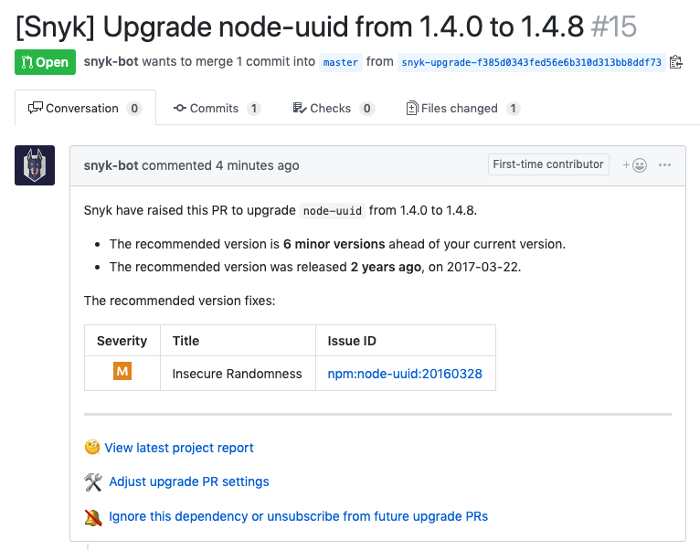

# Snyk SCM integration: good practices

You can integrate Snyk with your Source Control Manager (SCM) to quickly and easily gain visibility across all your projects.

[Snyk SCM integrations](snyk-scm-integration-good-practices.md) allow you to:

* Continuously perform security scanning across all integrated repositories
* Detect vulnerabilities in your open source components
* Provide automated fixes.

## Recommended deployment order

To ensure a smooth deployment by your team, follow the stages as outlined below for each integration.

If you try to implement all the SCM integration features at the same time, you risk causing friction in the [SDLC](https://snyk.io/learn/secure-sdlc/), which leads to a poor developer experience

| **Deployment Stages**                                                                                                                                                      | **Configurations**                                                                                                                                                                                                        | **Outcome**                                                                                             |
| -------------------------------------------------------------------------------------------------------------------------------------------------------------------------- | ------------------------------------------------------------------------------------------------------------------------------------------------------------------------------------------------------------------------- | ------------------------------------------------------------------------------------------------------- |
| 
<a href="snyk-scm-integration-good-practices.md">Stage 1</a>

Set up your SCM integration
                                                                      | See configuration documentation for each [SCM integration](./)                                                                                                                                                            | A configured integration, ready to import projects                                                      |
| 
<a href="snyk-scm-integration-good-practices.md">Stage 2</a>

Import all of the projects from your SCM.
                                                        | 
- Test both public and private repos

- Disable all user notifications

- Disable Snyk PR checks

- Disable Auto-fix PRs

- Disable Failing PR checks

- Disable Auto dependency upgrades
 | A complete Software Bill of Materials that enables you to assess risk across your applications.         |
| 
<a href="snyk-scm-integration-good-practices.md">Stage 3</a>

Developer and Security teams use Snyk prioritization reporting capabilities to build a fix plan.
 | Click [here](https://www.youtube.com/watch?v=\_kAY94JwQHY) to learn more about Snyk prioritization Reporting.                                                                                                             | Alignment between Developers and Security on what should be fixed and when streamlines the fix process. |
| 
<a href="snyk-scm-integration-good-practices.md">Stage 4</a>

Alert developers to issues in real-time, and educate them on available fixes.
                    | 
- Enable Snyk PR checks and fail PRs

if they contain High severity issues

with available fixes

- Enable Auto-fix PRs
                                                                             | Improve your organization’s mean-time-to-fix (MTTF).                                                    |
| 
<a href="snyk-scm-integration-good-practices.md">Stage 5</a>

Prevent developers from introducing any new vulnerabilities
                                      | 
- Enable Failing PR checks, for ANY

High severity issues (fix or no fix)
                                                                                                                                     | ‘Secure by Design’ methodology achieved.                                                                |
| 
<a href="snyk-scm-integration-good-practices.md">Stage 6</a>

Reduce technical security debt
                                                                   | - Enable Auto dependency upgrades                                                                                                                                                                                         | Reduce future design headaches, and hot fixes, which can be time-consuming to research & address.       |

## Stage 1: Set up your SCM Integration

Snyk has pre-built integrations for SCMs including GitHub, GitHub Enterprise, Bitbucket Cloud and others. See [GIT repository (SCM) integrations](https://support.snyk.io/hc/en-us/sections/360001138098-Git-repository-SCM-integrations) for a full list.

To check if an SCM is already configured for your Org, navigate to the **Integrations** tab. Configured SCMs are shown as **Configured**.


If your SCM is already configured, go to the next stage.


## Example: GitHub

Below is an example of how you would set up your integration for **Github.com**

1. Go to the **Integrations** tab, and click on **GitHub**.
2. Choose whether you'd like to give Snyk access to both public and private repositories or only to public repositories:
3. Click **Authorize snyk** to provide Snyk with access to your repositories:

 (2) (6) (1) (1) (1) (1) (1) (1) (1) (1) (1) (1) (1) (1) (1) (22).png>)

**SCM permissions on repositories**

Operations triggered using the Snyk UI (such as opening a Fix PR or retesting a project) are performed for the acting user. So to perform these operation, you must connect your own SCM user or service account. This gives Snyk the required permissions for the repositories for where you would like to perform these operations.

For example, in GitHub, the accounts connected to Snyk need the following access on the target repositories:

| **Action**                                              | **Why?**                                                                                                                                              | **Required permissions on the repository** |
| ------------------------------------------------------- | ----------------------------------------------------------------------------------------------------------------------------------------------------- | ------------------------------------------ |
| **Daily / weekly tests**                                | For reading manifest files in private repos                                                                                                           | _**Write**_ or above                       |
| **Snyk tests on pull requests**                         | For sending pull request status checks whenever a new PR is created / an existing PR is updated                                                       |                                            |
| **Opening fix and upgrade pull requests**               | For creating fix / upgrade PRs in the monitored repos                                                                                                 |                                            |
| **Snyk tests on pull requests - initial configuration** | For adding Snyk's webhooks to the imported repos, so Snyk will be informed whenever pull requests are created or updated and be able to trigger scans | _**Admin**_                                |

### **Change notification settings**

By default, Snyk emails every Org User when a new issue or fix in a project’s dependencies is found, and provides you with a weekly update of your security status across your organization. If you plan to import many projects to an Org, consider disabling all the notifications for that Org, to avoid too many email notifications sent to users.

To customize the emails your Org users receive, navigate to the Org’s settings  > **Notifications**. Any changes you make here here affect all of your organization’s members, although Org users can override these default settings in their user-level account settings.

To disable notifications for all the users in an Org ahead of your import, uncheck the appropriate notification boxes:

.png>)

See [Notification management](https://support.snyk.io/hc/en-us/articles/360004037657-Notification-management) for more details.

## Stage 2: Import Projects

1. Navigate to the **Projects** page in the Snyk UI, select **Add projects**, select the repos to import to Snyk, then click **Add selected repositories**.
2. Snyk starts scanning the selected repos for dependency files (for example, **package.json**) in the entire directory tree and imports these files as projects.
3. Snyk evaluates root folders and any custom file locations defined. If no manifest or configuration files are found, Snyk alerts you that no files can be imported.
4. Snyk detects the manifest files (projects), tests them, then displays the results. Imported projects appear underneath the repository name.

(Projects are continuously checked for vulnerabilities after being imported) 5. To see if a project was imported, navigate to the projects import page. Imported projects have a ✔ icon by the repo name.

## Stage 3: Enable Snyk test on PRs

**PR Test Settings & Workflows**

By default, Snyk scans every pull request submitted on your monitored repositories, showing the results and recommendations grouped together in a single security check and a single license check:

**Status details**

The following statuses can appear on your Snyk checks when you click the “Details” link:

* **Success**: no issues are identified and all checks pass
* **Processing**: this status appears until the Snyk test ends
* **Failure**: when issues are identified that must be fixed in order for the check to pass
* **Error**: an error occurs when your manifest file is out of sync, Snyk couldn't read the manifest file, or Snyk couldn't find the manifest file.

**Manage PR test settings**

Administrators can manage settings for Snyk PR tests at the organization level to apply it to all projects, or can select specific projects to apply the PR tests on. You can configure whether the feature is on (enabled by default), set fail conditions to define when Snyk should fail your PR checks.

To configure the PR test settings for your organization:

1. Navigate to **Org** > settings  **>** Integrations > Edit Settings.
2. Set the the toggle to **Enabled** and set the **Fail conditions** as needed:
3. Click **Update settings**.

To configure the pull request test settings for a specific project, navigate to **Projects Page**> **Projects Settings > Edit Settings** and set conditions similarly:


You can avoid Snyk failing PRs for licensing issues, using license policies. See [License policies](https://support.snyk.io/hc/en-us/sections/360002249578-License-Policies) for more details.


**Initial step: get visibility and set fail conditions**

At the start of rollout, we recommend that you begin with Snyk testing your PRs, but without failing them, so your developers get used to seeing the Snyk commit check.

1. Decide to apply this at the organization level, or for specific projects.
2. Set the conditions (as described above):
   * **Fail only** for **Only fail when the PR is adding a dependency with issues**.
   * Check both **Only Fail for high severity issues** and Only **fail when the issues found have a fix available**

## Stage 4: Enable Blocking PRs

After you’ve embedded Snyk into your SDLC, and have built good developer awareness, you can start to apply stricter policies to improve your overall security posture. For example:

* **Low priority projects**: you can fail the PR only for new high severity that are fixable.
* **Medium priority projects**: fail the PR only for high severity issues.
* **High priority projects (PCI/GDPR compliance)**: fail the PR for any issue.


To align vulns severity with your internal policy, use security policies to change severity of issues and attached them to relevant projects attributes. See [Security policies](https://docs.snyk.io/features/fixing-and-prioritizing-issues/security-policies) for more details.


## Stage 5: Automatic Fix PRs

Snyk scans your projects on either a daily or a weekly basis. When new vulnerabilities are found, Snyk notifies you by email and opens automated PRs with fixes to repositories.

Here is an example of a fix pull request opened by Snyk:

.png>)

To configure the PR test settings for specific projects, navigate to **Org** > settings  > **Integrations > Edit Settings**

We suggest you exclude patches from the auto fix PRs, if your developers are not familiar with how to use them and execute them.

You should ask your developers to consider the merge advice label that appears on the auto fix PRs:

 (2) (2) (1) (1) (1) (1) (1) (1) (1) (1) (1) (1) (1) (1) (25).png>)

 (2) (2) (4) (3) (1) (1) (1) (1) (1) (1) (1) (1) (1) (1) (1) (1) (15).png>)

 (2) (4) (2) (1) (1) (1) (1) (1) (1) (1) (1) (1) (1) (1) (1) (1) (21).png>)


Snyk auto fix PRs are only generated for new issues.


If your SCM is Github and you are not using Snyk Broker, then by default Snyk rotates every Org user's credentials to open the auto fix PRs. You can change this if needed, and set the user credentials to open the auto fix PRs. See [Opening fix and upgrade pull requests from a fixed GitHub account](https://docs.snyk.io/integrations/git-repository-scm-integrations/opening-fix-and-upgrade-pull-requests-from-a-fixed-github-account) for details.

## Stage 6 - Dependency Upgrade PRs

When your group is ready to start tackling security technical debt, you can configure Snyk to automatically create pull requests (PRs) on your behalf in order to upgrade your dependencies.

**How it works**

1. Integration is configured and users enable automatic upgrade PRs.
2. Snyk scans your projects as you import them and continues to monitor your projects, scanning on a regular basis.
3. For each scan, when Snyk identifies new versions for your dependencies:
   * Snyk creates automatic upgrade PRs (frequency based on Snyk project settings)
   * Snyk will not open a new upgrade PR for a dependency that is already changed (upgraded or patched) in another open Snyk PR.
   * Snyk opens separate PRs for each dependency.
   * Snyk will not create upgrade PRs for a repo that has 5 or more Snyk PRs open - if the limit of open PRs is reached, no new ones are created. This number can set to between 1-10 from the Settings. This limit only applies when creating upgrade PRs, but does count fix PRs. Fix PRs are not limited in this way.
   * By default, Snyk recommends only patch and minor upgrades, but major version upgrade can be enabled in the settings where the feature is enabled.
   * If the latest eligible version contains vulnerabilities not already found in your project, Snyk will not recommend an upgrade.
   * Snyk does not recommend upgrades to versions that are less than 21 days old. This is to avoid versions that introduce functional bugs and subsequently get unpublished, or versions that are released from a compromised account (where the account owner has lost control to someone with malicious intent).

**Supported languages and repos**

Snyk currently supports this feature for npm, Yarn and Maven-Central projects through GitHub, GitHub Enterprise Server and BitBucket Cloud, including use of the Snyk Broker. For use with the Broker, your admin should first upgrade to v4.55.0 or later.

**Enable automatic dependency upgrade PRs for a specific project**

To set PR Settings on the project level, overriding the PR settings on the organization level

1. Navigate to the organization for which you would like to enable automatic upgrade PRs
2. Click **Projects**.
3.  Navigate to the relevant project and click the **Settings** cog:

     (2) (3) (3) (3) (3) (4) (5) (5) (5) (5) (3) (1) (1) (1) (1) (1) (1) (1) (1) (1) (1) (1) (1) (1) (9).png>)
4. From the Settings area, click on the integration settings from the left panel menu to apply unique settings for that one project.
5. From settings that load, scroll to the **Automatic dependency upgrade pull requests** and click Disabled.
6. From the options that appear:
   1. Snyk creates PRs up to a maximum of 10 open simultaneously - per repo. To limit this number further, select the maximum number of PRs from the dropdown list. For more details, see [Upgrading dependencies with automatic PRs](https://docs.snyk.io/snyk-open-source/dependency-management/upgrading-dependencies-with-automatic-prs).
   2. In the Dependencies to ignore field, enter the exact name of any dependencies that should not be handled as part of the automatic functionality. This field accepts only lower case letters.
   3. Once you click ‘Upgrade dependency settings’ every time Snyk scans this project, it will automatically submit upgrade PRs based on results. If a newer version is released for an existing Snyk upgrade PR or for an existing fix PR, the existing PR must be closed or merged before Snyk can raise a new PR.

