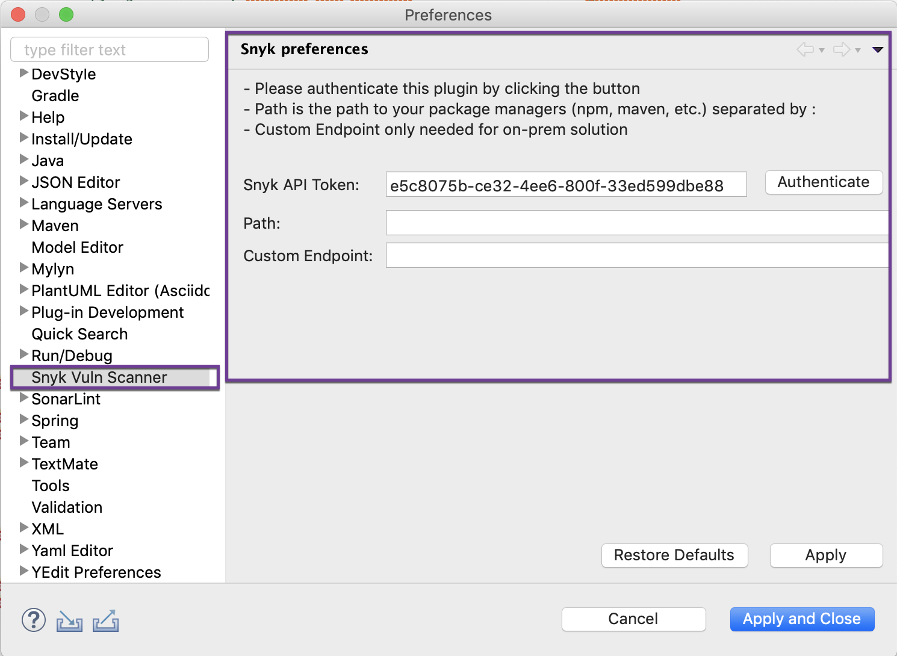

# Eclipse plugin

Install our **Snyk Vuln Scanner** in your Eclipse workflow to catch vulnerabilities and license issues directly from within your IDE (integrated development environment), before they are merged into your codebase.

Once installed and configured, every time you run the plugin, Snyk scans your project’s manifest files and:

* analyzes and delivers actionable vulnerability and license issue details
* records results per package
* displays results directly from the Eclipse UI

The Snyk plugin enables you to track and identify issues that risk your application’s security and avoid ever adding those issues to your shared repo.

## Supported languages and repos

Snyk supports all languages that are supported by both Eclipse and Snyk. Additionally, the Snyk plugin can also be implemented with our Broker and on-prem solutions.

## Installing the Eclipse Snyk plugin

1. Navigate to the Marketplace from within your running Eclipse instance.
2. Search for Snyk and click **Install**.&#x20;
3. When prompted accept the license agreement and the **Snyk Security** certificate to complete the installation.
4. Restart the Eclipse instance and navigate to **Eclipse Preferences** to ensure **Snyk Vuln Scanner** now appears in the list:&#x20;

## Use the Snyk plugin to secure your Eclipse projects

From the Snyk results click  whenever you are ready to scan your projects. It shouldn’t take too long for the results to appear—but no worries! You can continue to work as usual in the meantime anyway.

If for any reason you need to stop the scan before the build ends, click:  If you only want to scan a single project in your workspace, navigate to the Package Explorer panel, right-click the root of the project you want to test, and then choose **Snyk test**.

When the scan ends, results and any relevant error messages as well, are displayed from the **Snyk results**, grouped by project similar to the following:

Work with Snyk results from Eclipse as follows:

| **Column**         |                                                                                                                           | **Description**                                                                                                                                                                                                                                                                                                                                                                                                                                                                                                                                                                                                         |
| ------------------ | ------------------------------------------------------------------------------------------------------------------------- | ----------------------------------------------------------------------------------------------------------------------------------------------------------------------------------------------------------------------------------------------------------------------------------------------------------------------------------------------------------------------------------------------------------------------------------------------------------------------------------------------------------------------------------------------------------------------------------------------------------------------- |
| **Context menu**   | Right-click menu                                                                                                          | 
Options include:

Ignore issue—Hover over the specific issue that you want to ignore for the next 30 days and then access the context menu.

Snyk test—Run the Snyk test for the entire workspace.

Preferences—Access and update Snyk Vuln Scanner preferences directly from the right-click menu.
                                                                                                                                                                                                                                                                                               |
| **When collapsed** |                                                                                                                           |                                                                                                                                                                                                                                                                                                                                                                                                                                                                                                                                                                                                                         |
| **Title**          |                                                                                                                           | The name of the project.                                                                                                                                                                                                                                                                                                                                                                                                                                                                                                                                                                                                |
| **Dependency**     |                                                                                                                           | A summary of vulnerabilities and the number of affected paths found per project.                                                                                                                                                                                                                                                                                                                                                                                                                                                                                                                                        |
| **When expanded**  |                                                                                                                           |                                                                                                                                                                                                                                                                                                                                                                                                                                                                                                                                                                                                                         |
| **Title**          |                                                                                                                           | The full name of the vulnerability affecting your project, linked to a description and complete details of the vulnerability in our database, to assist you in resolving the issue.                                                                                                                                                                                                                                                                                                                                                                                                                                     |
| **Dependency**     |                                                                                                                           | The name of the direct dependency package in your project (the package you explicitly installed) that is affected by the vulnerability, either directly or indirectly.                                                                                                                                                                                                                                                                                                                                                                                                                                                  |
|                    |                                                                                                                           | 
All details appear on a single row and the Dependency (the name of the package explicitly used in the code) and Package (the name of the package that actually contains the vulnerability) columns both display the name of the same package:

                                                                                                                                                                                                                                                      |
|                    | 
<strong>When your project is affected by an indirect vulnerability:</strong>

<strong>Collapsed mode</strong>
 | 
An arrow appears on the row, grouping together all relevant details, similar to the following examples:

For example:

Package X uses Package Y, which in turn uses Package Z.

Package Z contains a Cross-Site Scripting (XSS) vulnerability, indirectly affecting your project.

The Dependency (the name of the package explicitly used in the code) is Package X; the Package field displays Package Z (the name of the package that actually contains the vulnerability).
 |
|                    | **Expanded mode**                                                                                                         | 
Click the arrow on the row to expand and view the full path from the direct dependency to the actual vulnerable package.

In the example above, the full path would appear as:

[Name of Package X]-->[Name of Package Y]-->[Name of Package Z]
                                                                                                                                                                                                                                          |
| **Package**        |                                                                                                                           | 
The name of the package in your project that is directly affected by the vulnerability.

In the example above:
<ul><li>the Dependency is indicated as Package X—this is the package the developer explicitly uses in the code</li><li>the Package field displays Package Z, which is the package that actually contains the vulnerability.</li></ul>                                                                                                                                                                                                                                                         |
| **Fix**            |                                                                                                                           | The name of the package, if such exists, and the version that it can be upgraded to in order to resolve the issue.                                                                                                                                                                                                                                                                                                                                                                                                                                                                                                      |
