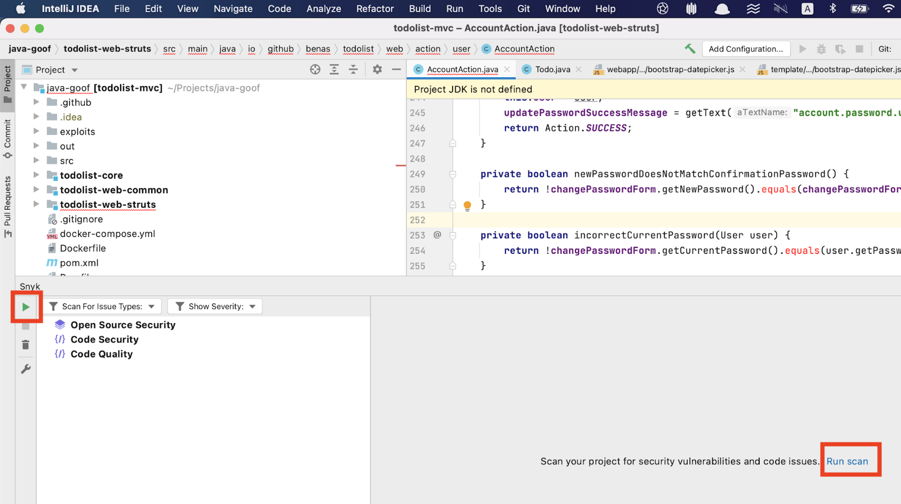
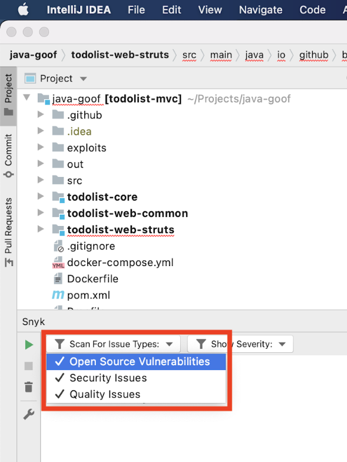

# JetBrains plugins

Snyk has a plugin for Jetbrains IDEs, which support all Snyk products: [Snyk Open Source](https://docs.snyk.io/snyk-open-source), [Snyk Code](https://docs.snyk.io/snyk-code), [Snyk Container](https://docs.snyk.io/products/snyk-container) and [Snyk Infrastructure as Code](https://docs.snyk.io/products/snyk-infrastructure-as-code). Snyk’s JetBrains plugin touches on all aspects of securing your application including:

* Security vulnerabilities in open source dependencies (Snyk Open Source).
* Security vulnerabilities and code quality issues in first party code (Snyk Code).
* Configuration issues in your infrastructure as code such as Terraform, AWS CloudFormation, Kubernetes, and Azure Resource Manager (ARM) (Snyk IaC)
* Security vulnerabilities in your container images found in Kubernetes workload files (Snyk Container)


Snyk's JetBrains plugin is available for install on the marketplace: [https://plugins.jetbrains.com/plugin/10972-snyk-vulnerability-scanner](https://plugins.jetbrains.com/plugin/10972-snyk-vulnerability-scanner).


## Supported JetBrains IDEs


JetBrains plugin versions: we support plugin versions from version 2020.2 on.


* Android Studio
* AppCode
* GoLand
* IntelliJ
* PhpStorm
* PyCharm
* Rider
* RubyMine
* WebStorm

## **How the plugin works**

* The plugin is based on Snyk CLI (but not only). The plugin supports all product features that are coming from the CLI for Snyk Open Source, Snyk IaC and Snyk Container.
* The plugin will automatically download the CLI in the background (will ask you to [authenticate](jetbrains-plugins.md#authentication)).
* We support all the [languages supported by Snyk Code](https://docs.snyk.io/products/snyk-code/snyk-code-language-and-framework-support#language-support-with-snyk-code-ai-engine) today. You can install the plugin on any of the IDEs (such as RubyMine) and with the plugin we would analyze all the language files we find.
* If the CLI is already installed on the machine, the plugin will use the token provided to it, otherwise, you’ll need to provide the authentication token via the plugin authentication mechanism.

## **Install the plugin**

The installation is done via the IDE plugins catalog/library:

1. Open the **Preferences** window from the IDE.
2. Navigate to the **Plugins** tab.
3. In the **Plugins** tab, search for **Snyk**.
4. Select the **Snyk Vulnerability Scanning** plugin.
5. Click on the **Install** button.
6. Once installed, restart the IDE.

 (1) (1) (1).png>)

## Configuration

### Environment

To analyze projects, the plugin uses the Snyk CLI which needs some environment variables. The following variables are needed or helpful, dependent on the type of project you analyse:

* `PATH`: the path to needed binaries, (for example, to maven).
* `JAVA_HOME`: the path to the JDK to use to analyze Java dependencies

Setting these variables only in a shell environment (for example, using `~/.bashrc`) is not sufficient, if you do not start the Jetbrains IDE from the command line or create a script file that starts it using a shell environment.

* On **Windows**, you can set the variables, using the GUI or on the command line using the `setx` tool.
* On **macOS**, the process `launchd` needs to know the environment variables if you want to launch the IDE from Finder directly. Set environment variables for applications launched via Finder using the `launchctl setenv` command (for example, on start-up or via a script you launch at user login).\
  **Note:** The provision of environment variables to the macOS UI can change between operating system releases, so it can be easier to create a small shell script that launches the IDE to leverage the shell environment, that can be defined via `~/.bashrc`.
* On **Linux**, updating the file `/etc/environment` can be used to propagate the environment variables to the windows manager and UI.

### Proxy

If you need to use a proxy server to connect to the internet, configure it using the [Jetbrains IDE settings](https://www.jetbrains.com/help/idea/settings-http-proxy.html). The Snyk plugin will use them.

## Authentication

The first time it is needed, the plugin automatically downloads the CLI in the background. There are a few ways to authenticate once the plugin is installed:

* After the plugin installs, you are prompted to authenticate and connect the IDE plugin to Snyk.

* Click **Test code note**. The plugin relies on the Snyk CLI, which authenticates you against Snyk’s web application.
* Click **Authenticate** when prompted by Snyk.

* After authentication you will see a confirmation message for the successful authentication

* The IDE will read and save the authentication on your local machine.
* You can now close the browser window and return to the IDE.
* The analysis should have started automatically:

### Add token manually

1. Produce token here [https://app.snyk.io/account](https://app.snyk.io/account)
2. **\[JetBrains IDE] >> Preferences >> Tools >> Snyk**
3. Paste or enter the token under **Connect IDE to Snyk**
4. Click **Apply or OK**

### Manually authenticating

Now, sometimes bad things happen and we can't authenticate. When that happens, run `snyk auth` from the command line and you should get the very same authentication screen as above.

## Run an analysis


Make sure your project file (for example, requirements.txt) is saved before running an analysis.


To trigger an analysis during your daily coding workflow, click either the run (play) button, or **Run scan**.

## Analysis results: Snyk Open Source

Snyk Open Source analysis shows a list of vulnerabilities and license issues found in the manifest file. For more detailed information, you can select a vulnerability/license issue.

## Analysis results: Snyk Code

Snyk Code analysis shows a list of security vulnerabilities and code issues found in your application code. For more details and examples fixes on how others fixed the issue, you just need to select the security vulnerability or the code security issue:

## Analysis results: Snyk Configuration

Snyk Configuration analysis results shows issues in your Terraform, Kubernetes, AWS CloudFormation, and Azure Resource Manager (ARM) code with every scan. Based on Snyk’s CLI, the scan is fast and friendly for local development.

For quickly understanding and fixing the underlying issue Snyk’s plugin tells you:

* **Description:** what the misconfiguration is.
* **Impact:** how the misconfiguration could potentially be exploited.
* **Path:** which path in the tree the issue occurs.
* **Remediation:** how to fix the issue.
* **References:** where you can investigate deeper from a variety of sources.
* **Ignore:** If the issue needs to be ignored, you got you covered as well- there is a button to do so in the top right corner.

## Analysis results: Snyk Container

The plugin scans Kubernetes configuration files and searches for container images. Vulnerabilities are found fast using the extracted container images and comparative analysis against the latest information from the [Snyk Intel Vulnerability Database](https://security.snyk.io).

You have the ability to go over each of the security vulnerabilities your image might be vulnerable to, and in the same manner like our Open Source findings.

The colorful comparison table (from above) with various severity levels (critical, high, etc.) provides the difference in vulnerabilities between the current image and the recommended by Snyk image with the same characteristics sorted by severtiy. This helps you to make a decision if you want to upgrade your image to the recommended one and increase the level of confidence in the image you are running in production.

## How Snyk Container / Kubernetes integration works?

* The plugin scans your Kubernetes workload files and collects the images used. To troubleshoot whether a plugin is correctly scanning a container image, you can verify:
  * if the image definition is in the Kubernetes YAML file in the project. Make sure you have the image specified with a YAML value to the YAML image key.
  * if the container image has been successfully built locally and/or pushed to a container registry. It is also a good practice to do this before referring to the container image in the Kubernetes YAML file.
  * If you, however, encounter an error, [let us know](https://docs.snyk.io/features/integrations/ide-tools/jetbrains-plugins#support-contact) so we can look into it.
* For each image we've found, we perform a test with our CLI.
  * Click [here](https://docs.snyk.io/products/snyk-container/snyk-cli-for-container-security#testing-an-image) if you want to learn more about how Snyk Container performs a test on the image.
  * During testing the image the CLI will download the image if it is not already available locally in your Docker daemon.
* We will be expanding the scope of Container scanning, so if there are more files (like Dockerfiles) or workflows that you want to be supported, submit a feature request [here](https://support.snyk.io/hc/en-us/requests/new).

## Filter results

### Filter by severity

Snyk delivers Critical, High, Medium and Low severities. You can filter for the severity you need by selecting the value from the dropdown as shown below. By default all levels are selected. You must select at least one.

### Filter by issue type

Snyk delivers the following types of issues:

* **Open Source Vulnerabilities**: found in open source dependencies.
* **Security Vulnerabilities**: found in your application’s source code.
* **Quality Issues**: found in your application’s source code.
* **Configuration Issues**: found in infrastructure as code files.
* **Container Vulnerabilities**: found in images sourced from Kubernetes workload files.

You can filter for each one of them by selecting the value from the dropdown as shown below. By default all three issue types are selected.

## Plugin configuration

After the plugin is installed, you can set the following configurations for the plugin, using **Preferences → Tools → Snyk**:

* **Token**: the token that should be used for authentication with Snyk (can be generated via the Account Settings in Snyk App)
* **Custom endpoint**: custom endpoint for Snyk app, if needed.
* **Ignore unknown CA**: for ignoring the SSL cert, if needed.
* **Organization**: the org to run Snyk test against (similarly to the --org param in the CLI).
* **Additional parameters**: additional CLI snyk test params, you’d like to run the test with.
* **Snyk Open Source vulnerabilities**: analyze the project for open source vulnerabilities through the CLI using the Snyk Open Source. Enabled by default.
* **Snyk Infrastructure as Code issues**: analyze the project for insecure configurations in Terraform and Kubernetes code. Enabled by default.
* **Snyk Container vulnerabilities**: analyze the project for container vulnerabilities in container images and Kubernetes applications. Enabled by default.
* **Snyk Code Security issues**: analyze the project for security vulnerabilities in your application code using Snyk Code. Enabled by default.
* **Snyk Code Quality issues**: analyze the project for quality issues in your application code using Snyk Code. Disabled by default.

### Support / Contact


Need more help? [Contact our Support team](https://support.snyk.io/hc/en-us/requests/new).


#### Share your experience

We continuously strive to improve our plugins experience. Would you like to share with us your feedback about Snyk's JetBrains Plugin: [schedule a meeting](https://calendly.com/snyk-georgi/45min?month=2022-01).
