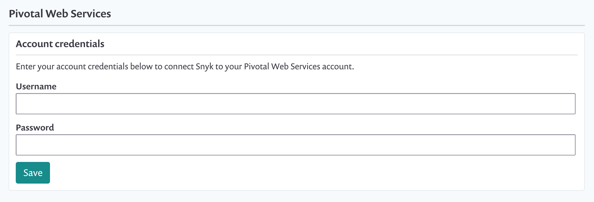

# Pivotal integration overview

Snyk’s Pivotal Web Services integration lets you monitor the deployed code of your Java, Node.js and Ruby Pivotal Web Services applications for any known vulnerabilities found in the application’s dependencies, testing at a frequency you control.

For each test, Snyk will communicate directly with Pivotal Web Services to determine exactly what code is currently deployed and what dependencies are being used. Each dependency will in turn be tested against Snyk’s vulnerability database to see if it contains any known vulnerabilities.

If vulnerabilities are found, you will be alerted (via email or Slack) so that you can take immediate action.

In order to turn on the Pivotal Web Services integration you’ll need to:

1. Connect to Pivotal Web Services from the integrations page
2. Select the projects you want to monitor and click “Add to Snyk”

## **Connect Snyk to Pivotal Web Services**

In order for Snyk to be able to monitor your deployed Pivotal Web Services applications, you’ll first need to connect Snyk to your Pivotal Web Services account. You can do this by navigating to the [Integrations page](https://app.snyk.io/integrations) and clicking on “Connect to Pivotal Web Services”.

 (2) (2) (2) (5) (7) (2) (1) (1) (1) (1) (1) (1) (1) (1) (1) (1) (1) (1) (1) (1) (1) (1) (1) (1) (1) (1) (1) (1) (1) (1) (1) (1) (23).png>)

This will take you to a page where you’ll be prompted to enter your Pivotal Web Services username and password. We recommend setting up a dedicated user for your Snyk organization.

## **Pivotal Web Services: check your connection status**

At any time after you’ve entered your Pivotal Web Services credentials, you can check on the connection status in one of two places.

The first is on your integration settings page, where you’ll see your current integrations listed as well as their connection status.

 (3) (3) (3) (3) (3) (3) (3) (3) (3) (2) (1) (1) (1) (1) (1) (1) (1) (1) (1) (1) (1) (1) (1) (15) (1) (1) (1) (1) (1) (1) (1) (1) (1) (1) (1) (14).png>)

The connection status is also displayed directly on the Pivotal Web Services integration settings page (found by clicking “Edit settings” on the integration settings page shown above). If you’ve entered credentials, you’ll see a box indicating whether or not Snyk is able to correctly connect to Pivotal Web Services.

If you are unable to connect, re-enter your account credentials to verify that they are correct.

## **Add Pivotal Web Services apps to Snyk**

Once you’ve successfully connected Snyk to your Pivotal Web Services account, you’ll be able to select Pivotal Web Services apps that you would like Snyk to monitor. You can do this either using the “Add projects” button on the integrations page, or directly from the Pivotal Web Services integration settings page.

In either case, you’ll see a list of any available projects on the Pivotal Web Services account you connected. Select the ones you want to monitor and click the “add to Snyk” button.

 (1) (3) (3) (3) (3) (3) (3) (3) (3) (3) (3) (2) (1) (1) (1) (1) (1) (1) (1) (1) (1) (1) (1) (1) (1) (1) (1) (1) (1) (1) (1) (1) (1) (1) (1) (1) (8).png>)

As soon as you’ve added the projects to Snyk, Snyk will test them and begin to display a list of all monitored Pivotal Web Services applications in your [project dashbard](https://app.snyk.io/projects). You’ll also see a snapshot of any current vulnerabilities, and be able to click through for a more detailed report including any steps to fix.

Snyk will now continuously monitor each of those projects for known vulnerabilities. You can add more projects at any time.

## **Disable the Pivotal Web Services integration**

If you decide to disable this integration for any reason, you can accomplish this from the Integrations page in your Settings.

You need to find the specific integration you wish to deactivate in your list of integrations and click Edit settings. You are taken to a page that shows the current status of your integration, a place to update your credentials, specific to each integration (credentials, API key, Service Principal, or connection details), and a red box at the bottom to disconnect this integration, like in the example seen below:

 (1) (1) (1) (1) (1) (1) (1) (1) (1) (1) (1) (1) (1) (1) (1) (1) (1) (1) (1) (1) (1) (1) (1) (41).png>)

If you choose to disconnect, your credentials will be removed from Snyk and any integration-specific projects we had been monitoring will be deactivated on Snyk.

If you choose to re-enable this integration at any time, you need to re-enter your credentials and activate your projects.

## **Add a Snyk-specific user to Pivotal Web Services**

We suggest adding a dedicated user to Pivotal Web Services for your Snyk org. That way if at some point you need to revoke access for any reason, you can do so without impacting anyone within your org.

The minimum permissions needed in order to integrate with Snyk is the space role of SpaceAuditor.

You can create a new user with these permissions from the Cloud Foundry command line using the following commands:

`cf create-user snyk pa55w0rd`

`cf set-space-role snyk my-example-org development SpaceAuditor`

You can learn more about how to add another user to your application via the command line on the [Cloud Foundry documentation](https://docs.cloudfoundry.org/adminguide/cli-user-management.html).

Alternatively, you can add a Snyk-specific user via the [Pivotal console](https://console.run.pivotal.io).
