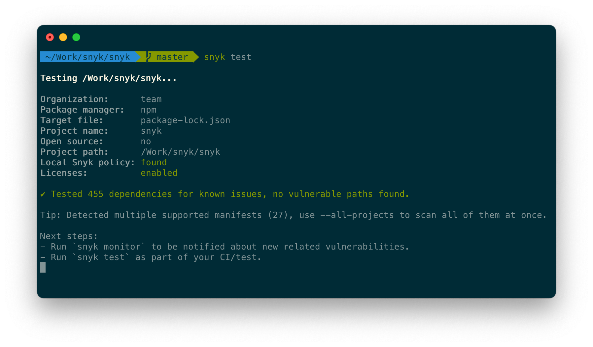

# Snyk CLI

[Snyk](https://snyk.io) scans and monitors software development projects for security vulnerabilities. Snyk CLI brings functionality of Snyk into the development workflow. You can run the CLI locally, or in your CI/CD pipeline, to scan development projects for security vulnerabilities and license issues.

Snyk supports many languages and tools, including Java, .NET, JavaScript, Python, Golang, PHP, C/C++, Ruby, Scala and more. See [Language and Package Manager support](../../products/snyk-open-source/language-and-package-manager-support/). CLI also supports [Snyk Container scanning](../../products/snyk-container/snyk-cli-for-container-security/) and [Infrastructure as Code scanning](../../products/snyk-infrastructure-as-code/snyk-cli-for-infrastructure-as-code/).

The following is an example of Snyk CLI command test output. A code block with the text follows.



```
~/Work/Work/Snyk master snyk test
Testing /Work/snyk/snyk...
Organization: team
Package manager: npm
Target file: package-lock.json
Project name: snyk
Open source: no
Project path: /Work/snyk/snyk
Local Snyk policy: found
Licenses: enabled
checkmark symbol Tested 455 dependencies for known issues, no vulnerable paths found.
Tip: Detected multiple supported manifests (27), use --all-proiects to scan all of them at once.
Next steps:
- Run "snyk monitor' to be notified about new related vulnerabilities
- Run "snyk test as part of vour CI/test.
```

