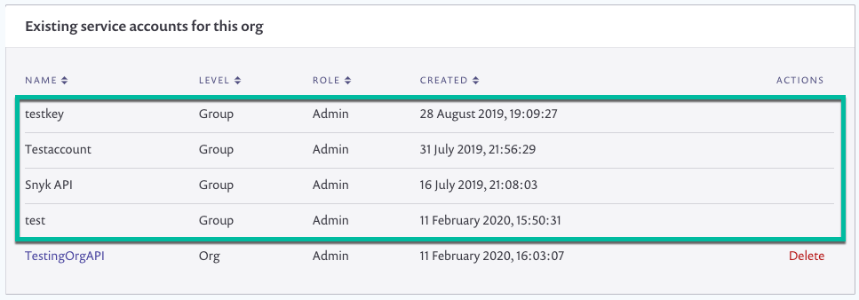
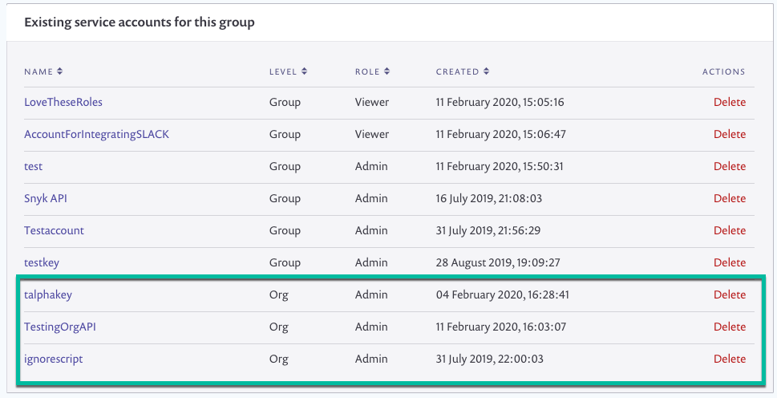

# Service accounts


**Feature availability**\
This feature is available with Enterprise plans. See [pricing plans](https://snyk.io/plans/) for more details.


### Introduction

You can set up a **service account**, to be used for continuous integration (CI) and other automation purposes, without using an actual Snyk user’s token.

Service accounts are a special type of system user that has only an API token associated with it, substituting for standard user credentials. Use this token to provide credentials for accessing your Snyk account when setting up integration with your development tools, and when working with our [CLI](../../../snyk-cli/) and [API](../../snyk-api-info/).

You can generate single or multiple tokens on the Organization or Group levels to manage your integrations. Use Group-level tokens to access group API endpoints, organization API endpoints, and the CLI, for all organizations in the Group.


Each service account has a unique name to make it easier to recognize. This name cannot be re-used.


#### Using service accounts

By using a service account token, you can:

* Create multiple tokens for different uses or integrations, to manage each separately.
* Ensure seamless integrations, for example when employees change roles or close their Snyk accounts.


Roles are only for service accounts on the Group level, and are only for paid accounts.



Service accounts can be used for GitHub Enterprise integrations. If your team needs to set up a service account in GitHub, it will need to be set up as a GitHub Enterprise integration. GHE is only available through Snyk Enterprise accounts.


### Set up a service account

Generate single or multiple tokens on the organization or group levels to manage your integrations.

#### Prerequisites

To create a group service account you must be a group admin. To create an org service account you must be an org admin or a group admin.

This process describes all options.

#### How to set up a service account

* Log in to your account and navigate to the relevant group and organization that you want to manage.
* Click on settings  > **Service accounts** to view existing service accounts and their details.
* Click **Create a service account** to create a new one. The screen that loads varies a little, depending on if you chose a group  or an organization:

While creating a Group Service Account, you can choose a Group level role. Whereas, while creating an Organisation Service Account, you can choose Org level roles including custom roles that you have set up for your organisations.

* From the **Service Account** name field, enter a unique name for this token. Remember this name can be used only once for tokens in the same area, either per organization or per group.

*   From the **Role** dropdown list, select an appropriate role.\
    For the Group Service Accounts, choose from the below list of roles to configure the scope of the token:

    * Group Viewer enables read-only access.
    * Group Admin enables full administrator access.
    * Group Member associates a service account to a group but does not grant any specific access. We recommend selecting Viewer or Admin.

    For the Organisation Service Accounts, choose from the standard roles Org Admin or Org Collaborator or a custom role if you have set up any. See [managing-permissions.md](../managing-users-and-permissions/managing-permissions.md "mention") to find out the scope of Org Admin and Org Collaborator roles.
*   Click **Create**. The token is generated and displayed from the same area, similar to the following:

    Make sure you copy this token as you won’t see it again. You can click **Close and Hide** once you've copied the token; either way, when you navigate away from this page it will no longer be accessible. This is a security standard to keep your tokens safe. The new token is also added to your **Existing service accounts** list, similar to the following image:

 (3) (3) (1) (1) (1) (1) (1) (1) (1) (1) (1) (1) (1) (1) (1) (1) (1) (1) (1) (1) (1) (1) (1) (1) (1) (1) (1) (1) (1) (1) (1) (13).png>)

* Furthermore, if you created the token for the entire group with an **Group Admin** role, the token also appears in the **Existing service accounts** list for each of its organizations, though it can only be edited from the **Group** level.

* If you created the token from an organization that is part of a group, the token now also appears in the **Existing service account** list on the group level, where the group admin can also change the token name or even delete it.

* Click any of the links to update the names for a service account token - for Group-level tokens, from the Group level only; for Organization-level tokens, from the relevant organization and also from the Group level:

* Repeat these steps to create multiple tokens for the same or any other organization or group.

### Edit and delete a service account

Administrators can change token names and delete tokens. When you delete a service account, the API token associated with it becomes immediately invalidated. When an account is managed with groups, the organization and the group admins can delete tokens for the organization; only group admins can view and manage tokens on the group level. Deleting a service account is the same as revoking the API token.

#### How to edit and delete a service account

*   Log in to your account and navigate to the relevant group and organization that you want to manage.

    For group tokens, navigate to the group level. For organization tokens, group admins can delete from either the group or the relevant organization; organization admins should navigate to the relevant organization.
* Click on settings  > **Service accounts**.
* Scroll to find the list of existing service accounts:

 (3) (3) (1) (1) (1) (1) (1) (1) (1) (1) (1) (1) (1) (1) (1) (1) (1) (1) (1) (1) (1) (1) (1) (1) (1) (1) (1) (1) (1) (1) (1) (14).png>)

* From the list of existing tokens:
  * Click **Delete** to delete a token and invalidate it immediately. When prompted, click **OK**. Remember that you cannot re-generate the same token!
  * Click the token name to navigate to change the token name and click **Save**.
