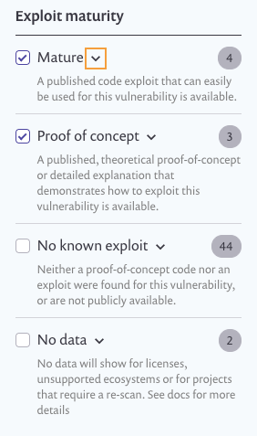
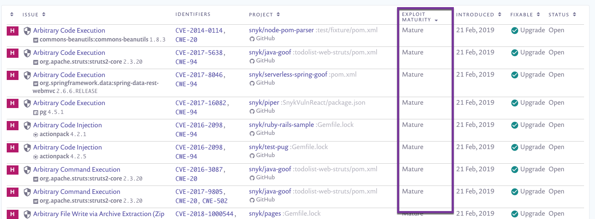

# Evaluating and prioritizing vulnerabilities

**Prioritize and remediate by exploit maturity**

You can filter detected vulnerabilities in your projects according to exploit maturity to see whether a specific vulnerability has an exploit in the wild and if so, how mature that exploit is.

In this way, you can prioritize and attend to the most important and risky vulnerabilities first.

The filter appears as follows:

These values are available:

* **Mature:** Snyk has a published code exploit for this vulnerability.
* **Proof of concept:** Snyk has a proof-of-concept or detailed explanation of how to exploit this vulnerability.
* **No known exploit:** Snyk did not find a proof-of-concept or a published exploit for this vulnerability.
* **No data**: this value indicates one of the following:
  * The issue is not a vulnerability \(but rather, a license issue\);
  * The Linux distro is not currently supported by Snyk \(only Alpine, Debian, and Ubuntu are supported\); or
  * The project was imported prior to the release of this feature. Re-import the project in order to scan for this data.

The **Exploit maturity** filter is available from any detailed **Projects** page, from our **Reports,** and from our **Vulnerabilities DB**. Furthermore, an API is now available.

**Proof of Concept vulnerability patches cannot be disabled** and will appear in fix PRs where they are found.

**Prerequisites:** Projects imported prior to the implementation of his feature cannot be evaluated for exploit maturity. Reimport the project in order to scan for this data.

**Steps:**

1. Log in to Snyk.
2. Go to the detailed **Projects** page for any of your projects

   

3. Work with and remediate vulnerabilities from the **Issues** tab of the **Reports** area as well: 
   1. Filter reports by exploit maturity:

      

   2. View exploit maturity data from the **Issues** list in **Grouped** mode:

      

   3. View exploit maturity data from the **Issues** list in **Ungrouped** mode:

      

