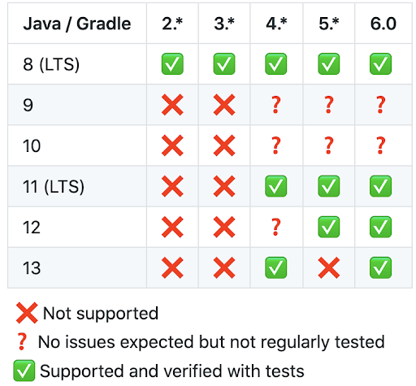

# Reachable vulnerabilities

## Introduction

The first step of scanning apps for open source vulnerabilities is to identify the packages used by the app.

The next step is to see which of the identified packages contains a vulnerability, whether or not if the vulnerability affects the apps’ code. This can easily lead to thousands of vulnerabilities when you look at the organization level, so you need to identify where to start.

Many vulnerabilities may not affect your code, as you may not use the vulnerable part of the package:

* A **reachable** vulnerability has a path from the code to the vulnerable function.
* A **not reachable** vulnerability does not have this path. 

By looking deeper into how the app is using the open-source dependencies, and how the open-source dependencies interact with each other, we can add the needed context around the found vulnerabilities. This reachability helps you decide how to prioritize which vulnerabilities to fix.

### How it works

To provide as accurate results as possible, we use multiple algorithms to build a call graph from your app to the open-source dependencies you use. After we have that call graph, we can identify which vulnerabilities have a path leading from the app’s code down to the vulnerable function or package.

We split the results into he following areas:

1. **Reachable** - A clear path from the code to vulnerable functions was found. Fixing those vulnerabilities first is recommended.
2. **Potentially reachable** - Indication that the vulnerability might be reachable was found. Further review is recommended.
3. **No path found** - Direct calls from the code to vulnerable functions could not be found.

### Supported languages and prerequisites

Reachable Vulnerabilities analysis is available for Java \(Maven and Gradle\) apps using Snyk CLI. In addition, Java Maven GitHub projects are supported, using Snyk UI.

#### Java support

* Java 8 to 13.
* Maven 3.6.\*
* Gradle \(see matrix below\)

### How to use it

To perform Reachable Vulnerabilities analysis, you can:

* Test your apps for reachability issues on repositories imported to Snyk from Git, using our Git integrations. Reachability is conducted as a part of the checks performed by Snyk \(currently, GitHub is supported\).  _**NOTE**: Using this method clones your repository to Snyk, to run the analysis. The repo will be deleted from our servers after the analysis is complete._
* Analyze your code for reachability issues using Snyk CLI. To run it using Snyk CLI, you must have the app already built \(compiled\), and the bytecode of the app should be available.

### Scanning for Reachable Vulnerabilities using Snyk CLI

1. Ensure you are using the latest version of the [CLI](https://www.npmjs.com/package/snyk).
2. Navigate into the folder of your app, where the relevant manifest files reside \(alternatively use the **--file** parameter to point to the right path\).
3. Run **snyk --reachable**_._

### Scanning for Reachable Vulnerabilities using Git Integrations

1. Set up your [GitHub integration](https://docs.snyk.io/integrations/git-repository-scm-integrations/github-integration).
2. Opt-in to Reachable Vulnerabilities analysis in GitHub’s integration settings:
   * In **Organization** settings, go to the **Integrations** section.
   * Click on **gitHub**.
   * Go to the **Reachable vulnerabilities analysis** section.
   * Opt-in to the **Reachable vulnerabilities analysis** and save your changes.
3. Go to the **import projects** page and choose the repositories to import to Snyk.
4. Selected projects are imported and analyzed for Reachable Vulnerabilities issues.

### Viewing the results

### CLI

When running **snyk test --reachable**_,_ the CLI output includes:

1. The number of tested dependencies, the number of found vulnerabilities and how many of them are reachable.
2. The reachability level appears next to the relevant vulnerability, and the path from the app’s code to the vulnerable function appears below.

### Project page

After running **snyk monitor** in the CLI, or importing a project via Snyk UI, the project is monitored by Snyk and the results of the Reachable Vulnerabilities analysis appears in the Project page in the following places:

1. **Filters** - Allows you to focus on reachable vulnerabilities first by filtering results based on reachability.
2. **Reachability badge** - Allows you to quickly understand the reachability level of vulnerabilities.
3. **Call path** - Allows you to see the path from your code to the vulnerable function in order to validate the result.

### Reports

The reachability information can be reviewed next to each issue under the Reports **Issues** tab \(ungrouped view\).

You can filter by reachability status, to quickly show the issues which are reachable.

