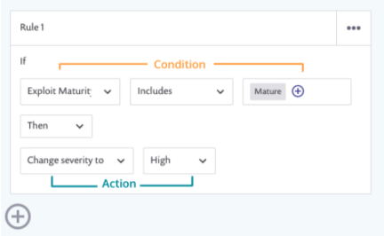

# How to create a security policy and set rules

To create a new security policy, click **Add a new policy** in the security policy menu.

Security policy rules follow an “if, then” framework, with one or more conditions, and an action. For example:

If you create a new security policy, the first blank rule is automatically created.

Select the condition\(s\) and action to complete a rule. See the [**Conditions**](fixing-and-prioritizing-issues/security-policies/security-policies-conditions/) and [**Actions**](fixing-and-prioritizing-issues/security-policies/security-policies-actions/) documentation for more details.

To add a new blank rule, click on **+** below the previous rule, as seen in the screenshot above.

To delete or duplicate a rule, click the **…** on the right hand side of each rule box, as seen in the screenshot above.


The order of your rules sets the precedence; if there is a conflict, the rule closest to the top supersedes any subsequent rules.



Ready to get started with Snyk? [Sign up for free!](https://snyk.io/login?cta=sign-up&loc=footer&page=support_docs_page)


