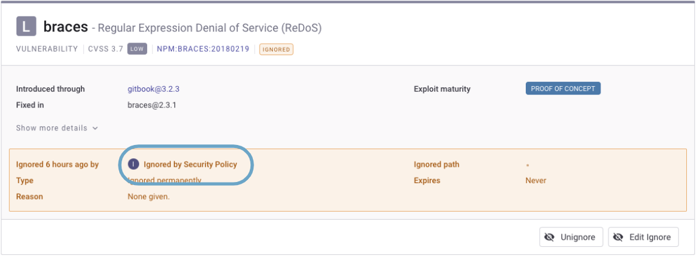

# Security policies: What collaborators see

  
A newly assigned policy, or changes to a policy, apply when the project is retested. This is what project collaborators see when an action is applied to a vulnerability:

| **Action** | **What project collaborators see** |
| :--- | :--- |
| Change severity to… | The new severity, as well as the originally assigned severity |
| Ignore current and future instances | An ignored issue will look the same as a manual ignore, but it will be labelled “ignored by security policy” |

## **Examples:**

An issue in a project page that’s been ignored by a security policy.

**Custom and original severity in the CLI**

**Custom and original severity in Project Page UI**

**Custom and original severity in Open Fix PR UI**

**Custom and original severity in Reports**

