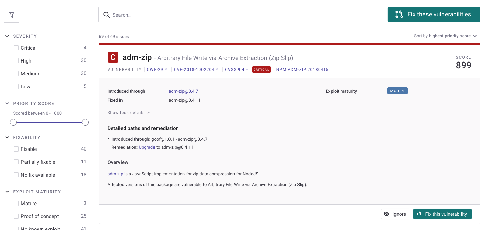
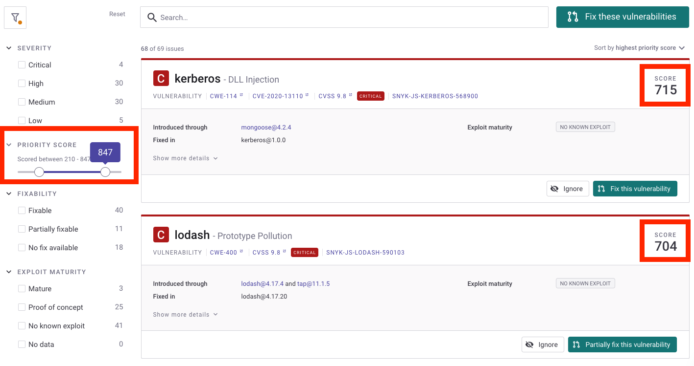

# Snyk Priority Score

**What is the Snyk Priority Score?**

Snyk created a Priority Score to make the prioritization of issues as quick and easy as possible, ensuring the highest-risk issues have the highest score.

Snyk's security group found a significant correlation between trending vulnerabilities and exploits or proof of concept's that can be found in the wild. Social trends are calculated and shown for all issues, vulnerabilities and licenses and range from 0 to 1,000 \(0 is considered low risk and 1,000 is considered critical\/). This gives users a high degree of granularity that reflects the many considerations taken into account. The granularity avoids having too many issues ending up with the same score so users can determine priority at a glance with a high degree of accuracy.


Snyk does not use the CVSS score alone to determine priority: Snyk’s Priority Score is a comprehensive scoring system that processes multiple factors, including the CVSS score, the availability of a fix, known exploits, how new the vulnerability is, and whether it is reachable or not. See [How it works](snyk-priority-score.md) section for details.


## How it works

For each issue, Snyk processes and weighs several factors in a proprietary algorithm, to produce the score for that issue.


Snyk continually refines our prioritization algorithm to include new factors, and updates weighting of factors, to always provide the most accurate and up-to-date representation of priority given the latest information.


Currently, these factors include:

* [**Severity levels**](introducing-snyk/snyks-core-concepts/severity-levels): calculated using CVSS scores for that issue.
* [**Exploit Maturity**](https://snyk.io/blog/whats-so-wild-about-exploits-in-the-wild-and-how-can-we-prioritize-accordingly/): determined by Snyk’s industry-leading security team using manual and automated methods to track which vulnerabilities are exploitable, and to what extent.
* [**Reachability**](https://snyk.io/blog/optimizing-prioritization-with-deep-application-level-context/): by looking at the code paths called within a project, Snyk identifies which vulnerabilities are reachable from the code.
* [**Fixability**](https://support.snyk.io/hc/en-us/articles/4405034808209) \(availability of a fix\): without a safer version to upgrade to, or a Snyk patch available, developers must either fix the code themselves or use an alternative package. So vulnerabilities with fixes are given higher priorities.
* **Time**: new vulnerabilities are likely to be an increased risk, so increasing priority score.
* [**Social Trends**](fixing-and-prioritizing-issues/prioritizing-issues/prioritize-by-social-trends): Snyk monitors mentions of known vulnerabilities in Twitter, calculating the trend of tweets and reactions.
* Malicious Packages: Snyk will prioritize vulnerabilities originating from malicious packages.

## Priority calculation for Kubernetes

Kubernetes configs images imported from the Kubernetes integration have a number of additional contributing factors for priority score calculation. See [Snyk Priority Score and Kubernetes](https://support.snyk.io/hc/en-us/articles/360010906897-Snyk-Priority-Score-and-Kubernetes).

## Priority calculation for Snyk Code

A number of specific factors contribute to priority calculation for Snyk Code, including:

* **Severity levels** 
* **Number of vulnerability occurrences** 
* **Rule tags**: decrease if **beta** tags are found
* **Open community projects**: if this vulnerability is fixed widely
* **Hot files**: if the vuln is in the source file, or inside a code flow
* **Fixability**: If we have fix examples available for this issue

See [Snyk Code](snyk-code) documentation for more details.

## View scores in projects

Scores can be seen on each issue in the projects view, with all issues now sorted by the Priority Score, to show you the most pressing issues first.

Issues can be filtered on the left.

## View scores in the Reports

The **Issues** tab in the reports includes the Priority Score as it's own sortable column. By default the table is already sorted by the score, to show you the most pressing issues first.

Issues can also be filtered by the score.

## View scores in the Snyk API

Various issue-related API calls now include the scores in the response, and support filtering by the score.

Read more about the relevant API calls:

* [https://snyk.docs.apiary.io/\#reference/reporting-api/latest-issues/get-list-of-latest-issues](https://snyk.docs.apiary.io/#reference/reporting-api/latest-issues/get-list-of-latest-issues)
* [https://snyk.docs.apiary.io/\#reference/reporting-api/get-list-of-issues](https://snyk.docs.apiary.io/#reference/reporting-api/get-list-of-issues)
* [https://snyk.docs.apiary.io/\#reference/projects/all-projects/list-all-issues](https://snyk.docs.apiary.io/#reference/projects/all-projects/list-all-issues)

## Settings

There are no settings related to the Priority Score. They have no active impact, so are just extra metadata, so they cannot be disabled or hidden.


Ready to get started with Snyk? [Sign up for free!](https://snyk.io/login?cta=sign-up&loc=footer&page=support_docs_page)


