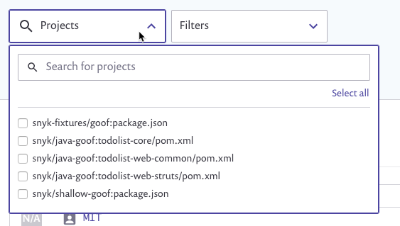
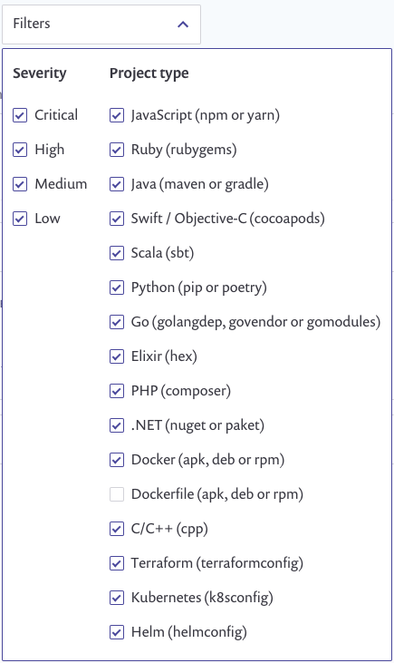

# General actions

This section describes the actions you can perform regardless of the tab you’ve selected.

## Filters

At the organization level, from the top of the Reports area, you can search for and filter specific projects, and you can filter projects by severity and type. Once you've filtered, the settings are retained as you navigate between tabs.

To search for and filter specific projects, open the dropdown from the Projects search field; additionally or alternatively, start typing any part of the project names:

To filter by vulnerability severities and by project types, open the **Filters** dropdown:

## How to navigate and view data for groups and organizations

To view data for a single organization you need to be an administrator for the organization.

**Steps:**

1. Select the organization from the dropdown list in the top panel.
2. Navigate to **Reports**.
3. Data appears only for the organization you selected.

## View data for multiple organizations


**Feature availability**  
This feature is available with Enterprise plans. See [pricing plans](https://snyk.io/plans/) for more details.


Group administrators can view report data for one, some or all of the organizations in a single group, together.

**Steps:**

1. Select the group from the dropdown list in the top panel.
2. Navigate to **Reports**.
3. Data appears for all organizations in the group and a dynamic dropdown of organizations is available.
4. Check or uncheck the organizations you wish to view.
5. To save the selected organizations as a quick filter, assign a unique name and then click **Save**.

## Sorting

Columns that allow the data to be sorted have arrows next to their headings. Click the arrows to sort the data in descending order by the relevant category. Click again to switch the order to ascending.


Ready to get started with Snyk? [Sign up for free!](https://snyk.io/login?cta=sign-up&loc=footer&page=support_docs_page)


