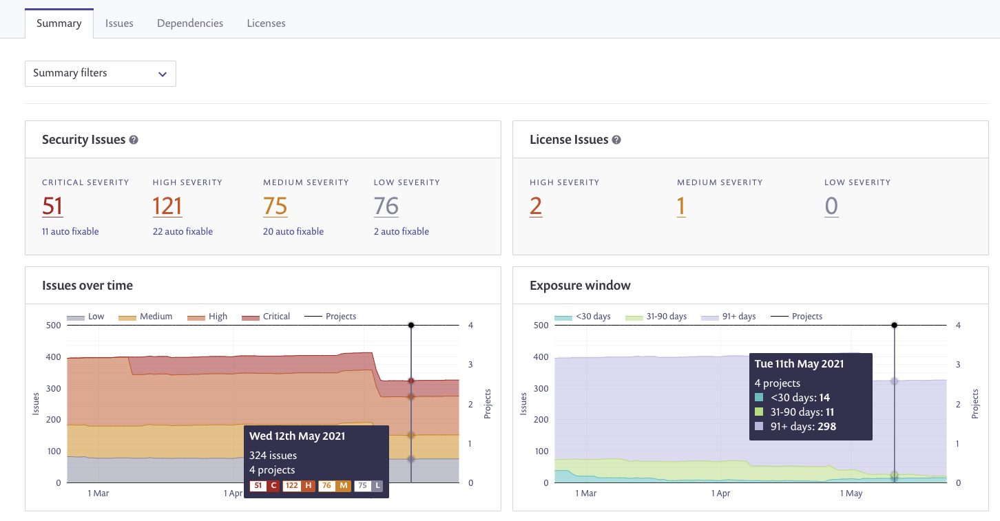

# Summary tab

The main dashboard of the **Reports** area displays a birds-eye view of all of the issues \(vulnerabilities and licenses\) found across all of your projects, presenting data for these specific areas:

* Security issues
* License issues
* Your overall project activity—a summary of all of your projects, tests and issues


**Note**  
Data in each of the four tabs is displayed based on the filters you've applied from the top of the Reports area, as well as the group or organization that you're viewing from.


The dashboard appears similar to the following image:

To quickly view additional data for a specific period in time, hover over the relevant graph and check out the pop-up.

## **Summary tab elements**

The following table describes the different parts of the **Summary** area:

<table>
  <thead>
    <tr>
      <th style="text-align:left"><b>Element</b>
      </th>
      <th style="text-align:left"><b>Description</b>
      </th>
    </tr>
  </thead>
  <tbody>
    <tr>
      <td style="text-align:left">Security issues</td>
      <td style="text-align:left">
        
Sum total of security issues broken down by severity. Security issues
          are vulnerabilities found when scanning your projects.

        
All statistics in the Security issue summary area are linked. Click a
          number in order to navigate to the <b>Issues</b> tab of the <b>Reports</b> area,
          filtered to vulnerabilities for the selected severity only.

        
For example, clicking the 300 in the <b>Security</b> issues high severity
          box navigates to the <b>Issues</b> tab, filtered to those 300 high severity
          vulnerabilities only.

        
Values:

        <ul>
          <li>Critical severity</li>
          <li>High severity</li>
          <li>Medium severity</li>
          <li>Low severity</li>
        </ul>
      </td>
    </tr>
    <tr>
      <td style="text-align:left">License issues</td>
      <td style="text-align:left">
        
Sum total of license issues broken down by severity.

        
All statistics in the <b>License issue summary</b> area are linked. Click
          a number in order to navigate to the <b>Issues</b> tab of the <b>Reports</b> area,
          filtered to the specific group of license issues.

        
For example, clicking the 28 in the <b>License</b> issues medium severity
          box navigates to the <b>Issues</b> tab, filtered to those 28 medium severity
          license issues only.

        
Values:

        <ul>
          <li>High severity</li>
          <li>Medium severity</li>
          <li>Low severity</li>
        </ul>
      </td>
    </tr>
    <tr>
      <td style="text-align:left">Issues over time</td>
      <td style="text-align:left">Issues graph displaying the number of issues, high medium and low, that
        were identified.</td>
    </tr>
    <tr>
      <td style="text-align:left">Exposure window</td>
      <td style="text-align:left">The elapsed time from when an issue was identified and until it was resolved.</td>
    </tr>
  </tbody>
</table>

For the **Activity** area, the following are the parameters and their descriptions:

<table>
  <thead>
    <tr>
      <th style="text-align:left"><b>Value</b>
      </th>
      <th style="text-align:left"><b>Description</b>
      </th>
    </tr>
  </thead>
  <tbody>
    <tr>
      <td style="text-align:left">Tests run</td>
      <td style="text-align:left">Number of tests run</td>
    </tr>
    <tr>
      <td style="text-align:left">Projects</td>
      <td style="text-align:left">Number of projects</td>
    </tr>
    <tr>
      <td style="text-align:left">New issues</td>
      <td style="text-align:left">Number of times an issue was introduced in the time period (includes reintroduced
        issues and deleted projects)</td>
    </tr>
    <tr>
      <td style="text-align:left">Fixed issues</td>
      <td style="text-align:left">Number of fixes applied in the time period (including reintroduced issues
        and deleted projects)</td>
    </tr>
    <tr>
      <td style="text-align:left">Tests preventing issues</td>
      <td style="text-align:left">Snyk tests that have been run and that have prevented new vulnerabilities
        from being introduced.</td>
    </tr>
    <tr>
      <td style="text-align:left">Ignored issues</td>
      <td style="text-align:left">
        
The total number of the issues found, but ignored, as well as the total
          number of ignored issues that have a fix available. These are issues not
          counted in any of the other totals in this <b>Summary</b> area.

        
These values are linked to the <b>Issues</b> tab of the <b>Reports</b> area,
          filtered to the specific group of ignored issues.

        
Click the number in the <b>Ignored</b> issues box to jump to the <b>Issues</b> tab,
          filtered to those ignored issues only. Clicking on the fixable number from
          the same box navigates to the <b>Issues</b> tab, filtered to those fixable,
          yet ignored, issues only.

        
<b>Note:</b>
        

        
Once you ignore an issue, it may take up to one hour before synchronizing
          with the data on the Summary tab of the Reports.

      </td>
    </tr>
  </tbody>
</table>

## **Summary tab actions**

These controls appear at the top of the window:

**Summary filters**—mark the issues to be displayed by selecting the relevant issue type and then click the list arrow again to close it.


Ready to get started with Snyk? [Sign up for free!](https://snyk.io/login?cta=sign-up&loc=footer&page=support_docs_page)


