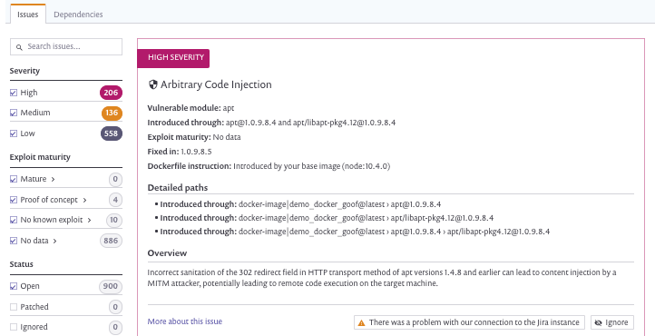

# Getting started with Snyk Container

Get started with Snyk Container to help you find and fix vulnerabilities in container images. See [Container security overview](https://support.snyk.io/hc/en-us/articles/360003946897-Container-security-overview) and [Snyk Container](https://solutions.snyk.io/snyk-academy/container) for details.


This process uses the Snyk.io UI. For details of Snyk Container using the Snyk CLI \(Command-Line Interface\) tool, see **Snyk CLI for container security** and **Test your container images with our CLI tool**.


### Prerequisites

Ensure you have:

1. Access to a relevant container registry to use with Snyk. Snyk supports registries including , Amazon Elastic Container Registry \([ECR](https://support.snyk.io/hc/en-us/sections/360001114218-ECR-image-scanning)\), Google Container Registry \([GCR](https://support.snyk.io/hc/en-us/sections/360001127497-GCR-image-scanning)\), Microsoft Azure Container Registry \([ACR](https://support.snyk.io/hc/en-us/sections/360001127457-ACR-image-scanning)\), and [JFrog Artifactory](https://support.snyk.io/hc/en-us/sections/360001127477-JFrog-Artifactory-image-scanning). Alternatively, access to [Kubernetes](https://support.snyk.io/hc/en-us/sections/360001114238-Kubernetes-workload-and-image-scanning) if you select that as an integration.
2. A Snyk account \(go to [https://snyk.io/](https://snyk.io/) and sign up - see [Create a Snyk account](https://docs.snyk.io/getting-started/getting-started-snyk-products) for details\).

See [Prerequisites](https://solutions.snyk.io/snyk-academy/container/prerequisites) for more details.

## Stage 1: Add container registry integration

Choose a container registry integration, to connect the registry with Snyk:

1. Log in to Snyk.io.
2. Select **Integrations**.
3. Select a **Container registries** entry.
4. Click the entry to integrate with Snyk: 
5. Fill in the account credentials and other details as prompted, then save the changes, to integrate this entry with Snyk:

   

## Stage 2: Add projects

Add projects for your selected container, to start scanning with Snyk.

1. Click **Add Project**, and select the integration registry entry to add from: 
2. Select the container repository and tags to import, then click **Add selected repositories** to import them into your projects:  
   

   Importing also sets Snyk to run a daily check on the repositories for vulnerabilities.

3. A progress bar appears: click **View log** to see log results.


If you encounter any errors during import, see the [Importing projects](https://support.snyk.io/hc/en-us/sections/360000923478-Importing-projects) information.


## Stage 3: View vulnerabilities

You can now see vulnerability results for imported projects.

1. Select **Projects**, then click on the imported project entry under its registry record, to see vulnerability information for that project.  Here you can see a summary of the severity of the detected vulnerabilities.
2. Click on an entry to see details of vulnerabilities found:

   

See [Analysis and remediation for your images from the Snyk app](https://docs.snyk.io/snyk-container/getting-around-the-snyk-container-ui/analysis-and-remediation-for-your-images-from-the-snyk-app) for more details.

## Stage 4: Fix and review

1. Fix issues found, based on Snyk recommendations.
2. Rebuild your image.
3. Snyk automatically rescans your new image after it is pushed.

## For more information

See [Snyk Container](https://docs.snyk.io/snyk-container).

