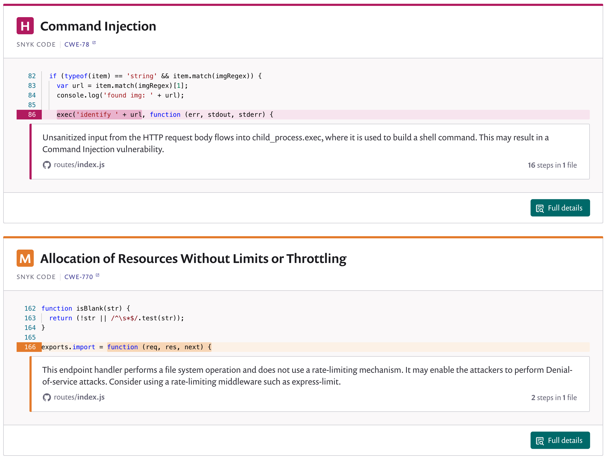

# Getting started with Snyk Code

Get started with [Snyk Code](https://snyk.io/product/snyk-code/) to find, prioritize and fix potential vulnerabilities in your proprietary code.


This documentation describes using Snyk Code with the Web UI. You can also use Snyk Code as a plugin to your JetBrains IDE; see [JetBrains IDE Plugins](https://snyk.gitbook.io/user-docs/integrations/ide-tools/jetbrains-plugins) for more details.


## Prerequisites

* A Snyk account.
* [Snyk Open Source](https://snyk.gitbook.io/user-docs/snyk-open-source) or [Snyk Container](https://snyk.gitbook.io/user-docs/snyk-container) installed \(as currently Snyk Code is distributed as an add-on\).
* Projects that include code in [a supported language](https://snyk.gitbook.io/user-docs/snyk-code/snyk-code-language-and-framework-support) \(currently Java, JavaScript, and Python\).
* One of the following supported source code management systems \(SCMs\): GitHub cloud, BitBucket cloud, Gitlab cloud.

## Stage 1: Enable Snyk Code

Snyk Code is disabled by default, so you must enable it for each organization:

1. Log in to [Snyk.io](http://snyk.io/).
2. Click on settings  &gt; **Snyk Code**. 
3. Under **Enable Snyk Code**, change **Disabled** to **Enabled:**
4. Click **Save changes**.

## Stage 2: Add source control integration


If you already have an integration set up, you can skip this step


Choose a source code integration, to allow Snyk to work on a project.

1. Log in to [Snyk.io](http://snyk.io/).
2. Select **Integrations &gt; Source control**.
3. Click the source control system \(for example, GitHub\) to integrate with Snyk: 
4. Fill in the account credentials as prompted \(or authenticate with your account in GitHub\), to grant Snyk access permissions for integration.

See [DevOps integrations & languages](https://snyk.gitbook.io/user-docs/introducing-snyk/introduction-to-snyk/integrations-and-languages) for more details.

## Stage 3: Add projects


If you already have projects added, you can skip this step.


Add projects to test with Snyk, by choosing repositories for Snyk to test and monitor.

1. Select **Projects** from [snyk.io](http://snyk.io/).
2. Select the tool to add the project from \(for example GitHub\): 
3. In **Personal and Organization repositories**, select the repositories to use: 
4. Click **Add selected repositories** to import the selected repositories into your projects. This sets Snyk to run a regular check \(daily by default\) for your proprietary code vulnerabilities. 
5. A progress bar appears: click **View log** to see log results. 
6. Project import completes.


Currently Snyk Code does not support the **Exclude folders** option during import. Please contact us if you need more information.


See [Snyk projects](https://support.snyk.io/hc/en-us/sections/360004724958-Snyk-projects) for more details.

## Stage 4: View vulnerabilities

You can now view vulnerability results for imported projects. The **Projects** tab appears by default after import, showing vulnerability information for projects you've imported.

1. Click on an imported project to see vulnerability information for that project, including the number of issues found, grouped by severity : 
2. Click on an entry to open the issues view for that entry. For each issue, this shows the exploitable code snippet and a description of the code flaw that may lead to this vulnerability if not fixed:

See [View project information](https://snyk.gitbook.io/user-docs/getting-started/introduction-to-snyk-projects/view-project-information) for more details.

## Stage 5: View issue details

Click **Full Details** on an issue to view more details about it, such as:

* **Data Flow**: The issue's taint flow from the source \(the user input\) to the sink \(the operation that needs to receive clean input and can be exploited otherwise\).
* **Remediation Strategy**: An area that focuses on how to fix the problem with more details, references and code samples related to it.

## For more information

* [Snyk Code](https://snyk.gitbook.io/user-docs/snyk-code)
* [Developer-first SAST with Snyk Code](https://snyk.io/blog/developer-first-sast-with-snyk-code/)
* [SAST vs DAST](https://snyk.io/learn/sast-vs-dast/)

