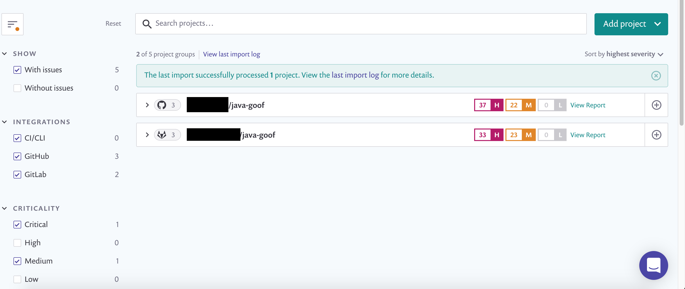

# Project attributes

Project attributes are static and non-configurable fields which allow you to add additional metadata (also known as “values”) to a project. Attributes have a predefined list of values you can select from. Values can be assigned and removed from attributes, and can be used to group, prioritize, and filter projects.

## **Available Attributes and their Values:**

**Lifecycle stage**

* Production
* Development
* Sandbox

**Business criticality**

* Critical
* High
* Medium
* Low

**Environment**

* Frontend
* Backend
* Internal
* External
* Mobile
* SaaS
* On-Prem
* Hosted
* Distributed

The ability to assign and remove values from attributes, and filter projects by their values, is also available in the API. For more information, please read the [docs](https://snyk.docs.apiary.io/reference/projects/project-attributes).

**Assigning values to attributes**

1. On the project page, click the “+” icon below the attribute you want to assign a value to
2. Select a value from the list available

You have assigned a value to the attribute, and it will appear on the project listing page. Each attribute can have multiple values assigned to them, and you can assign values to multiple attributes.

**Removing values from attributes**

1. Select the attribute you want to remove a value from
2. Click the “x” icon on the value.

The value has been removed from the attribute.

**Filtering values in the project listing page**

1. On the left of the project listing page, select the values for the attributes that you want to filter projects by.
2. When you filter by multiple values on a single attribute, you will return projects that have been assigned one or more of the values in the filter.
3. When you filter by multiple attributes, you will return projects which have been assigned values of both attributes in the filter.

