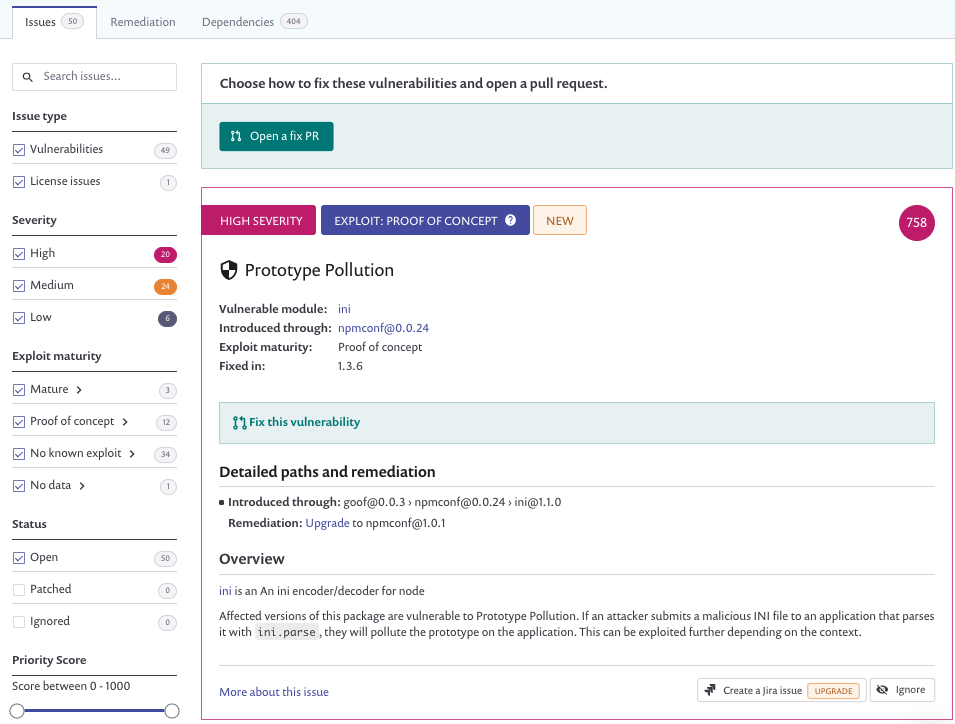
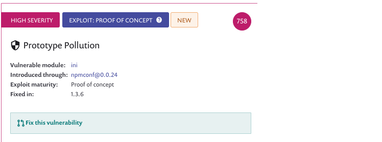
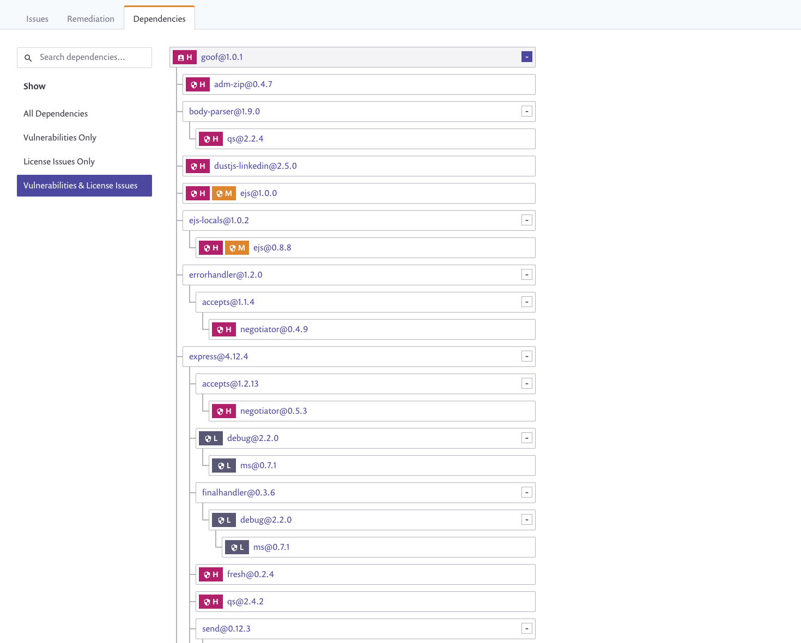

# View project issues, fixes, and dependencies

For your project, you can view the following displays:

* [Issues](view-project-issues-remediations-and-dependencies.md): the number of vulnerabilities and license issues.
* [Remediation](view-project-issues-remediations-and-dependencies.md): fix advice.
* [Dependencies](view-project-issues-remediations-and-dependencies.md): the total number of direct and transitive (nested) dependencies.

Below the project summary details, you can see vulnerabilities and licensing issues, in the **Issues** tab:

Use the left-hand area to filter and search issues. Click the checkboxes to filter issues by **Issue type**, **Severity**, **Exploit Maturity**, and **Status**. You can also edit the **Priority Score** slider to change the range displayed (by default this is set from 0 - 1000).

Issues details appear in the main area, sorted by priority score. See **View Issue Details.**

## Fix issues (Fix PR)

Snyk provides powerful features to fix issues identified during scanning, as shown in the **Open a fix PR** section of the **Issues** and **Remediation** displays:

You can also select to fix a specific issue, clicking **Fix this vulnerability** on a specific issue:

See [Fixing vulnerabilities](https://docs.snyk.io/snyk-open-source/open-source-basics/fixing-vulnerabilities) for an overview.\
See [Fixing and prioritizing issues](https://docs.snyk.io/fixing-and-prioritizing-issues) for more details.

## View issue details

For each issue, this display shows details about the vulnerability including its priority score (see [Prioritizing Snyk issues](https://docs.snyk.io/fixing-and-prioritizing-issues/starting-to-fix-vulnerabilities/snyk-priority-score)):

Click **More about this issue** to view detailed information about the vulnerability using [Snyk's vulnerability database](https://snyk.io/product/vulnerability-database/), giving you a deeper insight into the issue, including its CVSS score:

Snyk's knowledge of the transitive dependencies in your project make it possible for Snyk to offer fix advice, in the **Remediation** tab:

See [Fixing vulnerabilities](../../products/snyk-open-source/open-source-basics/fixing-vulnerabilities.md) for details.

Synk uses the package manager of your application to build the dependency tree and display it in the **dependency** tab of the project view. This shows which components introduce a vulnerability, to show how the dependency was introduced to the application:

For example, the above screenshot shows a vulnerability based on the transitive dependency **qs@2.2.4**, brought in from the direct dependency **body-parser@ 1.9.0**.
