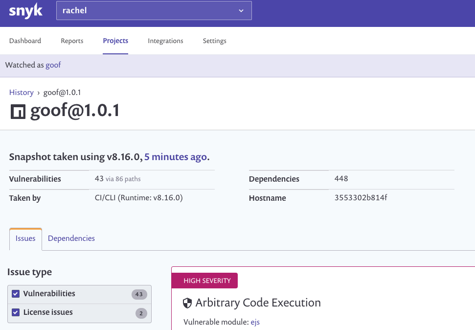

# Jenkins integration: Snyk for your pipeline

For any pipeline project, you can add a Snyk step to your build at any point in your pipeline, to scan the code while you build and to fail the build for vulnerabilities, based on your configurations. Simply generate a Snyk Security task pipe and add it to your `Jenkinsfile` to get started.

**Steps:**

1. From within Jenkins, generate a Snyk Security pipe:
   * Navigate to the pipeline project you would like to test, and click Pipeline Syntax.
   * From the Sample Step dropdown, select snykSecurity: Invoke Snyk Security task.
   * Configure the security task as follows:

     When Issues are found:

     * **Fail the build, if severity at or above**—fails the build when a single vulnerability of the severity level selected from the dropdown is identified in the project
     * **Let the build continue**—display vulnerabilities and details, but allow the build to continue
     * **Monitor project on build**—push a snapshot of the project to the Snyk UI. Snyk then continues to monitor your project for newly disclosed vulnerabilities.
     * **Snyk token**—select the token that you already created from the Jenkins Credentials area.
     * **Target file**—indicate the path to the manifest file; if the file is in the root folder, leave blank.
     * **Organization**—the Snyk organization to which this project should be associated.
     * **Project name**—enter a unique name by which to identify this project from the Snyk UI. If left blank, Snyk assigns a project name based on the manifest file data.

   * From the **Advanced** area, leave the Snyk installation default. Enter any additional valid Snyk CLI arguments and their values in the Arguments box.
   * Click **Generate Pipeline Script**. The pipe syntax is generated and displayed in the window.
2. Copy the generated pipe syntax. 
3. Navigate to the **Configure** area of your pipeline and go to the **Pipeline** part. Paste the Snyk step syntax in your pipeline as part of an existing stage or as a new separate stage.

   **Note**: You can also choose to add the stage to your `Jenkinsfile` directly from the Git.

4. Now, every time you run your project build: **\(Note**: If you updated the Jenkinsfile from the Git and external to Jenkins, then when Jenkins fetches that file to run the build, it receives the edited pipeline, now including the newly added Snyk step.\)
   * Snyk verifies the plugin installation \(if necessary, and as based on your policy configuration\).
   * Snyk runs the snyk test command, analyzing the manifest file of your project to find its direct and transitive dependencies and testing your pipeline against the Snyk vulnerability database for known vulnerabilities.
   * From the **Jenkins Console Output**, the test results summary is displayed, indicating the number of known issues and the number of associated dependency paths identified.
   * Based on the **Monitor project on build configuration** for this project:
     * If you did not choose **Monitor project on build**, then Snyk displays all vulnerability results and details from the **Snyk Security Report** area of the **Build** menu.
     * If a severity threshold was defined for a severity that is assigned to any vulnerability in your project, Jenkins breaks the build.
     * Otherwise, Jenkins continues to run the build to completion \(success or failure\) and Snyk activity ends.
     * If you checkmarked the Monitor project on build option, then Snyk displays all vulnerability results and details from the Snyk Security Report area of the Build menu and also pushes a snapshot for continuous monitoring to the Snyk UI.
     * When pushed to the Snyk UI, the project is associated with your default organization if you did not specify another org in your arguments, and the project is named according to the package used in your root manifest file.
     * If a severity threshold was defined for a severity that is assigned to any vulnerability in your project, Jenkins breaks the build.
     * Otherwise, Jenkins continues to run the build to completion \(success or failure\) and Snyk activity ends.
     * From the top of the report, right-click View on Snyk.io to view the snapshot and vulnerability information directly from our app:

