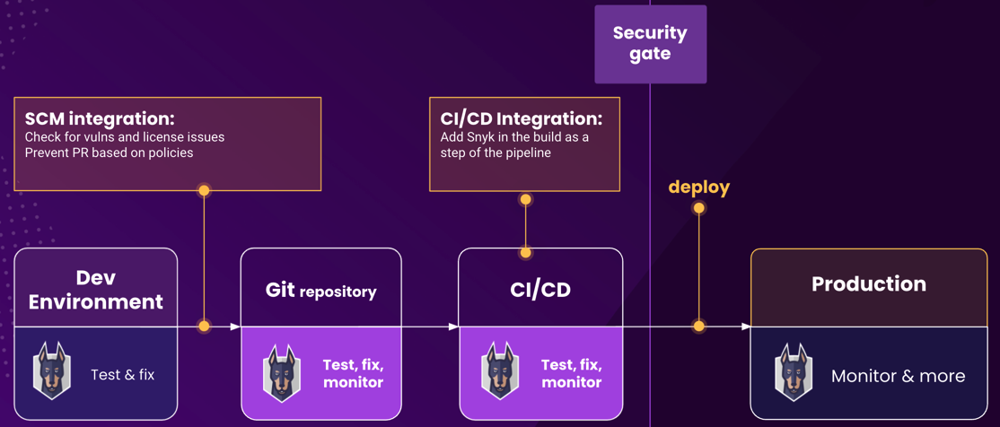

# 3rd-party integrations

The most popular integrations for Snyk implementation are [Git Repository](git-repository-scm-integrations/) and [CI/CD pipeline](ci-cd-integrations/).

* **Git repository**: Improve application security in your Git repository, preventing vulnerable code from entering your codebase, and getting quick visibility of your vulnerabilities.
* **CI/CD**: Keep your applications secure by preventing deployment of vulnerable applications or components (registries), adding Snyk in the build as a step of the pipeline.

#### Which integrations to choose?

You can decide to implement either Git repository, or CI/CD, or both. Both have advantages and disadvantages, and your choice will depend on your team flows and organizational processes.

The following considerations explain the benefits of each type of integration.

### Git repository

Use Git repository integrations to Improve security of your code and deployed applications.

#### Considerations

* Easier to setup and maintain.
* Allows scanning and visibility earlier in the software development lifecycle, through:
  * Automatic daily rescanning of all imported Projects.
  * Checking all submitted PRs for security issues.
  * Generating dependency upgrade PRs to deal with technical debt.
  * Generating fix PRs for existing vulnerabilities that have not been addressed
* More friendly experience for developers.
* Does not take resources from your CI/CD pipeline.

For more details, see [Snyk Git repository integration: deployment recommendations](git-repository-scm-integrations/snyk-scm-integration-good-practices.md).

### CI/CD

Use CI/CD integrations to keep your code and deployed applications secure, and give visibility on components that are pushed to production, by either breaking builds and reporting to Snyk, or only reporting to Snyk.

#### Considerations

* Some package managers require local context and are better run within your environment (including Scala, Gradle, Go modules, Artifactory, and Nexus).
* More granular options to block.
* Strong gatekeeper.
* Best practice for container and Infrastructure as Code scans (for IaC, get more accurate results by scanning a Terraform plan file, rather than the untemplated IaC declarations).

For more details, see [Snyk CI/CD Integration deployment and strategies](ci-cd-integrations/snyk-ci-cd-integration-deployment-and-strategies/).
