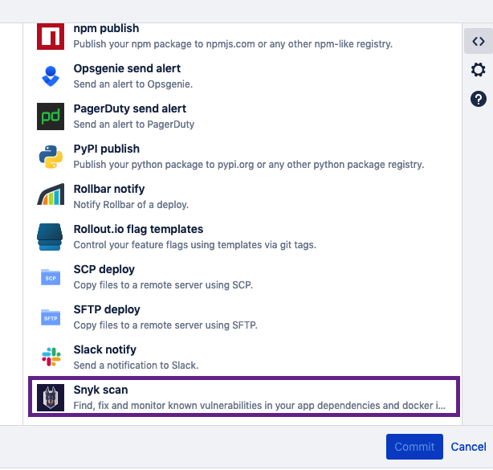

# Bitbucket Pipelines integration

Snyk integrates with Bitbucket Pipelines using a **Snyk pipe**, seamlessly scanning your application dependencies and Docker images for security vulnerabilities as part of the continuous integration/continuous delivery (CI/CD) workflow.

[Bitbucket Pipes](https://bitbucket.org/blog/meet-bitbucket-pipes-30-ways-to-automate-your-ci-cd-pipeline) enables users to customize and automate a Bitbucket Pipeline CI/CD workflow with a group of ready-to-use tasks that can be added inside of your pipelines by copying and pasting them from the Bitbucket interface.

With the Snyk pipe, you can quickly add Snyk scanning to your pipelines to test and monitor for vulnerabilities at different points of the CI/CD workflow, based on your configurations. Results are then displayed in the Bitbucket Pipelines output view and can also be monitored on the [Snyk Web UI](http://app.snyk.io).

## Snyk pipe information in Bitbucket

From the build directory, Bitbucket Pipelines displays a list of available pipes customized for you, similar to the list in the following screenshot:

On this list, find and click **Snyk** to view the pipe, examples, parameters, and values:

## Setup and use details

For setup and use details, see the following pages:

* [Language support for Bitbucket Pipelines integration](language-support-for-bitbucket-pipelines-integration.md)
* [Bitbucket Pipelines integration: how it works](bitbucket-pipelines-integration-how-it-works.md)
* [Prerequisites for Bitbucket Pipelines integration](prerequisites-for-bitbucket-pipelines-integration.md)
* [Configure your Bitbucket Pipelines integration](configure-your-bitbucket-pipelines-integration.md)
* [How to add a Snyk pipe](how-to-add-a-snyk-pipe.md)
* [Snyk pipe parameters and values (Bitbucket Cloud)](snyk-pipe-parameters-and-values-bitbucket-cloud.md)
* [Example of a Snyk pipe for Docker](example-of-a-snyk-pipe-for-docker.md)
* [Example of a Snyk pipe for npm](example-of-a-snyk-pipe-for-npm.md)
