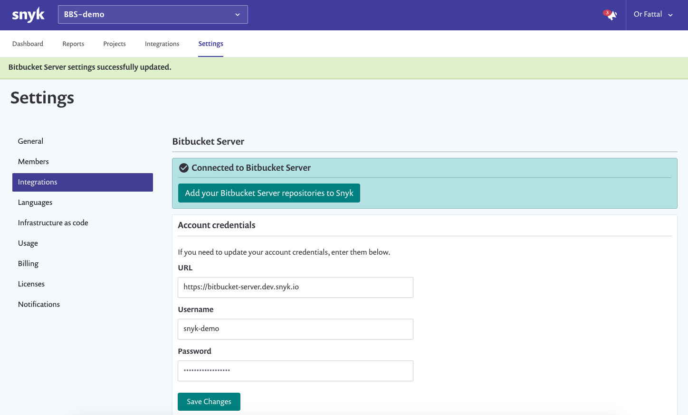
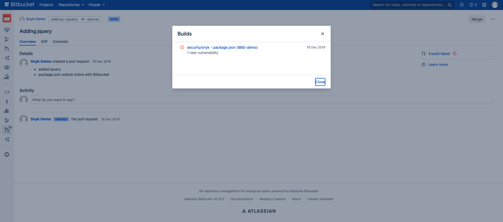

# Bitbucket Data Center/Server integration

Snyk's Bitbucket Data Center / Server integration allows you to continuously perform security scanning across all the integrated repositories, detect vulnerabilities in your open source components, and use automated remediation. This integration supports Bitbucket Data Center / Server versions 4.0 and above.

> **Feature availability**  
> This feature is available with Enterprise plans. See [pricing plans](https://snyk.io/plans/) for more details.

## Setting up a Bitbucket DC/Server Integration

> **Important**  
> Make sure the newly created user has **Admin** permissions to all the repositories you need to monitor with Snyk.

1. To give Snyk access to your Bitbucket DC/Server account, set up up a dedicated service account in Bitbucket DC/Server, with admin permissions. Visit [Bitbucket Server documentation ](https://confluence.atlassian.com/bitbucketserver/users-and-groups-776640439.html#Usersandgroups-Creatingauser)to learn more about creating users.
2. In Snyk, go to the **Integrations** page and click on **Bitbucket Server** card: 
3. Enter your Bitbucket DC/Server URL, and the username and password for the service account you created: 
4. Click **Save**. Snyk connects to your Bitbucket DC/Server instance. When the connection succeeds, the following indications appear: 

You can now select the repositories for Snyk to monitor.

1. Click **Add your Bitbucket Server repositories to Snyk** to start importing repositories to Snyk.
2. Select the repositories to import to Snyk when prompted, then click **Add selected repositories**.
3. Snyk scans the selected repositories for dependency files \(such as package.json and pom.xml\) in the entire directory tree, and import them to Snyk as projects:
4. The imported projects appear in your **Projects** page and are continuously checked for vulnerabilities.

## Bitbucket DC/Server Integration Features

After the integration is done, you can use the following capabilities:

## **Project level security reports**

Snyk produces advanced security reports, allowing you to explore the vulnerabilities found in your repositories, and fix them immediately by opening a fix pull request directly to your repository, with the required upgrades or patches.

This is an example of a project level security report:

## **Projects monitoring and automatic fix pull requests**

Snyk frequently scans your projects on either a daily or a weekly basis. When new vulnerabilities are found, notifications are sent both by email and by opening an automated pull requests with fixes to repositories.

Here is an example of a fix pull request opened by Snyk:

To review and adjust the automatic fix pull request settings:

Click on settings &gt; **Integrations**. 2. Select **Edit Settings** for Bitbucket Server 3. Navigate to **Automatic fix pull requests**:

## **Pull request tests**

Snyk tests any newly created pull request in your repositories for security vulnerabilities, and sends a build check to Bitbucket DC/Server. You can to see whether the pull request introduces new security issues, directly from Bitbucket DC/Server.

This is how Snyk pull request build check appears in the **Pull Request** page in Bitbucket DC/Server:

To review and adjust the pull request tests settings:

1. Click on settings &gt; **Integrations**. 
2. Select **Edit Settings** for Bitbucket Server. 
3. Navigate to **Default Snyk test for pull requests**:

## Required permissions scope for the Bitbucket DC/Server integration

Snyk performs all the operations in Bitbucket DC/Server on behalf of the integrated service account.

For Snyk to perform the required operations on monitored repositories \(such as reading manifest files on a frequent basis and opening fix or upgrade PRs\), the integrated Bitbucket DC/Server service account needs **Admin** permissions on the imported repositories:

| **Action** | **Why?** | **Required permissions on the repository** |
| :--- | :--- | :--- |
| Daily / weekly tests | To read manifest files in private repositories. | **Write** or above |
| Snyk tests on pull requests | To send pull request status checks when a new PR is created, or an existing PR is updated. |  |
| Opening fix and upgrade pull requests | To create fix PRs in monitored repositories. |  |
| Snyk tests on pull requests - initial configuration | To add Snyk's webhooks to the imported repos, so Snyk is informed when pull requests are created or updated, and can trigger scans. | **Admin** |

## **Disabling the Bitbucket DC/Server integration**

To disable this integration:

Click on settings &gt; **Integrations**. 2. Find the specific integration to deactivate in your list of integrations, and click Edit settings. 3. A page appears showing the current status of your integration and a place to update your credentials, specific to each integration \(credentials, API key, Service Principal, or connection details\): 4. Click **Disconnect**.

> **WARNING**  
> Your credentials are removed from Snyk and any integration-specific projects Snyk is monitoring are deactivated on Snyk.  
>   
> If you then choose to re-enable this integration at any time, you will need to re-enter your credentials and activate your projects.


Ready to get started with Snyk? [Sign up for free!](https://snyk.io/login?cta=sign-up&loc=footer&page=support_docs_page)


