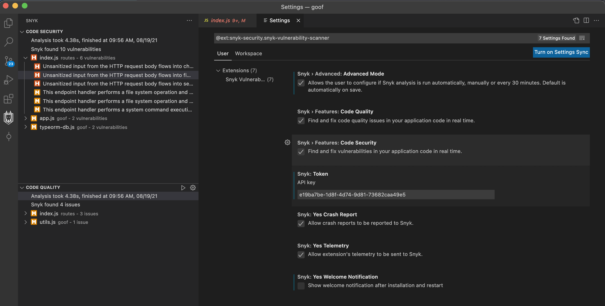
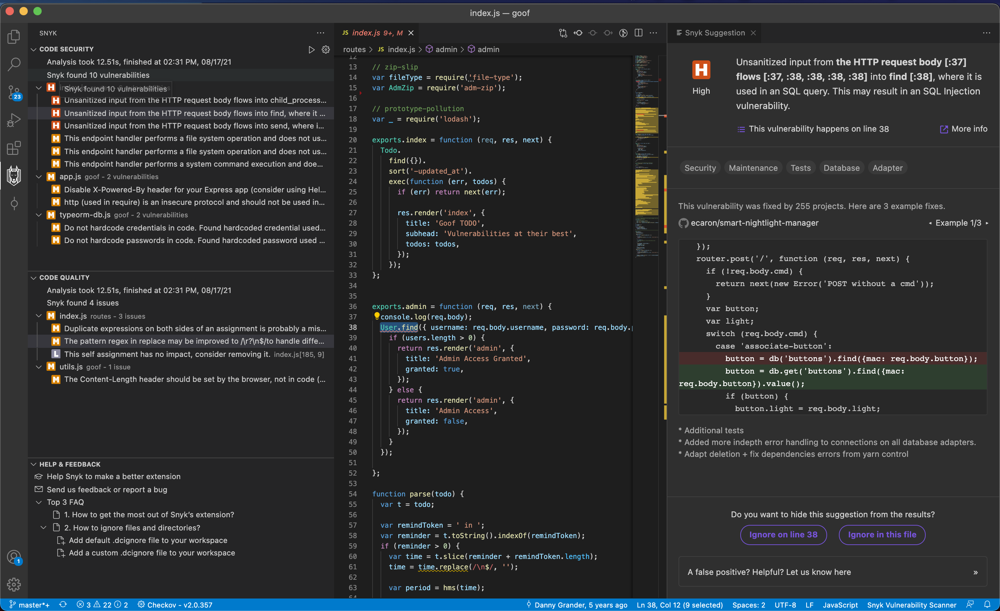

# Visual Studio Code extension for Snyk Code

Use this documentation to get started with the Visual Studio Code extension for [Snyk Code](snyk-code/).


A Visual Studio extension is also available for Snyk Open Source. See [Visual Studio extension](integrations/untitled/visual-studio-extension).


## Supported languages

Currently supported languages for Snyk Code are JavaScript, TypeScript, Java and Python. We also provide coverage for frameworks like Vue and React. We analyze the following file types:

* .es, .es6, .htm, .html, .java, .js, .jsx, .py, .ts, .tsx, .vue

See [Snyk Code language and framework support](snyk-code/snyk-code-language-and-framework-support/) for more information.

## Install the plugin

You can find the Snyk Extension in the Visual Studio Code Marketplace. To install, either:

* Navigate to the [Snyk Extension on the Visual Studio Code Marketplace](https://marketplace.visualstudio.com/items?itemName=snyk-security.snyk-vulnerability-scanner/) and follow the instructions for the Snyk extension. The docs from VS Code help you trigger the installation process from Visual Studio Code and guide you through the installation steps.
* Browse for the extension as advised [here](https://code.visualstudio.com/docs/editor/extension-gallery#_browse-for-extensions/) and search for Snyk, then install \(as described [here](https://code.visualstudio.com/docs/editor/extension-gallery#_install-an-extension)\).

Once installed you can find a Snyk icon in the sidebar.

Snyk’s extension provides all the suggestions in a concise and clean view containing all information you need to decide how to fix or act upon:

## Authentication

To authenticate follow the steps:

1. Once the plugin is installed, click on the Snyk Icon in the left navigation bar:

   

2. Click **Connect VS Code with Snyk**. The plugin relies on the Snyk authentication API and it will ask you to authenticate you against Snyk’s web application:
3. Click **Authenticate**. 
4. After successful authentication, you will see a confirmation message: 
5. Close the browser window and return to the IDE. The IDE is now reading and saving the authentication on your local machine.

## Run analysis

In the IDE you will notice that the extension is already picking up the files and uploading them for analysis.

Snyk Code analysis runs quickly, so results may even already be available:

Snyk's analysis runs automatically when you open a folder or project, or when you save your work.

**Tip**: if you don't like to manually save while working, enable [AutoSave](https://code.visualstudio.com/docs/editor/codebasics#_save-auto-save).

To manually perform the analysis, in the configuration of the extension, you can enable Advanced Mode which enables you to control the scanning process:

To manually trigger a scan, either Save or manually rescan using the rescan icon:

If you only need the Code Quality or Code Security portion of the Snyk Code findings, you can easily hide the view with the results you don't want to see:

## View analysis results

Snyk Code analysis shows a list of security vulnerabilities and code issues found in the application code. For more details and examples of how others fixed the issue, select a security vulnerability or a code security issue. Once selected you will see the Snyk suggestion information in a panel on the right side:

## Snyk panel

The Snyk analysis panel \(on the left of the code screen in the above screenshot\) shows how much time the analysis took plus a list of files with the suggestions found for them.

The icons here mean:

|  | Critical suggestion - should be addressed. |
| :--- | :--- |
|  | Warning suggestion -  likely a coding error. |
|  | Information suggestion - points to style glitches or logical issues. |

## Editor window

The editor window \(in the middle of the results screen\) shows the code that is inspected. This ensures that when you are inspecting a Snyk issue, you always have the code context close to the issue.

## Snyk suggestions window

The Snyk Suggestion panel \(on the right of the results screen\) shows the argumentation of the Snyk engine using for example variable names of your code and the line numbers in red. You can also see:

* Links to external resources to explain the bug pattern in more detail \(the **More info** link\). 
* Tags that were assigned by Snyk, such as **Security** \(the issue found is a security issue\), **Database** \(it is related to database interaction\), or **In Test** \(the issue is within the test code\). 
* Code from open source repositories that might be of help to see how others fixed the issue. 
* You can add ignore comments that would make Snyk ignore this particular suggestion, or all of these suggestions for the whole file, by using the two buttons on the lower end of the panel.

We also include a feedback mechanism to report false positives so you others do not see the same issue.

## Extension configuration

After the plugin is installed, you can set the following configurations for the extension :

* **Advanced mode**: toggles a panel to allow the user to manually control when the analysis should be run.
* **Token**: the token the extension uses to connect to Snyk. You can manually replace it, if you need to switch to another account.

## Create a .dcignore file

To ignore certain files and directories \(for example, **node\_modules**\), create a **.dcignore** file. You can create it in any directory on any level starting from the directory where your project resides. The file syntax is identical to .gitignore.

* We recommend adding the file when there is no **.gitignore** file. This will significantly reduce the files that need to be uploaded and speed up the analysis.
* To quickly add the default **.dcignore** file use the command provided by VS Code and the Snyk extension: Snyk create .dcignore file and save the newly created .dcignore file.


Ready to get started with Snyk? [Sign up for free!](https://snyk.io/login?cta=sign-up&loc=footer&page=support_docs_page)


