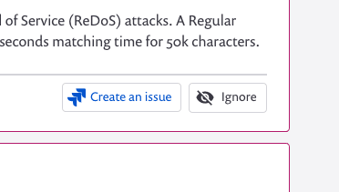
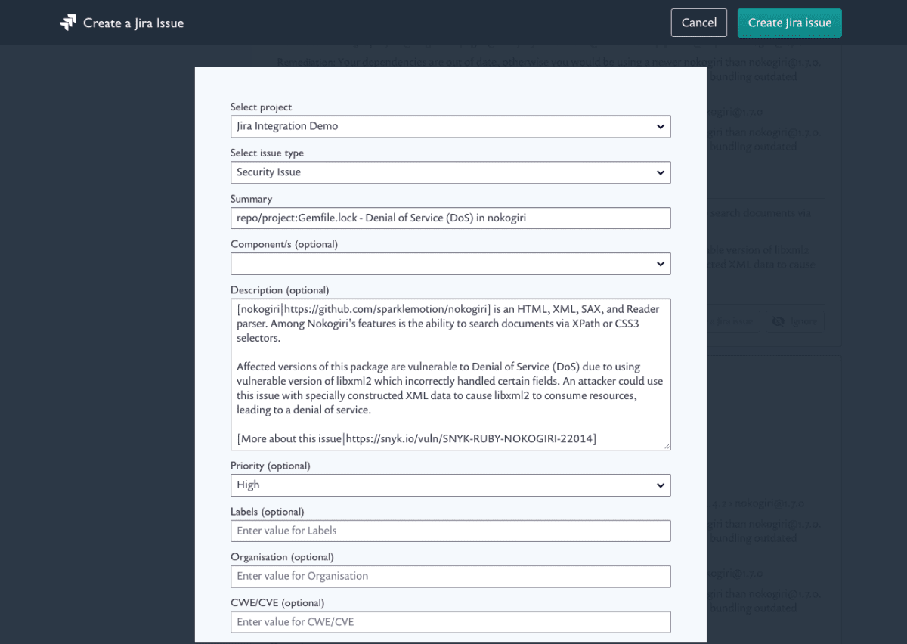
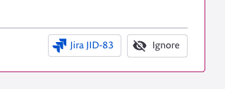

# Jira


**Feature availability**  
This feature is available with all paid plans. See [pricing plans](https://snyk.io/plans/) for more details.


### **Set up your Jira integration**

Our Jira integration allows you to manually raise Jira issues in the Snyk UI for vulnerabilities or license issues, and also includes an API \([see our API docs](https://snyk.docs.apiary.io/#reference/projects/project-jira-issues)\).


**Caution**  
if your Jira instance is private, you'll need to set up with Snyk Broker and then follow our brokered Jira setup instructions.


### **Prerequisites**

Snyk requires Jira version 5 or above.  
["Browse Projects" and "Create Issues"](https://community.atlassian.com/t5/Answers-Developer-Questions/Projects-are-not-being-returned-by-a-REST-API-call-to-createmeta/qaq-p/522042#M59700) permissions are needed. 

## **How to set up your Jira integration**

To connect your Snyk account to your Jira account, go to the integrations page in your organization settings and type in your credentials. We recommend setting up a new user in Jira for this, rather than using existing credentials. You can authenticate by username and password, but we recommend authenticating by API token which you can generate from [Atlassian API tokens](https://id.atlassian.com/manage/api-tokens).

### **Create a Jira issue**

Once you’ve set up the connection, visit one of your Snyk projects. You’ll now see a new button at the bottom of each vulnerability and license issue card that allows you to create a Jira issue.

When you click on this, a Jira issue creation form will appear with the Snyk issue details copied across into the relevant fields. You can review and edit this before creating the issue.

Select which Jira project you’d like to send the issue to. The fields that we display below are based on the fields that the project has, so switching between projects may show different options.

**Note**  
Snyk currently supports non-Epic Jira ticket creation. Epics will need to be added manually to the ticket once it has been created.

Once you’ve created a Jira issue, the Jira key with a link will display on the issue card. If you’re using the Jira API, you can generate multiple Jira issues for the same issue in Snyk.

You can also see which Jira issues have been created from the Issues view in your reports.

## See also:

[Enable permissions for Snyk Broker from your third-party tool](https://docs.snyk.io/integrations/snyk-broker/enable-permissions-for-snyk-broker-from-your-third-party-tool)

