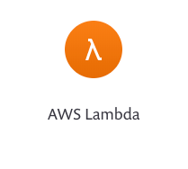
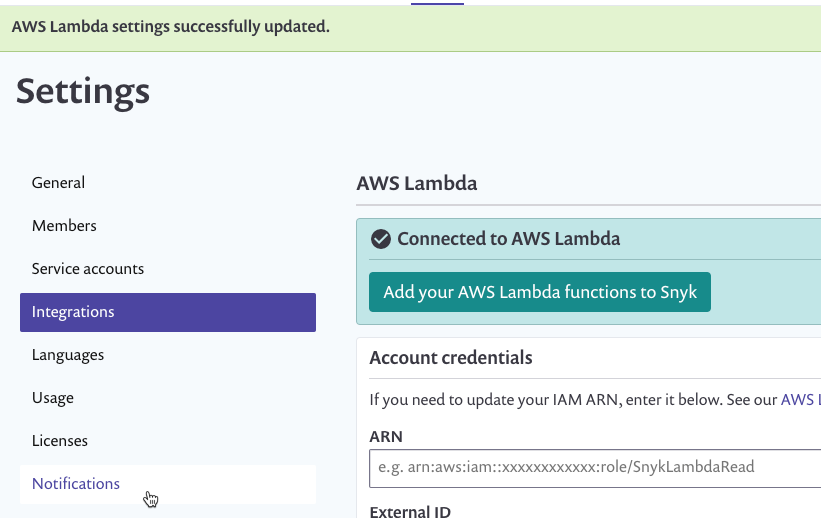
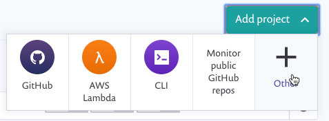

# AWS Lambda integration

Enable integration between your deployed AWS Lambda resources and a Snyk organization, and start managing the security of your deployed code.

## **Automated process**

[Open the Snyk Security on AWS Guide](https://aws.amazon.com/quickstart/architecture/snyk-security/)

You have the option of establishing cross-account access to enable Snyk's AWS Lambda integration as a one-click deployment. This options is available as an official [AWS Quick Start](https://aws.amazon.com/quickstart/architecture/snyk-security/) and eliminates the need for manual configuration.


You will need your Snyk **Organization ID** and AWS IAM [role ARN](https://docs.aws.amazon.com/IAM/latest/UserGuide/reference\_identifiers.html#identifiers-arns) to complete the integration. The role ARN will be provided for you in the AWS CloudFormation Console's Output tab.

## **Manual process**

Configure the integration with these two parts:

1. Enable permissions from your AWS account
2. Configure the integration from your Snyk account

## **Prerequisites**

You must be the owner or an administrator of the Snyk account you’re integrating.

## **How AWS Lambda Snyk integration works**

1. The user creates a policy-based role, called a **Role ARN**, in the format arn:aws:iam:::role/. The role enables read-only access to the user’s Lambda services. The user configures Snyk for integration with AWS Lambda using the credentials for the role created.
2. The user requests to import functions to Snyk (for testing and monitoring).
3. Snyk evaluates the selected functions and imports them.
4. Snyk communicates directly with AWS Lambda for each test it runs to determine exactly what code is currently deployed and what dependencies are being used. Each dependency is tested against Snyk’s vulnerability database to see if it contains any known vulnerabilities.
5. Based on your configurations, if vulnerabilities are found, Snyk notifies you via email or Slack so that you can take immediate action to fix.

## Supported repos and languages

Snyk currently supports integration with AWS Lambda for Node, Ruby, and Java projects.

## Create a role and enable permissions

Enable permissions to access AWS Lambda for the first time by creating a new read-only policy-based role from the AWS Identity and Access Management (IAM) console and updating the policy directly from the associated JSON file as necessary.

The role delegates read-only access to all of your AWS Lamda resources by Snyk per organization.

This section generally describes how to navigate the AWS IAM Console for these purposes. For more assistance, see the [AWS documentation](https://docs.aws.amazon.com/IAM/latest/UserGuide/access\_policies\_manage.html). AWS offers a [CloudFormation template](https://aws-quickstart.github.io/quickstart-snyk-security/#\_deployment\_options) to automatize the following steps.

1. From your Snyk account, navigate to the organization you’d like to integrate with, go to **Settings** and when the General Settings load for the group, scroll down and copy your Organization ID. Save this for use later in this process.
2.  Now [log in](https://console.aws.amazon.com/iam/home?#/policies) to the **AWS Management Console,** navigate to the **Policies** page, and create a new policy for the role by updating the related JSON file **only**, as follows: 1. From the **Policies** area of the AWS Management Console, create a new policy. 2. Navigate to the **JSON** tab. 3. Select and delete all of the default text in the JSON file. 4. Copy the following script and paste it into the JSON file:

    ```
             {
                 "Version": "2012-10-17",
                 "Statement": [
                     {
                         "Effect": "Allow",
                         "Action": [
                             "lambda:ListFunctions",
                             "lambda:GetFunction",
                             "lambda:ListAliases",
                             "lambda:GetAccountSettings"
                         ],
                         "Resource": "*"
                     }
                 ]
             }
    ```
3. Click **Review policy**.
4. Name the policy **SnykReadOnlyForLambda**.
5. Skip any other steps, finish the wizard, and create the policy. The policy is now available in the list of your existing policies.
6. Create a role by which to implement the policy:
   1. Open the [AWS Management Console](https://console.aws.amazon.com/iam/home), navigate to the **Roles** page, and create a new role.
   2. When the first step loads, select **Another AWS account** as the trusted entity and in the **Account ID** field \*\*\*\* and \*\*\*\* type the **Snyk AWS account ID** specified on the Snyk Web UI (integrations -> AWS Lambda).
   3. Check **Require External ID** and in the **External ID** field that appears, enter the **Organization ID** that you copied and saved from your Snyk organization.
   4. Click **Next: permissions.**
   5. From the list that is displayed, select the **SnykReadOnlyForLambda** policy you just created.
   6. Skip to the last step **(Review)** of the process.
   7. Name the role **SnykLambdaServiceRole** and then finish creating it.

## Configure your integration with Snyk

1. Allow a few minutes for AWS to update the role on their servers.
2. From AWS, copy the **Role ARN** key for the previously created role that appears at the top of the **Summary** section (inside the **Role** area still; in the format arn:aws:iam:::role/). Save this value to paste in Snyk soon.
3. Now, log in to [your Snyk account](https://app.snyk.io).
4. Navigate to **Integrations** from the menu bar at the top, find and click the **AWS Lambda** option:  The **AWSLambda** configuration page in the **Settings** area loads, with the **External ID** value automatically populated for you based on the Snyk organization that you’re configuring.
5. Paste the **Role ARN** that you saved into the **ARN** field.\
   .png>)
6. Click **Save**. Snyk tests the connection values and the page reloads, now displaying AWS Lambda integration details as you entered them. A confirmation message that the details were saved also appears in green at the top of the screen.



In addition, if the connection to AWS failed, notification appears under the **Connected to AWS Lambda** section.

## **Add projects to Snyk**

Add projects and functions to your Snyk projects. Snyk then tests and monitors your AWS Lambda applications to identify vulnerabilities in your deployed code.

### **Prerequisites**

You must be added as a collaborator to the Snyk organization you’d like to work with.

### **Steps**

1.  Go to **Projects**, click **Add projects** and select **AWS Lambda.** 

    **Note:** If you can’t see that icon, click the **+** option and then from the **Integrations** page, find and click the **Lambda** option.
2. Select the repositories and their relevant functions you’d like to test and click **Add selected repositories**.
3. Snyk evaluates root folders and custom file locations. If no manifest files are found on the root level or in the paths you configure, Snyk notifies you that no files can be imported.
4. Once repositories are imported, a confirmation appears in green at the top of the screen, for example, 
5. Refresh the page to view the added functions. AWS ECR images are indicated with a unique icon . They are grouped and named by repo, and you can now also filter to view only those projects:


AWS Lambda integration works similar to other Snyk integrations. To continue to monitor, fix, and manage your projects, see the relevant pages in the docs.
