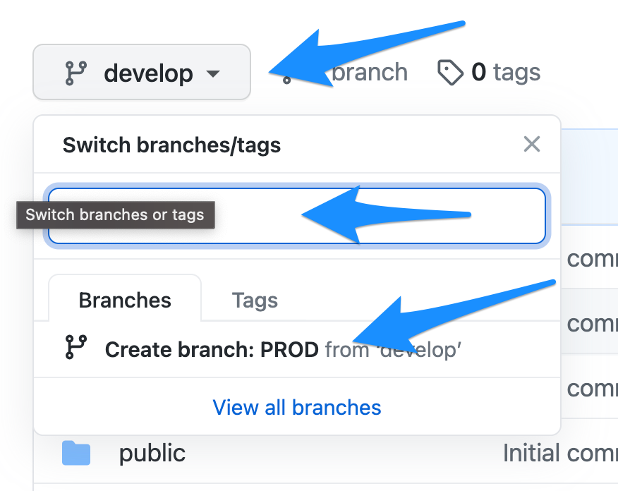
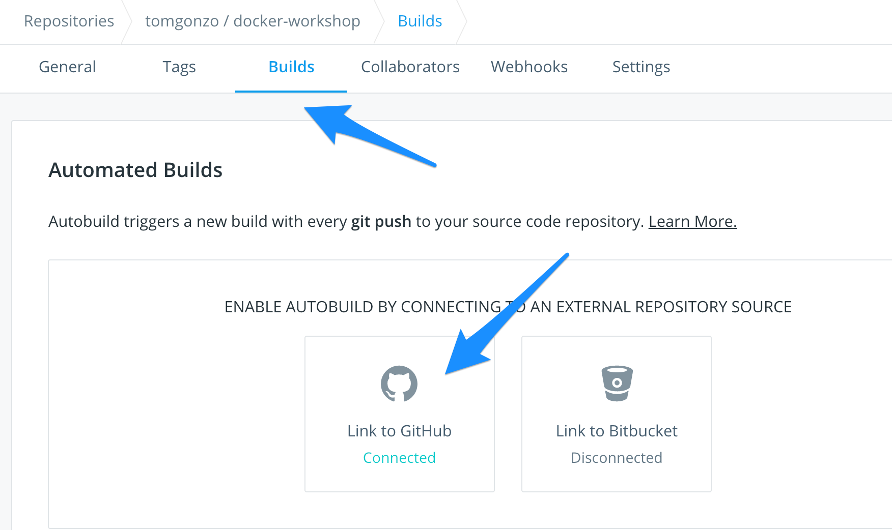
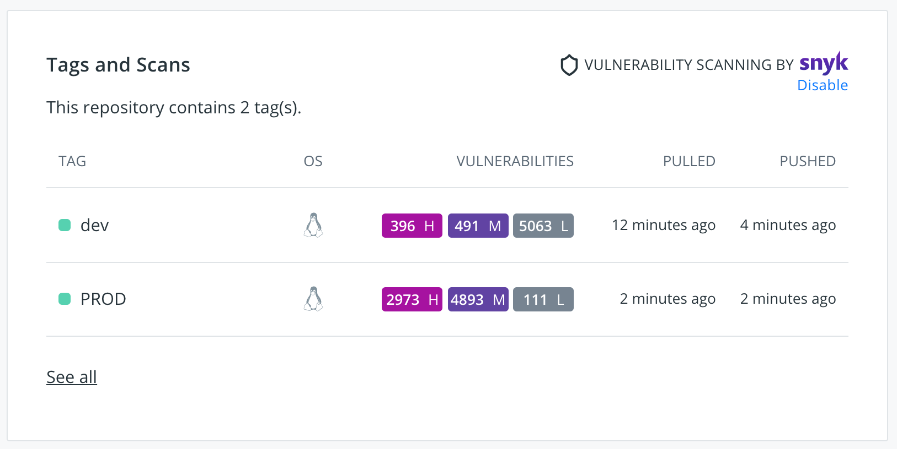

# Set up a container delivery pipeline with vulnerability scanning

Now that we know our container builds and runs, we'll set up a delivery pipeline to differentiate the PROD-ready version of our container, from the `dev` tag we're actively developing.

We'll use Git branches to track these two states of our code.

## Create a GitHub branch for the PROD code

In GitHub, create a new branch. Call it PROD.



That's all for now! Now, let's set up the CD portion of our pipeline in Docker Hub.

## Configure Docker Hub for Continuous Delivery

We can use Docker Hub's Autobuild to re-build our PROD Container every time changes are pushed into our repo's PROD branch. Navigate to the repo for the `goof` container created in the last step.

### Optional: Enable Vulnerability Scanning


This step requires a paid Docker Hub subscription


Navigate to the Repository settings, then click the button to enable Vulnerability Scanning.


Docker Hub uses Snyk to scan for vulnerabilities as images are pushed into Docker Hub. Combined with Autobuild, Docker Hub will update vulnerability counts each time our PROD container is re-built.

### Configure AutoBuild for the GitHub repo's PROD branch

Next up, navigate to `Builds`. AutoBuild requires you to connect Docker Hub to GitHub.



Select your GitHub Repo from the drop-down list.


Configure the rules to use the PROD branch, and to tag the built image PROD. Trigger the build.


Once Autobuild completes, you'll see the PROD container, and its vulnerabilities, next to the dev container we pushed earlier in the Repo overview Tab.



Our container has many vulnerabilities! It's not good to wait until PROD to catch these, so we'll set up CI workflows with GitHub Actions to catch vulnerabilities as part of the Pull Request process.

## Set up CI and Snyk scans with GitHub Actions

The sample repo includes two GitHub Actions templates that run when Pull Requests are opened against the PROD branch. They can be found in the repo's `.github/workflows` folder.

* The first one will fail if high severity vulnerabilities with available fixes are found
* The second one builds the application and container, then scans with Snyk Container

The Container task ensures our application builds correctly after code changes, and will not fail the check in case of vulnerabilities.



```text
name: Check for Open Source Vulnerabilities with Snyk
on: 
  pull_request:
    branches:
      PROD
jobs:
  oss-security:
    runs-on: ubuntu-latest
    steps:
    - uses: actions/checkout@master
    - name: Check for High Severity OSS Vulnerabilities
      uses: snyk/actions/node@master
      env:
        SNYK_TOKEN: ${{ secrets.SNYK_TOKEN }}
      with:
        args: --severity-threshold=high --fail-on=upgradable
```



```text
name: CI task for PROD branch

on:
  pull_request:
    branches: [ PROD ]

jobs:
  build_app:
    runs-on: ubuntu-latest
    steps:
    - uses: actions/checkout@v2
    - name: Use Node.js 12.x
      uses: actions/setup-node@v1
      with:
        node-version: 12.x
    - run: npm ci
    - run: npm run build --if-present
  build_container:
    needs: [build_app]
    runs-on: ubuntu-latest
    steps:
      - uses: actions/checkout@v2
      - name: Setup up Docker Buildx
        uses: docker/setup-buildx-action@v1
      - name: Build Docker Image
        id: docker_build
        uses: docker/build-push-action@v2
        with:
          push: false
          load: true
          tags: goof:PROD         
      - name: Snyk Container Test
        continue-on-error: true
        uses: snyk/actions/docker@master
        env:
          SNYK_TOKEN: ${{ Secrets.SNYK_TOKEN }}
        with:
          image: goof:PROD
          args: --file=Dockerfile
      - name: Upload Container Scan results to GitHub Code Scanning
        uses: github/codeql-action/upload-sarif@v1
        with:
          sarif_file: snyk.sarif
```



To use these workflows, you'll need to save a Snyk Token into GitHub.

#### Retrieve your Snyk Token

You can find your API Token one of two ways:

* If you have the Snyk CLI, retrieve it by running `snyk config get api`
* In the Snyk UI, head to your account [Settings Page](https://app.snyk.io/account) and retrieve it.



Stuck? Check out [Revoking and regenerating Snyk API Tokens](https://support.snyk.io/hc/en-us/articles/360004008278-Revoking-and-regenerating-Snyk-API-tokens)


#### Store the Snyk Token in GitHub Secrets

Store the Token in the Forked Repo's secrets by navigating to Settings -&gt; Secrets -&gt; New Repository Secret. Name the Secret `SNYK_TOKEN`



Stuck? Check out [Creating Encrypted Secrets for a Repository](https://docs.github.com/en/free-pro-team@latest/actions/reference/encrypted-secrets#creating-encrypted-secrets-for-a-repository)


With our build and test infrastructure in place, we can start fixing our container vulnerabilities!

