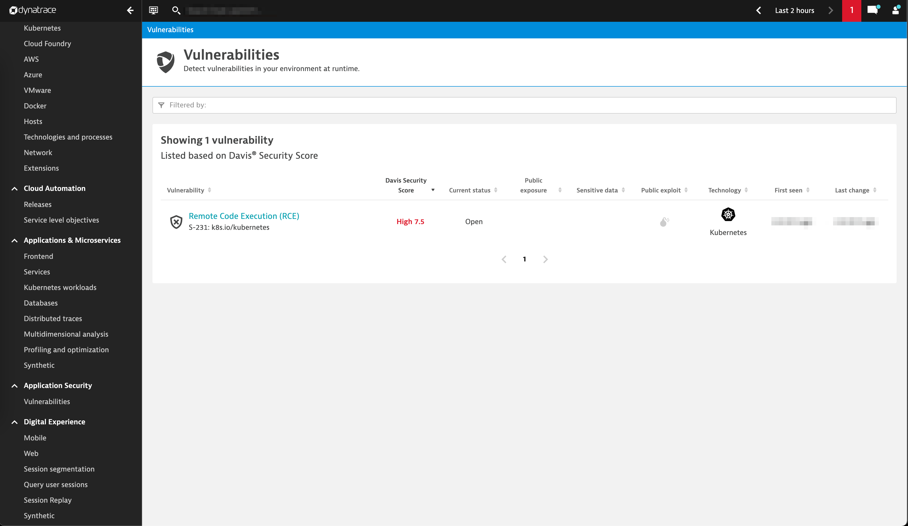
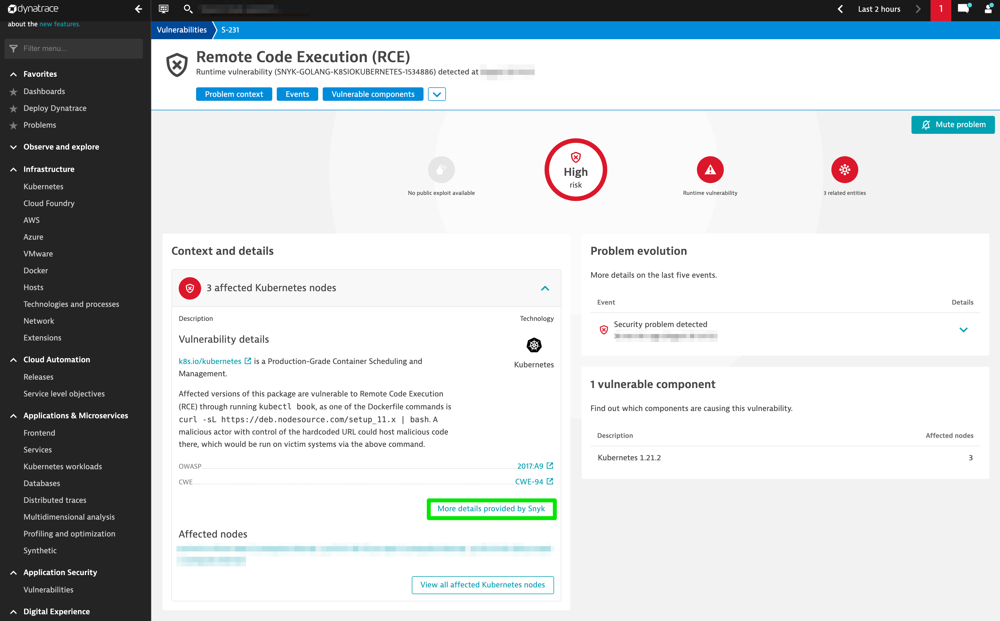
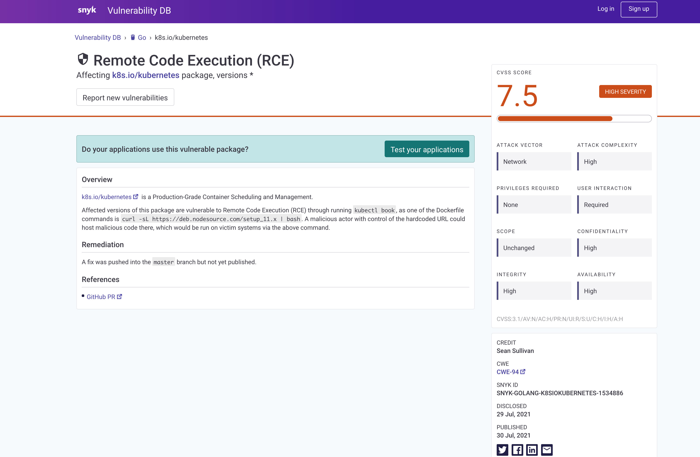
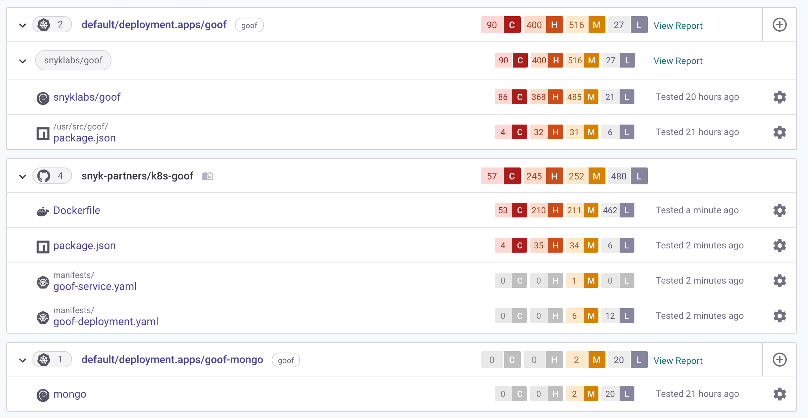

# Findings Reports

## Dynatrace

From your Dynatrace environment, navigate to the **Application Security** menu and **Vulnerabilities** submenu to view monitored resources.

You can drill down to specific vulnerabilities by clicking on the link to see additional contextual information such as affected nodes and link to Snyk for details.

Clicking on the **More details provided by Snyk** button as shown above will provide a more detailed report for the particular vulnerability.

## Snyk

Since we have also deployed the Snyk Monitor on this cluster along with the Dynatrace OneAgent, we are able to obtain additional details such as container base image upgrade recommendation, application misconfigurations as well as fix advice across these and the application code as well.

In the example above, we have imported our Kubernetes projects and have also imported our source in GitHub following the guidance on our [Snyk SCM Integrations Best Practices Guide](https://support.snyk.io/hc/en-us/articles/360018010597-Snyk-SCM-integration-good-practices).

With these integrations in place, we are able to quickly identify specific vulnerabilities and exploits running in our environment and more importantly, how to fix them!

