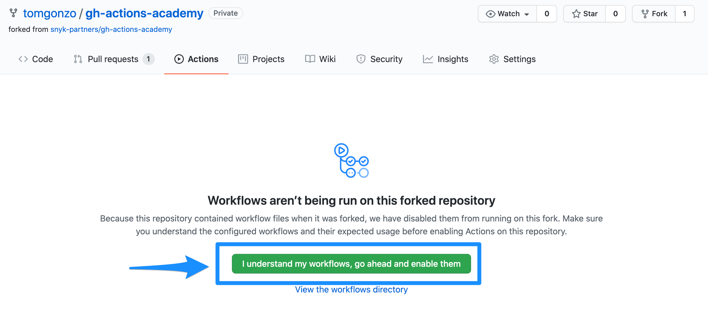

# Securing a Toolchain with Snyk and GitHub

## Lab Meta

> **Difficulty**: Intermediate
>
> **Time to Complete:** 60 minutes

The lab has three parts, to be completed in sequence. Each covers a different Snyk product.

1. Part 1 covers fixing Open Source vulnerabilities in the Sample App.
2. Part 2 adds Dockerfile and Container Security Scanning to the pipeline.
3. Part 3 adds Deployment YAML and Infrastructure as Code Scans.

### Pre-Requisites

* GitHub Account. If you need one, [sign up free at GitHub](https://github.com/join).
* Snyk Account. If you need one, [sign up free at snyk.io](https://app.snyk.io/login)

You'll also need to fork the GitHub Repo with the sample application.



### Branch Structure

The Repo is structured as follows:

* A _PROD_ branch that represents the deploy-ready state of the code.
* A _develop_ branch that is the default branch we'll be working with.
* A _oss-actions_ branch that will be used for Part 1.
* A _container-actions_ branch that will be used for Part 2.
* A _iac-actions_ branch that will be used for Part 3.

### GitHub Actions Workflows

When you fork a Repo with existing workflows, GitHub disables GitHub Actions by default. To enable GitHub Actions, click on the Actions Tab, and then "Enable my Workflows".

The `.github.workflows` folder contains CI workflows for the `develop` and `PROD` branches. These rebuild and test the app when code is pushed to the branch, to ensure no breaking changes are introduced. We'll add onto these files throughout the Lab to do more with GitHub Actions.

When ready, head on to Part 1 and get started!

