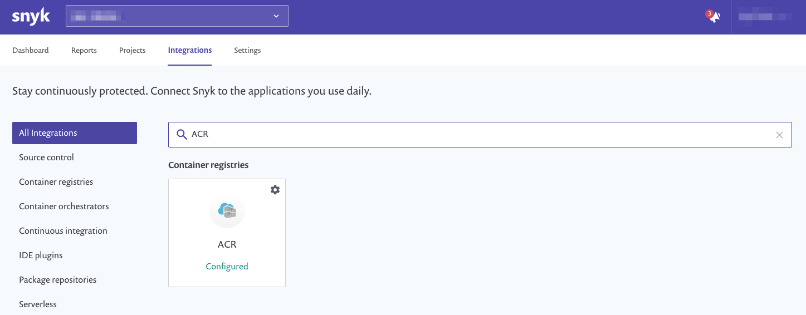

# Configure the ACR integration

## Create a service principal

It is recommended that you assign a [service principal](https://docs.microsoft.com/en-us/azure/active-directory/develop/app-objects-and-service-principals) to your registry. Please review the [Authenticate with an Azure container registry](https://docs.microsoft.com/en-us/azure/container-registry/container-registry-authentication) documentation for further information on this topic.

To simplify this process, you will find a sample `bash` script in the `scripts/` directory of your cloned repo. From the terminal, let's make sure we are at the root of our cloned repository by typing `pwd` and verifying the result displays `$HOME/snyk-azure-resources/`.

Then, let's change directory by typing the following command:

```bash
cd scripts/
```

From here, a simple `ls -a` command will show the contents and you will see the `create-acr-service-principal.sh` script in that directory. You can open this in your favorite editor like [Microsoft Visual Studio Code](https://code.visualstudio.com/) and review the contents.

These will look like this:

```bash
#!/bin/bash

# Modify for your environment.
# ACR_NAME: The name of your Azure Container Registry
# SERVICE_PRINCIPAL_NAME: Must be unique within your AD tenant
ACR_NAME=${1}
SERVICE_PRINCIPAL_NAME=acr-service-principal

# Obtain the full registry ID for subsequent command args
ACR_REGISTRY_ID=$(az acr show --name $ACR_NAME --query id --output tsv)

# Create the service principal with rights scoped to the registry.
# Default permissions are for docker pull access. Modify the '--role'
# argument value as desired:
# acrpull:     pull only
# acrpush:     push and pull
# owner:       push, pull, and assign roles
SP_PASSWD=$(az ad sp create-for-rbac --name http://$SERVICE_PRINCIPAL_NAME --scopes $ACR_REGISTRY_ID --role acrpull --query password --output tsv)
SP_APP_ID=$(az ad sp show --id http://$SERVICE_PRINCIPAL_NAME --query appId --output tsv)

# Output the service principal's credentials; use these in your services and
# applications to authenticate to the container registry.
echo "Service principal ID: $SP_APP_ID"
echo "Service principal password: $SP_PASSWD"
```

To run the script simply invoke it from the present working directory and pass the ACR name, `mysnykcontainerregistry` as a parameter as follows:

```bash
./create-acr-service-principal.sh mysnykcontainerregistry
```

Upon successful completion, you will see results similar to the following:

```text
Creating a role assignment under the scope of "/subscriptions/<guid>/resourceGroups/mySnykACRResourceGroup/providers/Microsoft.ContainerRegistry/registries/mySnykContainerRegistry"
  Retrying role assignment creation: 1/36
Service principal ID: <guid>
Service principal password: <guid>
```

Take note of the values for `Service principal ID` and `Service principal password`. You will need these to configure the integration in the following steps so **DO NOT** close or clear your terminal window.

## Enable the integration

From the Snyk web console, navigate to `Integrations`. Search and select `ACR`. Click the tile.



Follow the steps outlined in the following diagram and provide the `Service principal ID` `Service principal password` and `loginServer` value for your ACR instance:


Remember to save your settings!

