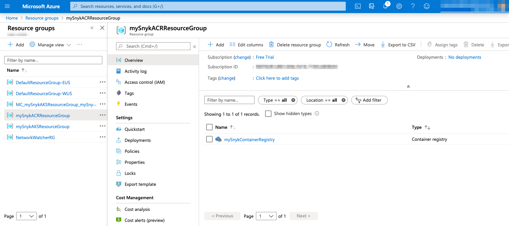

# Provision Azure services

## Background

In order to understand the various Snyk integration points to Azure, we are going to deploy and configure some supporting resources. The objective for these exercises is to demonstrate how Snyk secures your workloads. We will provide basic patterns intended for use in learning environments. For a deeper dive and learning more about Azure, we suggest referencing Microsoft's self-paced [training modules](https://docs.microsoft.com/en-us/learn/browse/?products=azure).

## Deploy Azure Container Registry \(ACR\)

The following examples are based on an [Azure Quickstart ](https://docs.microsoft.com/en-us/azure/container-registry/container-registry-get-started-azure-cli)for deploying ACR using the CLI. We will deploy an Azure Container Registry instance using the Azure CLI, then tag and push container images into the registry.

### Create a resource group

We begin by creating an [Azure resource group](https://docs.microsoft.com/en-us/learn/modules/control-and-organize-with-azure-resource-manager/2-principles-of-resource-groups) to logical organize the resources we will deploy and manage. Here, we will also define the location where our resources will run in Azure. In this case, we will deploy to the `eastus` location. From your terminal, run the following command:

```bash
az group create --name mySnykACRResourceGroup --location eastus
```

When successfully completed, you will see output similar to the following:

```javascript
{
  "id": "/subscriptions/<guid>/resourceGroups/mySnykACRResourceGroup",
  "location": "eastus",
  "managedBy": null,
  "name": "mySnykACRResourceGroup",
  "properties": {
    "provisioningState": "Succeeded"
  },
  "tags": null,
  "type": "Microsoft.Resources/resourceGroups"
}
```

You can also validate the creation of the resource group in the Azure portal as illustrate below:


### Create the ACR instance

Next, we are going to create a registry named `mySnykContainerRegistry` in our recently created `mySnykACSResourceGroup`.

```bash
az acr create \
--resource-group mySnykACRResourceGroup \
--name mySnykContainerRegistry \
--sku Basic
```

Once the deployment completes the CLI will return a lengthy JSON response containing details about your registry. You will want to make a note of the `loginServer` value as that will be needed later on for authentication.

```javascript
{- Finished ..
  "adminUserEnabled": false,
  "creationDate": "<timestamp>",
  "dataEndpointEnabled": false,
  "dataEndpointHostNames": [],
  "encryption": {
    "keyVaultProperties": null,
    "status": "disabled"
  },
  "id": "/subscriptions/<guid>/resourceGroups/mySnykACRResourceGroup/providers/Microsoft.ContainerRegistry/registries/mySnykContainerRegistry",
  "identity": null,
  "location": "eastus",
  "loginServer": "mysnykcontainerregistry.azurecr.io",
  "name": "mySnykContainerRegistry",
  "networkRuleSet": null,
  "policies": {
    "quarantinePolicy": {
      "status": "disabled"
    },
    "retentionPolicy": {
      "days": 7,
      "lastUpdatedTime": "<timestamp>",
      "status": "disabled"
    },
    "trustPolicy": {
      "status": "disabled",
      "type": "Notary"
    }
  },
  "privateEndpointConnections": [],
  "provisioningState": "Succeeded",
  "resourceGroup": "mySnykACRResourceGroup",
  "sku": {
    "name": "Basic",
    "tier": "Basic"
  },
  "status": null,
  "storageAccount": null,
  "tags": {},
  "type": "Microsoft.ContainerRegistry/registries"
}
```

You can also view this within the Azure portal:



### Log in to registry

We will need to log in to the registry before performing any operations such as `docker push` or `docker pull`. To do so, run the following command:

```bash
az acr login --name mySnykContainerRegistry
```

The command will return `Login Succeeded` if you provided the correct values.

