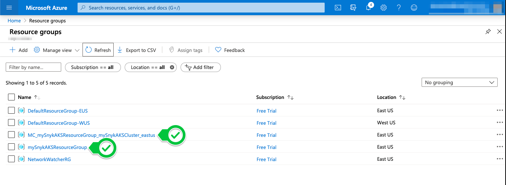
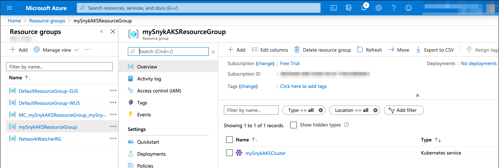
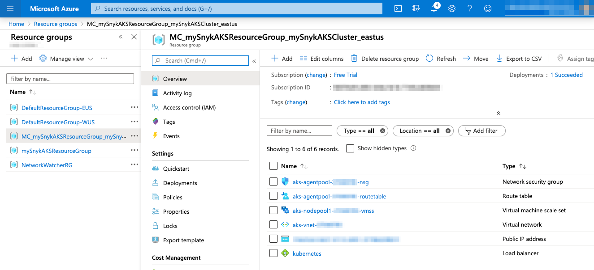

# Provision Azure services

## Background

In order to understand the various Snyk integration points to Azure, we are going to deploy and configure some supporting resources. The objective for these exercises is to demonstrate how Snyk secures your workloads. We will provide basic patterns intended for use in learning environments. For a deeper dive and learning more about Azure, we suggest referencing Microsoft's self-paced [training modules](https://docs.microsoft.com/en-us/learn/browse/?products=azure).

## Deploy Azure Kubernetes Service \(AKS\)

The following examples are based on an [Azure Quickstart](https://docs.microsoft.com/en-us/azure/aks/kubernetes-walkthrough) for deploying AKS using the CLI. We will deploy a cluster as well as a sample multi-container application. The application will include both a web front end as well as a Redis instance.

### Create a resource group

We begin by creating an [Azure resource group](https://docs.microsoft.com/en-us/learn/modules/control-and-organize-with-azure-resource-manager/2-principles-of-resource-groups) to logical organize the resources we will deploy and manage. Here, we will also define the location where our resources will run in Azure. In this case, we will deploy to the `eastus` location. From your terminal, run the following command:

```bash
az group create --name mySnykAKSResourceGroup --location eastus
```

When successfully completed, you will see output similar to the following:

```javascript
{
  "id": "/subscriptions/<guid>/resourceGroups/mySnykAKSResourceGroup",
  "location": "eastus",
  "managedBy": null,
  "name": "mySnykAKSResourceGroup",
  "properties": {
    "provisioningState": "Succeeded"
  },
  "tags": null,
  "type": "Microsoft.Resources/resourceGroups"
}
```

You can also validate the creation of the resource group in the Azure portal as illustrate below:


### Create the AKS cluster

Next, we are going to create a cluster named `mySnykAKSCluster` in our recently created `mySnykAKSResourceGroup`. Our cluster will have one node and will have monitoring enabled.

```bash
az aks create --resource-group mySnykAKSResourceGroup --name mySnykAKSCluster --node-count 1 --enable-addons monitoring --generate-ssh-keys
```

This may take several minutes to complete. You will see the following outputs in the terminal:

```text
Finished service principal creation[##########################]  100.0000%
- Running...
AAD role propagation done[[##########################]  100.0000%
```

Once the deployment completes the CLI will return a lengthy JSON response containing details about your cluster. You can also view this within the Azure portal:

_**Figure 1**_



_**Figure 2**_



_**Figure 3**_



### Connect to the cluster

To manage our AKS cluster, we will use [kubectl](https://kubernetes.io/docs/user-guide/kubectl/). Since we are using the Azure CLI, we will need to install `kubectl` with the following command:

```bash
az aks install-cli
```

Next, we will need to configure `kubectl` to connect to AKS by downloading our credentials and configuring the CLI to use these.

```bash
az aks get-credentials --resource-group mySnykAKSResourceGroup --name mySnykAKSCluster
```

If successful, you should see output similar to this:

```text
Merged "mySnykAKSCluster" as current context in $HOME/.kube/config
```

Now, we are ready to verify our connection to our cluster.

```bash
kubectl get nodes
```

When the node is ready, you should see an example output similar to the following:

```text
NAME                                STATUS   ROLES   AGE   VERSION
aks-nodepool1-27048785-vmss000000   Ready    agent   5m    v1.15.10
```

