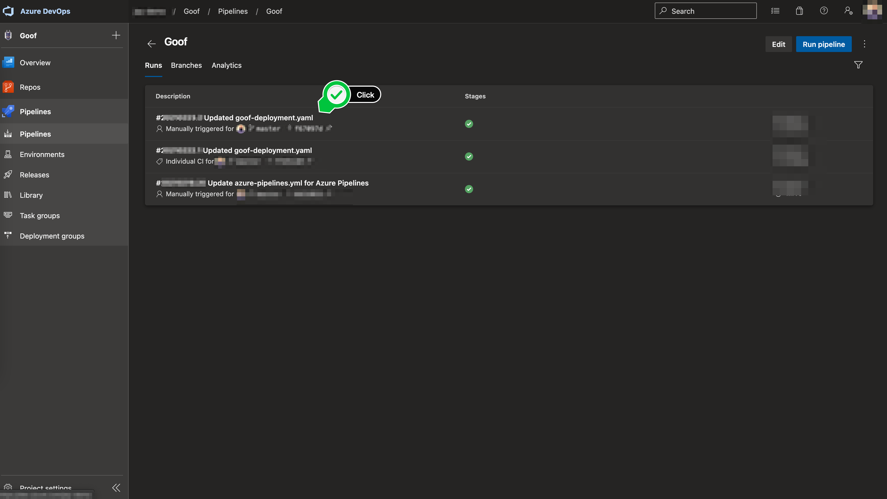
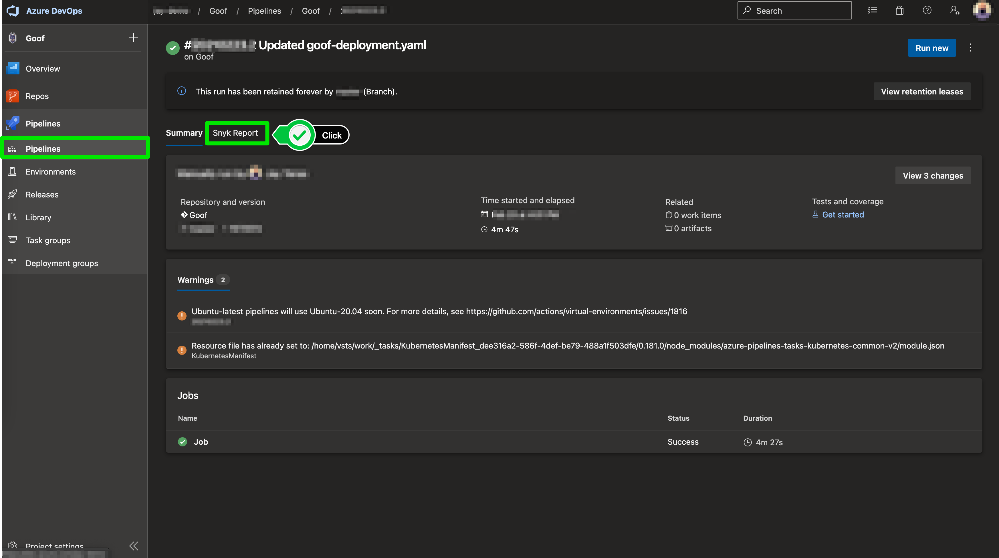
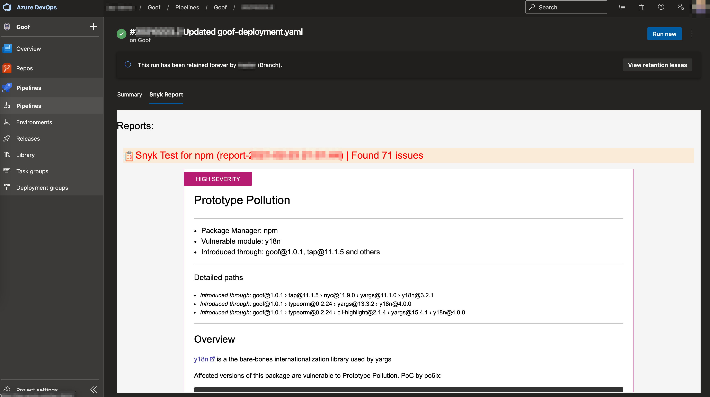

# Scanning

With the Snyk extension installed and configured and a working azure-pipelines.yml setup, you are ready to scan your code as part of your CI/CD workflow. The next pipeline run, will include a Snyk scan with a findings report.

Let's take a look at the example shown below:

Here we see a recent pipeline run. We will click on the latest run to view details. Notice that there is a **Snyk Report** tab available within Azure Pipelines. Let's click it!

Now, we are able to view a summary report containing findings.

Let's move onto the final section on interpreting our scan results!

