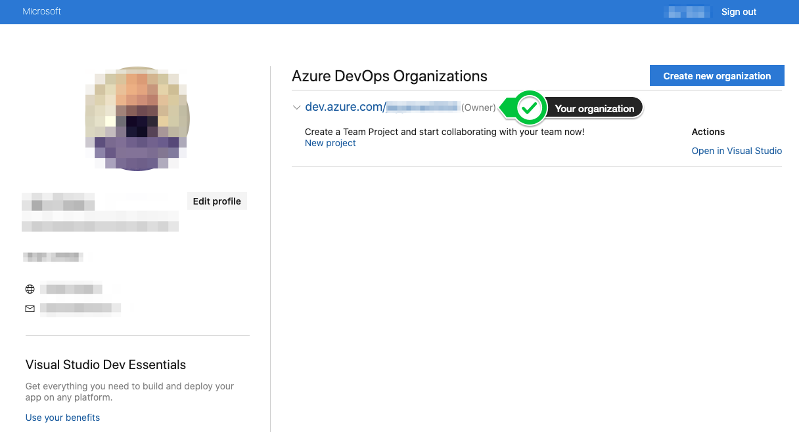

# Getting started

## Background

In **Securing AKS with Snyk** we learned how to quickly deploy an application to a Kubernetes cluster running on Microsoft Azure Kubernetes Service \(AKS\) using [manifest](https://kubernetes.io/docs/concepts/cluster-administration/manage-deployment/) templates. Then, in **Securing ACS with Snyk**, we learned how to build container images using `Dockerfile` and securely storing these in ACR for later consumption. This allowed us more visibility and control over our application as we are able to define which resources we will consume and from where we will consume those resources. However, when we examined our container images scanned by Snyk, we noticed the following alert:


In this module, we will expand on best practices for building container images. We will build upon previous modules that taught how to leverage Snyk to secure a Kubernetes cluster and scan a private registry like ACR. We will provide prescriptive guidance on securing source code management systems in order to provide comprehensive security of your entire workflow.

## Azure DevOps CLI

In the main **Getting started** section of the **Microsoft Azure** series, we covered setting up the Azure CLI. Now, we will add the Azure DevOps extension for Azure CLI allowing you to work in a more streamlined manner.

Run the following command from your terminal:

```bash
az extension add --name azure-devops
```

You should see a confirmation message indicating these were installed successfully. Next, after [creating](https://azure.microsoft.com/en-us/services/devops/) your Azure DevOps account, you should have an Organization. Please refer to the following figure for where to find this from your [Azure DevOps portal](https://aex.dev.azure.com/):



For more detailed instructions, please refer to the [Sign up, sign in to Azure DevOps Quickstart](https://docs.microsoft.com/en-us/azure/devops/user-guide/sign-up-invite-teammates?view=azure-devops). The organization should be in the format `https://dev.azure.com/MyOrganizationName` Now, let's sign in on the terminal by running `az login` from the terminal and configure the CLI with our `organization` value by running the following command:

```bash
az devops configure --defaults organization=https://dev.azure.com/MyOrganizationName/
```


Be sure to substitute `MyOrganizationName`with the correct value.


