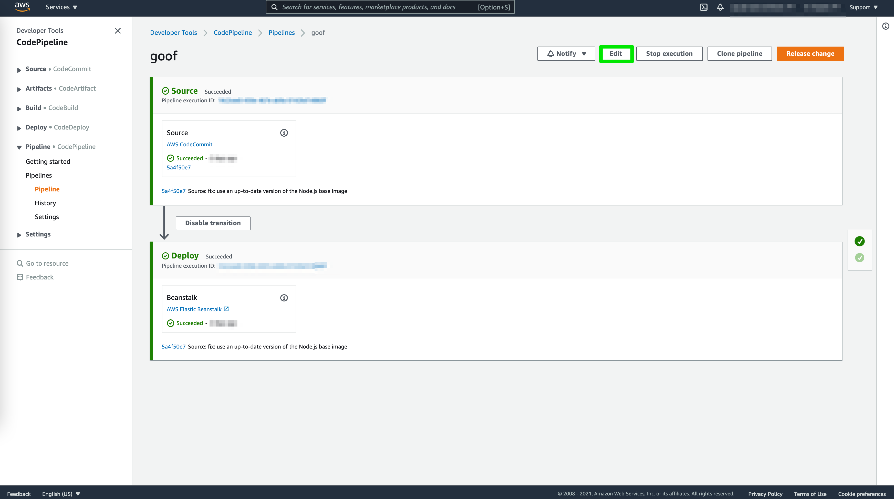
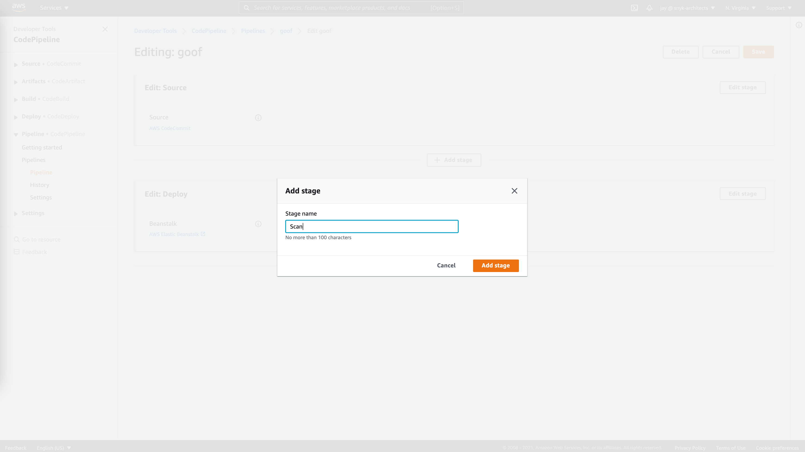
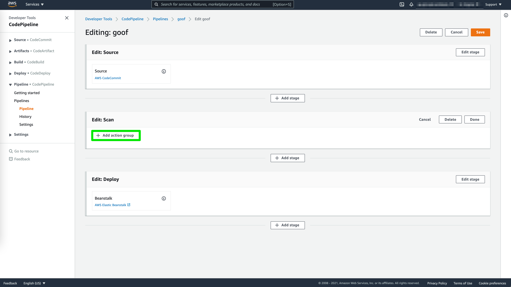
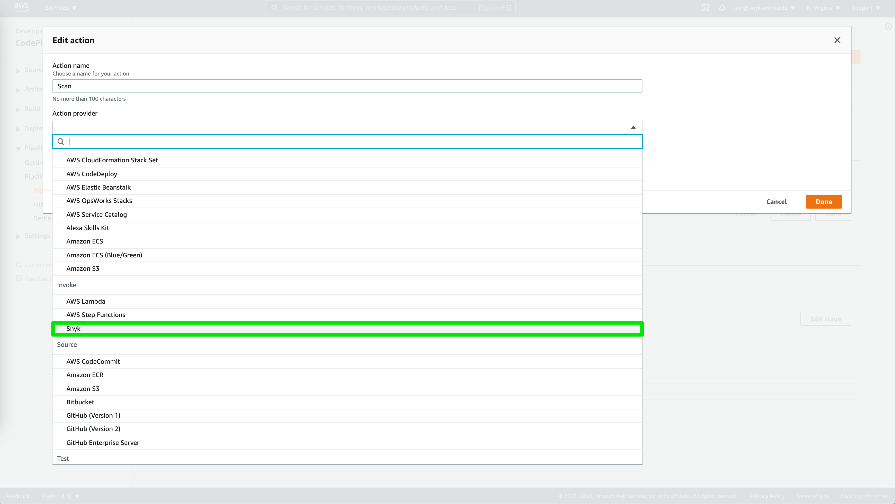
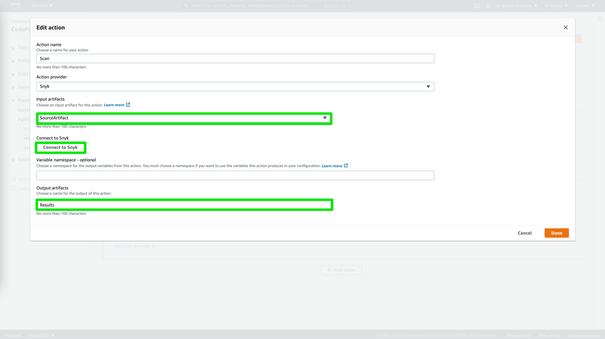

# Editing the pipeline

Our example pipeline begins with a clone of Snyk's favorite vulnerable demo app, [Goof](https://github.com/snyk/goof). This application was cloned into an [AWS CodeCommit ](https://aws.amazon.com/codecommit/)repository, but you can use any [source control](https://aws.amazon.com/devops/source-control/) integrations supported by CodePipeline as [source action integrations](https://docs.aws.amazon.com/codepipeline/latest/userguide/integrations-action-type.html#integrations-source).

We have chosen to deploy our application to [AWS Elastic Beanstalk](https://aws.amazon.com/elasticbeanstalk/) in this example but you can choose any of the supported [deploy action integrations ](https://docs.aws.amazon.com/codepipeline/latest/userguide/integrations-action-type.html#integrations-deploy)supported by CodePipeline. 

From the AWS CodePipeline console, select the desired pipeline and click the **Edit** button as shown in the image above.

Next, immediately after the **Source** stage, click on the **Add stage** button.

Provide a name for your stage. This can be anything that makes sense to you, but for our example, we will name it **Scan** and confirm by clicking the button.

Now, we will click on **Add action group** within our **Scan** stage.

This will bring up a dialogue box with a pull-down menu where we can either scroll down and select **Snyk** or simply search for it. Let's select **Snyk**!

We will also need to specify our **Input artifacts** as well as our **Output artifacts.** These will be **SourceArtifact** and **Results**, respectively. SourceArtifact will reference whatever you configured during your **Source** stage and the output artifact can be named something of your choosing. 

When ready, we will click on the **Connect to Snyk** button.

