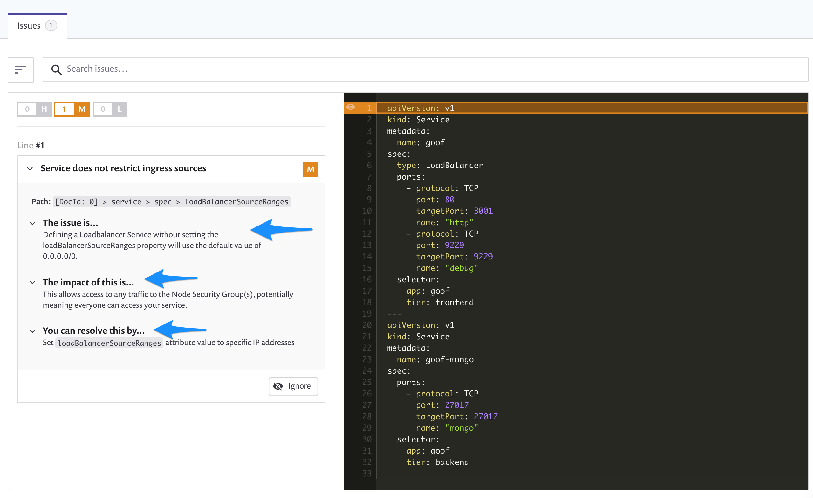
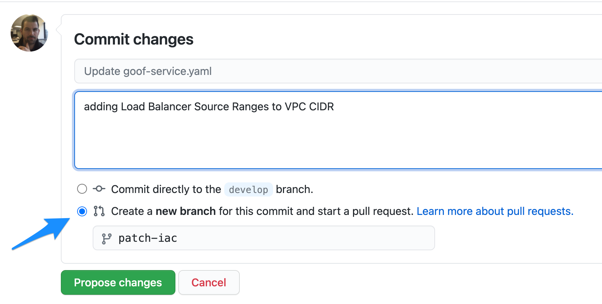
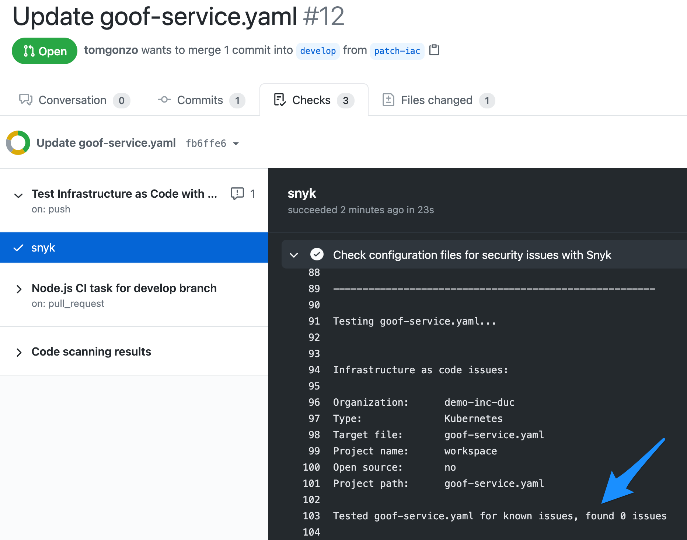

# Section 9: Unblock the PROD Deployment

## Step 1: Fix the issue in the Service definition YAML file

In the Project issues, Snyk calls out the issue identified, its impact, and how it can be resolved. It also highlights the line of code where the issue exists. In this case, an issue was identified in our `goof-service.yaml` file because the Load Balancer, as currently defined, is open to the world.



In some scenarios, such as when our load balancer being open to the world is by design because it's a client-facing web application, we can choose to ignore the issue. In this case, let's assume our Kubernetes cluster sits in a VPC, and an external Application Load Balancer is in use. We'll restrict this Kubernetes Load Balancer to the CIDR Block for our imaginary VPC. 

Open  `goof-service.yaml`  with the GitHub Web Editor, and replace the contents with the following:

```text
apiVersion: v1
kind: Service
metadata:
  name: goof
spec:
  type: LoadBalancer
  loadBalancerSourceRanges:
    - "143.231.0.0/16"
  ports:
    - protocol: TCP
      port: 80
      targetPort: 3001
      name: "http"
    - protocol: TCP
      port: 9229
      targetPort: 9229
      name: "debug"
  selector:
    app: goof
    tier: frontend
---
apiVersion: v1
kind: Service
metadata:
  name: goof-mongo
spec:
  ports:
    - protocol: TCP
      port: 27017
      targetPort: 27017
      name: "mongo"
  selector:
    app: goof
    tier: backend
```

When ready, propose changes by creating a new branch and opening a Pull Request. This will trigger our IaC verification workflow we set up earlier.



When checks complete, in the run details for the IaC workflow, we can appreciate that no other issues are present in the `goof-service.yaml` file. 



Go ahead and merge the PR. Our CI workflows for the `develop` branch will now kick on. Once they complete, we can see that in both the GitHub Security Code Scanning results, as well as in the Snyk UI, the issue from our `goof-service.yaml` has vanished! Well done! 

## Step 2: Fix the issues in the Deployment manifest

Now, on to the `goof-deployment.yaml` file and its 4 blocking issues. This file actually contains two deployment definitions: one for the database, and another for the app's frontend. The four blocking issues are actually two issues, present in both deployments. Let's take a look in the Snyk UI. 


The first issue states that our container is running without root user control. The second issue, in a similar vein, tells us the container runs with potentially unnecessary privileges. We can fix both of these issues by adding a securityContext in our container's spec.


This is a practical example. It's possible your application requires administrative privileges or other explicitly stated privileges. Know your application and its dependencies before arbitrarily making changes to your files, you could break your deployment if you're not careful.


Setting our SecurityContext to `runAsNonRoot` will require the container to run with a user with a UID other than 0, and dropping capabilities will restrict how our container interacts with the cluster. Using the GitHub Web Editor, modify the goof-deployment file's `spec` for both deployments.

#### Add Security Context to the App Container

```text
spec:
  containers:
    - name: goof-app
      image: goof:PROD
      ports:
        - containerPort: 3001
        - containerPort: 9229
      env:
        - name: DOCKER
          value: "1"
      securityContext:
        runAsNonRoot: true
        capabilities:
          drop: 
            - all
```

#### Add Security Context to the DB Container

```text
spec:
  containers:
    - name: goof-mongo
      image: mongo
      ports:
       - containerPort: 27017
      securityContext:
        runAsNonRoot: true
        capabilities:
          drop:
            - all
```


It's possible to set securityContext for both the Pod and the Containers it runs. In this case, we're setting securityContext for the containers. Learn more in the [Kubernetes Documentation](https://kubernetes.io/docs/tasks/configure-pod-container/security-context/).


Merge the changes into the `develop` branch and wait for the CI workflows to run. Like before, the issue counts will be updated in both GitHub Security Code Scanning and the Snyk UI.

## Step 3: Merge our changes into PROD

Back in Section 7, our Snyk Gate blocked the Pull Request we creates from `develop` into `PROD`. Now that we've fixed the issues in our files, back in the Pull Request, we can appreciate that our tests re-ran and this time the Snyk Security Gate is pleased with the changes we made.


With this assurance, we can merge our changes into PROD. Once merged, our CI workflows will re-run for `PROD`. If we had a workflow to re-deploy our application, it would also run. 

That's it! You reached the end of this lab! Check out the next section to recap what you accomplished.

