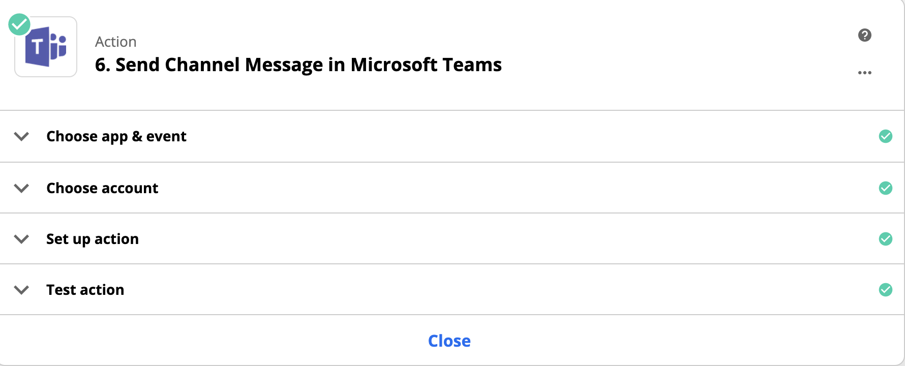
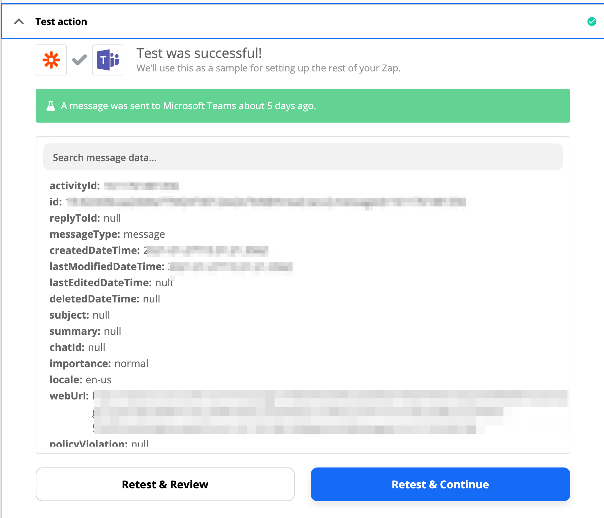

# Send Message

Lastly, create an **Action** and name it **Send Channel Message in Microsoft Teams**:



Select **Send Channel Message** for the **Microsoft Teams** app:


Choose your Microsoft Teams account:


Choose your Channel and select **Markdown** for the **Message Text Format**:


Copy and paste the following snippet into the **Message Text** field:

```markup
# New Issue
We found vulnerabilities that affect [{{project__name}}]({{project__browseUrl}}) project in the [{{org__name}}]({{org__url}}).

## Details:
<div class="issue">
  <p>{{newIssues}}</p>
</div>
```


You will need to update the fields accordingly to correspond with those mapped from your payload.


Test your action:



