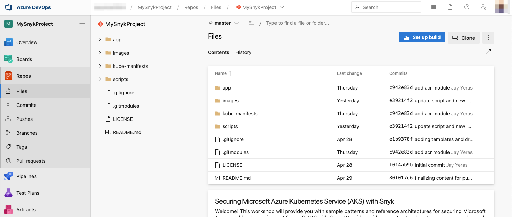

# Working with repos

### Background


If you haven't already done so, you are encouraged to [`clone`](https://github.com/snyk-partners/snyk-azure-resources.git) or [`fork`](https://github.com/snyk-partners/snyk-azure-resources/fork) the repository for these workshops as these will be necessary to complete some of the following steps. 


In this section, we will work with the [`az repos list`](https://docs.microsoft.com/en-us/cli/azure/ext/azure-devops/repos?view=azure-cli-latest) command to query our `git clone` url. We will then  add our Azure Repo as an `upstream` repository and `git push` our code.

#### Create the project

From the terminal, run the following command:

```bash
az repos list --project mySnykProject
```

This should output JSON similar to the following:

```javascript
[
  {
    "defaultBranch": null,
    "id": "<guid>",
    "isFork": null,
    "name": "MySnykProject",
    "parentRepository": null,
    "project": {
      "abbreviation": null,
      "defaultTeamImageUrl": null,
      "description": null,
      "id": "<guid>",
      "name": "MySnykProject",
      "revision": 21,
      "state": "wellFormed",
      "url": "https://dev.azure.com/myOrganizationName/_apis/projects/<guid>",
      "visibility": "private"
    },
    "remoteUrl": "https://myOrganizationName@dev.azure.com/myOrganizationName/MySnykProject/_git/MySnykProject",
    "size": 0,
    "sshUrl": "git@ssh.dev.azure.com:v3/myOrganizationName/MySnykProject/MySnykProject",
    "url": "https://dev.azure.com/myOrganizationName/<guid>/_apis/git/repositories/<guid>",
    "validRemoteUrls": null,
    "webUrl": "https://dev.azure.com/myOrganizationName/MySnykProject/_git/MySnykProject"
  }
]
```

#### Connect to the repo

We recommend using SSH. The following steps will walk you through the necessary steps to set this up. You may opt to use HTTPS, but we will not provide steps for connecting with that method. You can read more about how to [authenticate access with personal access tokens](https://docs.microsoft.com/en-us/azure/devops/organizations/accounts/use-personal-access-tokens-to-authenticate?view=azure-devops&tabs=preview-page) or using [Git Credential Managers to authenticate to Azure Repos](https://docs.microsoft.com/en-us/azure/devops/repos/git/set-up-credential-managers?view=azure-devops) for alternatives.



If you already have an SSH key you would like to use, you can skip this section. Otherwise, proceed with the following steps:

From the terminal, [create your SSH key](https://docs.microsoft.com/en-us/azure/devops/repos/git/use-ssh-keys-to-authenticate?view=azure-devops&tabs=current-page#step-1-create-your-ssh-keys) with the following command:

```bash
ssh-keygen -t rsa -b 4096 -C "your_email@example.com"
```


Use the email address used to authenticate to your Azure portal.


When prompted to enter a file to save your key, **DO NOT** accept the default file location of `/Users/you/.ssh/id_rsa`. Instead, provide a unique file name for your key such as `/Users/you/.ssh/id_rsa_azure`.  Next you will be prompted to provide a secure passphrase:

```text
> Enter passphrase (empty for no passphrase): [Type a passphrase]
> Enter same passphrase again: [Type passphrase again]
```



Start the ssh-agent:

```bash
eval "$(ssh-agent -s)"
```

Add your SSH private key to the ssh-agent:

```bash
ssh-add -K ~/.ssh/id_rsa_azure
```

For macOS, modify `~/.ssh/config` with the following entry:

```text
Host ssh.dev.azure.com 
  Hostname ssh.dev.azure.com 
  AddKeysToAgent yes 
  UseKeychain yes 
  IdentityFile ~/.ssh/id_rsa_azure 
  IdentitiesOnly yes
```

Lastly, copy your SSH public key to your clipboard. You will need this in the next step:

```bash
pbcopy < ~/.ssh/id_rsa_azure.pub
```



With the steps above completed, you are ready to [add the public key to Azure DevOps Services](https://docs.microsoft.com/en-us/azure/devops/repos/git/use-ssh-keys-to-authenticate?view=azure-devops&tabs=current-page#step-2--add-the-public-key-to-azure-devops-servicestfs).

#### Git submodules

The source repository containing the sample code and templates we are providing contains a `submodule` that references a dependent project. When you cloned this repository it contained a `.gitmodules` file that points to the `app/redis` directory. This will appear empty until you run a couple of [`git submodule`](https://git-scm.com/book/en/v2/Git-Tools-Submodules) commands.

From the terminal and the working directory for the cloned project, initialize with the following command:

```bash
git submodule init
```

This should output the following:

```text
Submodule 'app/redis' (git@github.com:docker-library/redis.git) registered for path 'app/redis'
```

Next, let's update recursively so we clone into our directory all files:

```bash
git submodule update --recursive
```

This should output the following:

```text
Cloning into '/Users/you/git/snyk-azure-resources/app/redis'...
Submodule path 'app/redis': checked out '9a598d433acf8fbf3d1f07223c164b3bd7ead3b3'
```

#### Cloning the repo

After identifying which repository in our project we will use, we will invoke the [`az repos show`](https://docs.microsoft.com/en-us/cli/azure/ext/azure-devops/repos?view=azure-cli-latest#ext-azure-devops-az-repos-show) command to provide details of a specific Git repository. From the terminal, let's run the following command:

```bash
az repos show --project mySnykProject --repository mySnykProject --query sshUrl --output tsv
```

In the above command, we will query for the `sshUrl` we will need to clone the repo and outputs this as text. We will then pass that value to the [`git remote`](https://git-scm.com/docs/git-remote) command where we are adding `mySnykProject` as a remote repository:

```bash
git remote add azure $(az repos show --project mySnykProject --repository mySnykProject --query sshUrl --output tsv)
```

We can optionally validate this was successful with the by invoking `git remote` once more but this time passing the `-v` option:

```bash
git remote -v
```

You should see output similar to the following:

```text
azure	git@ssh.dev.azure.com:v3/myOrganizationName/MySnykProject/MySnykProject (fetch)
azure	git@ssh.dev.azure.com:v3/myOrganizationName/MySnykProject/MySnykProject (push)
origin	git@github.com:myGitHub/snyk-azure-resources.git (fetch)
origin	git@github.com:myGitHub/snyk-azure-resources.git (push)
```

Now, we are ready to run our first [`git push`](https://git-scm.com/docs/git-push) command to update our remote repository:

```bash
git push azure master
```


For our example, we will use `master` branch. There are different strategies here such as trunk-based versus feature-driven. These are beyond the scope of this module so we will continue with a simplified approach.


You should see output similar to the following:

```text
Warning: Permanently added the RSA host key for IP address '192.168.1.100' to the list of known hosts.
Enumerating objects: 65, done.
Counting objects: 100% (65/65), done.
Delta compression using up to 16 threads
Compressing objects: 100% (56/56), done.
Writing objects: 100% (65/65), 1.80 MiB | 92.30 MiB/s, done.
Total 65 (delta 6), reused 65 (delta 6)
remote: Storing packfile... done (178 ms)
remote: Storing index... done (76 ms)
To ssh.dev.azure.com:v3/myOrganizationName/MySnykProject/MySnykProject
 * [new branch]      master -> master
```

Alternatively, you can view the files in your repo by visiting the Azure DevOps portal:



