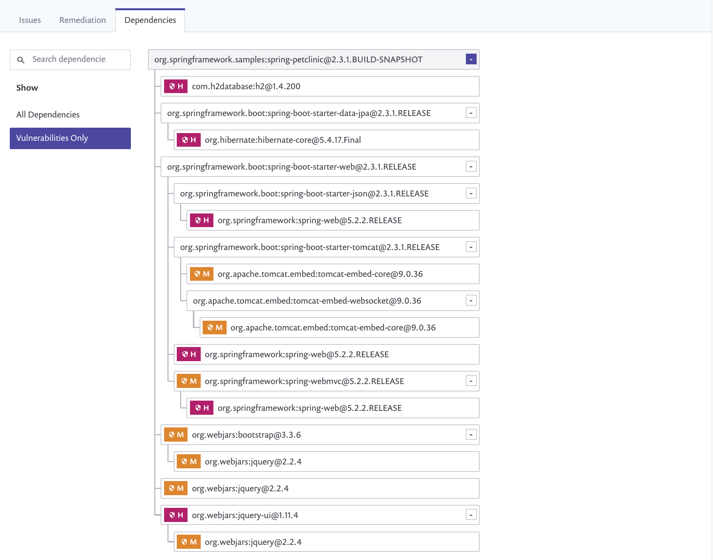

# Review Project Dependency Tree

## Viewing the dependency tree

Synk uses the package manager of your application to build the dependency tree and display it in the Snyk UI. The dependency tree helps visualize which component is introducing the vulnerability and helps Snyk to determine the appropriate remediation advice.

In our sample application, we see how the transitive dependencies introduced a vulnerability into our application by examining the direct dependency **org.springframework.boot:spring-boot-starter-web@2.3.1.RELEASE.** The developer directly included this library into the source code via the pom.xml file and the **org.springframework.boot:spring-boot-starter-web@2.3.1.RELEASE** library had a dependency on **org.springframework.boot:spring-boot-starter-tomcat@2.3.1.RELEASE** which has another dependency **org.apache.tomcat.embed:tomcat-embed-core@9.0.36**. This helps understand how the dependency was introduced to the application and also how Snyk can remediate the issue.


The **org.apache.tomcat.embed:tomcat-embed-core@9.0.36** library is included multiple times due to transitive dependencies.


