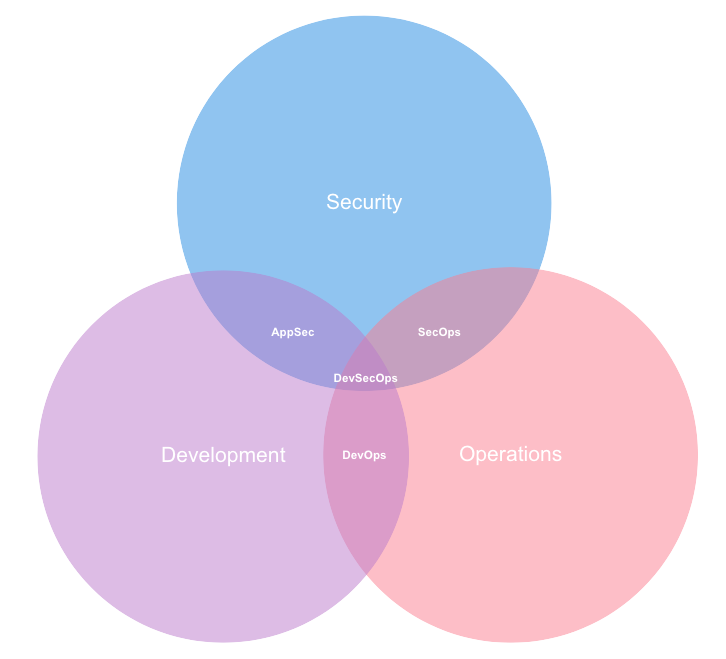

# Workshop Overview

## What is DevSecOps?

DevSecOps is the Venn diagram of IT. It represents where the developer, security, and operations organizations join forces to deliver applications to customers, using automated processes, while proactively addressing security, and maintaining observability and high availability.

While this is the panacea and an incredible feat to accomplish, the reality is most enterprise organizations have a considerable amount of internal change to consider such a goal. In addition, DevSecOps is in its early stages of being formed, much like containers in 2015, and many of the best practices and thought leadership, if you will, are still developing.

## What is the DevSecOps Workshop?

This workshop's focus is to give developers and security teams hands-on experience using the Snyk solutions to solve security-related concerns in the development and CI/CD phases of the SDLC. Addressing application security concerns in these phases of the SDLC is often called "shift-left."

In this workshop, we take the popular Spring Java application called Spring Petclinic \(SPC\) and deploy it as a container-based solution using Kubernetes. We apply the Snyk solutions during the SDLC to demonstrate the first principles of DevSecOps.

Using Snyk solutions, we will cover the following:

**Vulnerability management of open source components \(SCA\)**

* The developer experience using a Snyk before committing code. 
* Using Snyk to automate vulnerabilities in source code
* Using Snyk to provide security gates in CI/CD 
* License compliance of open source components

**Container security**

* Synk's container solution to scan container images.
* Using Snyk to remediate vulnerability issues

  **Infrastructure as Code \(IaC\)**

* Snyk's IaC for Kubernetes solution to verify our K8s files adhere to policy standards.

## What do I need to complete the workshop?

To complete the exercises in the workshop, you need an account for the following:

* Snyk account and personal API token
* Github account and personal token with write permissions.
* Docker Hub account and personal API token
* Scratch pad application to cut-n-paste API keys, commands, etc.

Besides Snyk solutions, we used the following technologies to minimize requirements and demonstrate an application deployment.

* Github Repos
* Github Actions
* Kubernetes
* Helm

## What is included in this workshop?

### Overview of Snyk solutions

We will provide a quick overview of the Snyk solutions.

### Getting started with the lab VM

We've created a lab VM with all the necessary tools to complete the exercises in this workshop. In addition to the command-line tools, there are a few external interfaces to web-based solutions to execute forking the repo, accessing GitHub, accessing Docker Hub, accessing the Snyk UI, and viewing the workshop instructions.

### Workshop Outline

Each section contains a brief description followed by a set of workshop exercises.

