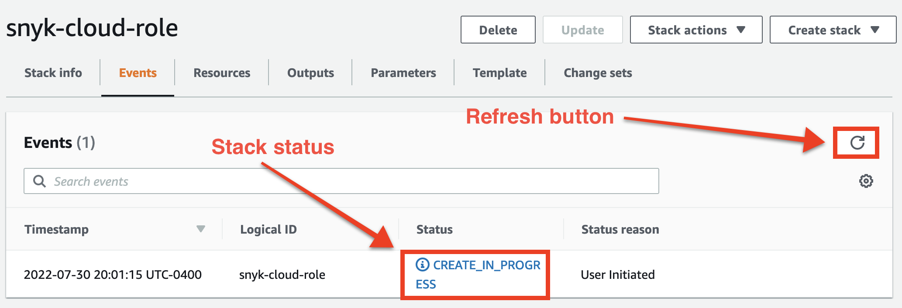

# Step 2: Create the Snyk IAM role


**Recap**\
****You have downloaded the Terraform or Amazon Web Services (AWS) CloudFormation template declaring the Identity & Access Management (IAM) role for Snyk Cloud. Now you need to provision the infrastructure.


The IAM role you will provision has the following policies attached to it:

* The AWS-managed [SecurityAudit](https://docs.aws.amazon.com/IAM/latest/UserGuide/access\_policies\_job-functions.html#jf\_security-auditor) read-only policy.
* A supplemental inline policy, granting required read permissions not covered by SecurityAudit.

The role also has a trust policy that specifies an [external ID](https://docs.aws.amazon.com/IAM/latest/UserGuide/id\_roles\_create\_for-user\_externalid.html). Snyk generates this unique ID for your organization to prevent other parties from assuming the role without the ID, even if they have your role Amazon Resource Name (ARN).

## Create the IAM role with Terraform or CloudFormation

You can create the IAM role using one of the following tools, according to the type of template you retrieved from the Snyk API:

* **Terraform:** [Terraform CLI](step-2-create-the-snyk-iam-role.md#terraform)
* **AWS CloudFormation:** [AWS CLI](step-2-create-the-snyk-iam-role.md#aws-cli) or [AWS Management Console](step-2-create-the-snyk-iam-role.md#aws-management-console)

### Terraform


Before you use the [Terraform CLI](https://www.terraform.io/downloads), ensure you [configure it to use your AWS credentials](https://registry.terraform.io/providers/hashicorp/aws/latest/docs#authentication-and-configuration).


1. In your terminal, navigate to the directory containing your `.tf` file.
2. Using the Terraform CLI, initialize the Terraform project:

```
terraform init
```

3\. Review and apply the Terraform plan:

```
terraform apply
```

4\. Enter `yes` when Terraform asks if you want to perform the actions.

Terraform then creates the IAM role. When it is finished, you'll see the following output:

```
Apply complete! Resources: 1 added, 0 changed, 0 destroyed.
```

### AWS CLI


Before you use the [AWS CLI](https://aws.amazon.com/cli/), ensure you [configure it to use your AWS credentials](https://docs.aws.amazon.com/cli/latest/userguide/cli-configure-quickstart.html).


1. In your terminal, navigate to the directory containing your `.yaml` file.
2. Using the AWS CLI, launch the CloudFormation stack, replacing `cfn.yaml` with the name of your file:

```
aws cloudformation create-stack \
  --stack-name snyk-cloud-role \
  --capabilities CAPABILITY_NAMED_IAM \
  --template-body file://cfn.yaml
```

3\. AWS then creates the IAM role. This typically takes about a minute. To check if it is finished:

```
aws cloudformation describe-stacks \
  --stack-name snyk-cloud-role \
  --query 'Stacks[0].StackStatus'
```

If the output says `"CREATE_COMPLETE"`, AWS has finished creating your role.

### AWS Management Console

1. Log in to the [AWS Management Console](https://console.aws.amazon.com).
2. Navigate to [CloudFormation](https://console.aws.amazon.com/cloudformation).
3. Select the **Create stack** button:&#x20;


4\. Select **With new resources (standard)** from the drop-down menu.

5\. On the **Create stack** page, in the **Specify template** section, select **Upload a template file**.

6\. Click the **Choose file** button that appears and select your CloudFormation file containing the Snyk IAM role.

7\. Select **Next**.

8\. On the **Specify stack details** page, in the **Stack name** section, enter a stack name, such as `snyk-cloud-role`.

9\. Select **Next**.

10\. On the **Configure stack options** page, enter tags if desired, and keep the rest of the defaults.

11\. Select **Next**.

12\. On the **Review** page, in the **Capabilities** section at the bottom, check the box **I acknowledge that AWS CloudFormation might create IAM resources with custom names.**

13\. Select **Create stack**.

14\. AWS launches the stack, and you'll see a page with stack details. You can select the **Refresh** button to refresh its status:



If the **Status** column says `CREATE_COMPLETE`, AWS has finished creating the IAM role.

## What's next?

The next step is to create and scan the Snyk Cloud Environment.
