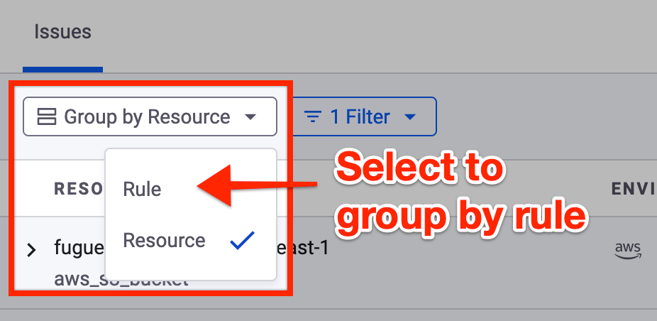
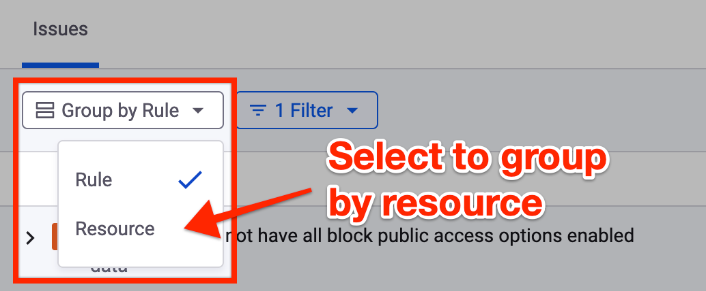
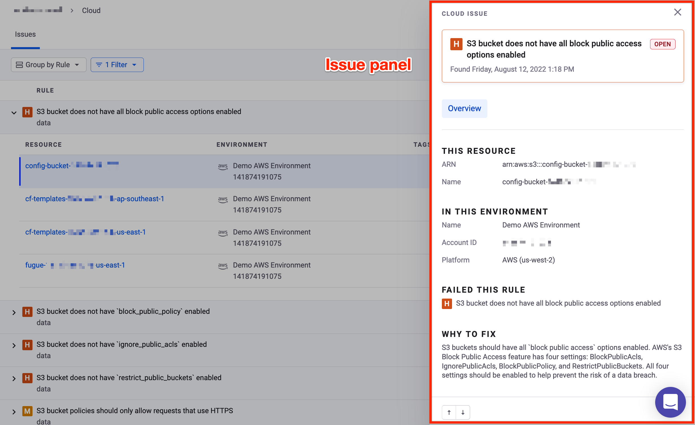
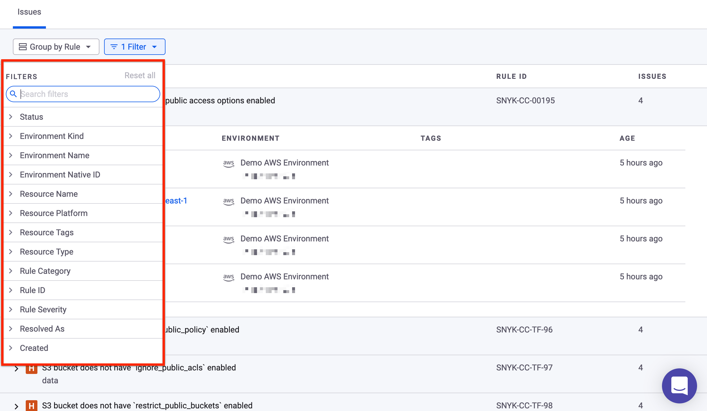

# View cloud issues in the Snyk Web UI

You can view cloud issues for an Organization through the Snyk Web UI. Also see [View cloud issues in the API](view-cloud-issues-in-the-api.md).

To view your Organization's cloud issues in the Snyk Web UI, navigate to the Organization and select **Cloud** in the left menu:

By default, Snyk displays open issues across all Snyk Cloud Environments in an Organization. The issues are initially [grouped by the security rule they failed](view-cloud-issues-in-the-snyk-web-ui.md#group-cloud-issues-by-rule), but you can choose to [group them by resource](view-cloud-issues-in-the-snyk-web-ui.md#group-cloud-issues-by-resource).

## Group cloud issues by rule

Issues are grouped by rule by default.

If you have grouped them by resource instead, you can group them by rule again by selecting the **Group by Resource** drop-down menu and selecting **Rule**:

The rules are sorted by severity and then by number of issues, both from highest to lowest.

### Rule details

Each rule shows the following information:

* Severity
  * C: Critical
  * H: High
  * M: Medium
  * L: Low
* Rule title
* Rule category
* Rule ID
* Number of open issues

By default, when you expand a rule by selecting its **Expand row** (`>`) symbol, you see all the resources with an open issue associated with that rule. Each resource shows the following information:

* Resource name
* Resource type
* Environment kind (provider)
* Environment name
* Environment native ID (Amazon Web Services account ID)
* Resource tags
* Age of issue

## Group cloud issues by resource

If issues are currently grouped by rule, you can group them by resource instead by selecting the **Group by Rule** drop-down menu next to the search bar and selecting **Resource**:

The resources are sorted by severity of issue and then by number of issues, both from highest to lowest.

### Resource details

Each resource shows the following information:

* Resource name
* Resource type
* Environment kind
* Environment name
* Environment native ID
* Resource tags
* Severity of open issues
* Number of issues for each severity

By default, when you expand a resource by selecting its **Expand row** (`>`) symbol, you see all the rules with an open issue associated with that resource. Each rule shows the following information:

* Severity
* Rule title
* Rule category
* Rule ID
* Age of issue

## View cloud issue details

To view an issue, select the **Expand row** (`>`) symbol on the left side of a row, then select a corresponding resource or rule. Snyk displays a panel with the cloud issue details.

### Issue summary panel

The cloud issue summary panel contains the following information:

* Severity
* Status
  * Open
  * Closed
* Resource ARN (Amazon Resource Name)
* Resource name
* Resource type
* Environment name
* Environment native ID
* Environment platform (AWS region)
* Rule title (**Failed this rule** section)
* Rule description (**Why to fix** section)

## Filter cloud issues

To filter which cloud issues are shown:

1. Select the **Filter** drop-down menu. The name of the menu shows how many filters are selected (for example, **1 Filter**).
2. Select the parameter you want to filter by (for example, **Severity**).
3. Check the box for the values you want to show (for example, **Critical**).

By default, the **Status** filter is set to only include **open** issues.

