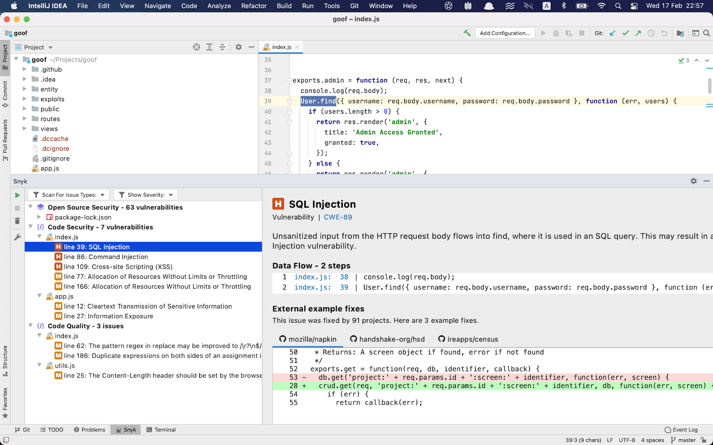

# Snyk Code

## **About Snyk Code**

Snyk has always been dedicated to the premise that security needs to be implemented developer-first in order to meet the speed and scale needs of software-driven businesses.

Unlike traditional SAST products in the market, which were primarily designed for security teams to test applications post-development, Snyk Code uses a revolutionary approach designed to be developer-first. The problem with traditional SAST products is that they do not work for developers: they are too slow, with scans that can take several hours; they have poor accuracy, returning too many false positives, creating hours of wasted time as false alarms are chased down. This erodes developer trust in the tool and they require security expertise to make their output actionable in order to remediate the issues they find.

### Developer-first approach

Snyk Code is developer-first, embedding SAST as part of the development process, enabling developers to build software securely during development, not trying to find and fix problems after the code is compiled. Snyk Code works in the IDEs and SCMs developers use to build and review software and provides fast, actionable, meaningful results to fix issues in real-time.

### Unparalleled accuracy

SAST tools are notoriously known for their huge amount of false positives. Snyk Code utilizes a semantic analysis AI engine that learns from millions of open-source commits and is paired with Snyk’s Security Intelligence database, creating a continually growing code security knowledge base, which reduces false positives to near-zero and provide actionable findings that matter.

### Real-time

Speed is a critical factor if you want to support rapid, agile development. Real-time speed allows developers leverage Code from the IDE and during code review in the SCM, rather than a slow and unnecessary extra step at the end o the development process. Snyk Code scans 10-50x faster than other SAST products, enabling developers to use it _while_ they develop, rather than _after_ they develop as a slow and disruptive step in their process.

### Actionable

Although quickly and accurately detecting potential security flaws in source code is a complicated task, we believe that it's not enough. You can only shift left and empower developers if you actually help them remediate the issue and learn about prevention. Code leverages it's security knowledge base to provide fix examples from real-world projects that offer inspiration on how to fix the issue. Additionally, Code offers an curated educational content about every vulnerability to help developers grow their knowledge and reduce issues over time.

## **Integrated platform**

Snyk Code expands the Snyk cloud-native application security platform, supporting all elements for a modern software supply chain. For a cloud-native application, this provides security for:

* [**Snyk Code**](https://docs.snyk.io/snyk-code): the application’s proprietary code
* [**Snyk Open Source**](https://docs.snyk.io/snyk-open-source): the open-source libraries it leverages
* [**Snyk Container**](https://docs.snyk.io/snyk-container): the container it runs in
* [**Snyk Infrastructure as Code**](https://docs.snyk.io/snyk-infrastructure-as-code): the infrastructure as code that provisions it

## Secret detection in source code

Snyk Code includes secret detection capabilities that scan and highlight secrets like keys, credentials, PII, and sensitive information in your source code. Unlike tools that use entropy checks or regular expressions, Snyk Code uses machine learning and is able to learn from experience, improving the odds of accurately detecting secrets while minimizing false positives.

## Issue code flow visualization

Snyk products all provide a developer-friendly experience, so Snyk Code helps developers to quickly understand the problem, learn the background, and how to approach it. Snyk Code helps you understand the dangerous code flow step-by-step.

For every issue, Code also provides a link to the lines in the relevant files, to view more details on the problem like the CWE, and how to approach it.

Snyk Code also provides rich curated additional information for many suggestions.

## Repository monitoring

You can seamlessly import and continuously monitor your repositories, and discover security flaws in the source code files in them using static analysis.

This integration allows you to:

* Manage Code projects using your existing native import flow and tools
* View and prioritize security issues found in the source code
* Run a retest of a project and see history snapshots of a project

### Supported SCMs

Snyk Code integrates with the following SCMs:

* [GitHub](https://docs.snyk.io/integrations/git-repository-scm-integrations/github-integration)
* [Bitbucket](https://docs.snyk.io/integrations/git-repository-scm-integrations/bitbucket-cloud-integration)&#x20;
* [Azure](https://docs.snyk.io/integrations/git-repository-scm-integrations/azure-repos-integration)
* [GitLab](https://docs.snyk.io/integrations/git-repository-scm-integrations/gitlab-integration)

### Supported languages

Snyk Code supports wide range of languages: see [Snyk Code language support](https://docs.snyk.io/snyk-code/snyk-code-language-and-framework-support) for the full list.

## Snyk Code IDE plugins

IDE integrations use Snyk Code’s fast analysis and response, allowing you to spot an issue, understand and learn more about it, and fix it, as you write the code before you check the code in. So you can find possible security flaws in your code as you write it, on a line-by-line basis.

### JetBrains IDE plugins

Snyk Code supports the JetBrains IDEs such as IntelliJ, Webstorm, PyCharm and more with a plugin that allows you to find and fix issues directly from the IDE:

For more details, see [JetBrains IDE Plugins](https://docs.snyk.io/integrations/ide-tools/jetbrains-plugins).

### VS Code IDE plugin

Snyk Code supports a Visual Studio Code plugin to support issue finding and fixing, directly from the IDE:

 (2) (4) (4) (4) (3) (5).png>)

For more details, see the [Visual Studio Code extension for Snyk Code](../../features/integrations/ide-tools/visual-studio-code-extension-for-snyk-code.md).

## Excluding files

1. Checks and reads for DeepCode/Snyk ignore specific files `.gitignore` `.dcignore` (if they exist).
2. Using the information obtained in step 1, we are filtering to get only [the following source code files](snyk-code-language-and-framework-support.md#supported-extensions):
   * We are accessing only the files in the project directory. We do not go above the current project directory.
3. Files which size is less than 4 MB found in step 2 are bundled and sent to Snyk.
