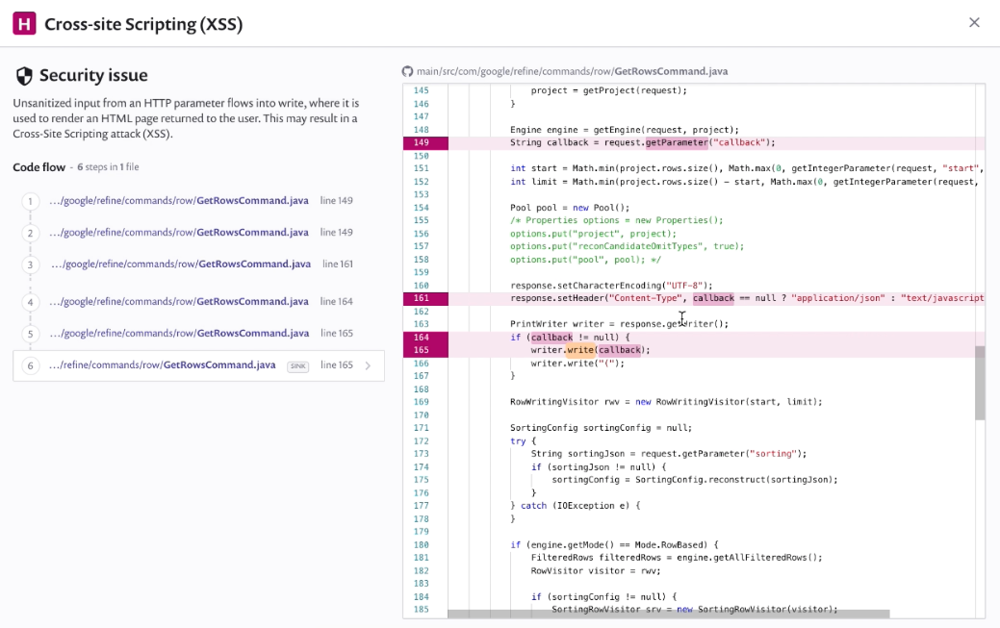

# Viewing the Snyk Code results via the Web UI

## View project vulnerabilities

Use Snyk Code with the [Snyk Web UI](../../../snyk-web-ui/) to find and fix vulnerabilities in your code.

1. In your **Projects** area, select the project to open
2. Snyk Code displays information and vulnerability cards for that project:

Information available shows standard Snyk project information (see [introduction-to-snyk-projects](../../../introducing-snyk/introduction-to-snyk-projects/ "mention")), including:

* Snapshot information showing when the project was last tested.
* **Overview**, **History** and **Settings** information. For example, use the **History** section to view previous snapshots of projects.
* Filters on the left of the screen.

## Vulnerability card details

Each vulnerability card shows specific details about that vulnerability:

Card details include:

* The severity level (for example, **H** for high), the name (for example, **Cross-site Scripting**), and the [snyk-priority-score.md](../../../features/fixing-and-prioritizing-issues/issue-management/snyk-priority-score.md "mention") value.
* The [CWE type:](https://cwe.mitre.org/data/index.html) click the link to view more information about that type of vulnerability.
* A snippet of your code showing the exact area that is vulnerable.
* A clear and helpful text description of the vulnerability.

See [issue-card-information.md](../../../introducing-snyk/introduction-to-snyk-projects/issue-card-information.md "mention") for more details.

* Click **Ignore** to ignore this vulnerability (see [ignore-issues.md](../../../features/fixing-and-prioritizing-issues/issue-management/ignore-issues.md "mention"))
* Click **Full details** to view more information (see [#view-full-details](using-snyk-code-web.md#view-full-details "mention")).

### View full details

Click **Full details** from a vulnerability card to view more information:

Full details include all the information in the vulnerability card, plus:

* **Data Flow**: This area helps you understand where the issue is and how it flows throughout your application by showing you the full taint flow of the issue in the code, from the source (the user input) to the sink (the operation that needs to receive clean input and can be exploited otherwise). In the above example, the developer has not sanitized the input, allowing an attacker to do a pass traversal to potentially access any file on the file system, including sensitive data such as password files.
* **Fix Analysis:** This area provides you with more information about the issue and how it could be fixed. Developers are able to see fix-related information, vulnerability overview information (understanding and approach), and fix examples for this vulnerability type.
* A link to the source file, which you can open to make changes directly (see [#open-the-related-source-code-file](using-snyk-code-web.md#open-the-related-source-code-file "mention")).
* A full window showing the code affected, with specific lines highlighted to accompany the **Data flow** information.

### Open the related source code file

1.  Click the code link to open the source code file itself (for example, in GitHub)

    
2. The file opens, showing you exactly where to fix the vulnerability (in this example, by adding the sanitation required to the input).
3. You can now make the fix as required, to address the vulnerability in your code.

### Example: Cross-site Scripting (XSS)

This shows an example of a common vulnerability, Cross-site Scripting (XSS). XSS vulnerabilities allow attackers to compromise the interactions users have with your application, including gaining control over the application's functionality and data.

The vulnerability card shows key information about this vulnerability:

Click **Full details** to see more information about this vulnerability:

(This example shows a non-sanitized, HTTP input flows into a **write** response returned by the server, so could be running malicious code.)

Click the code link to open the source code file directly, then make changes to fix this vulnerability.
