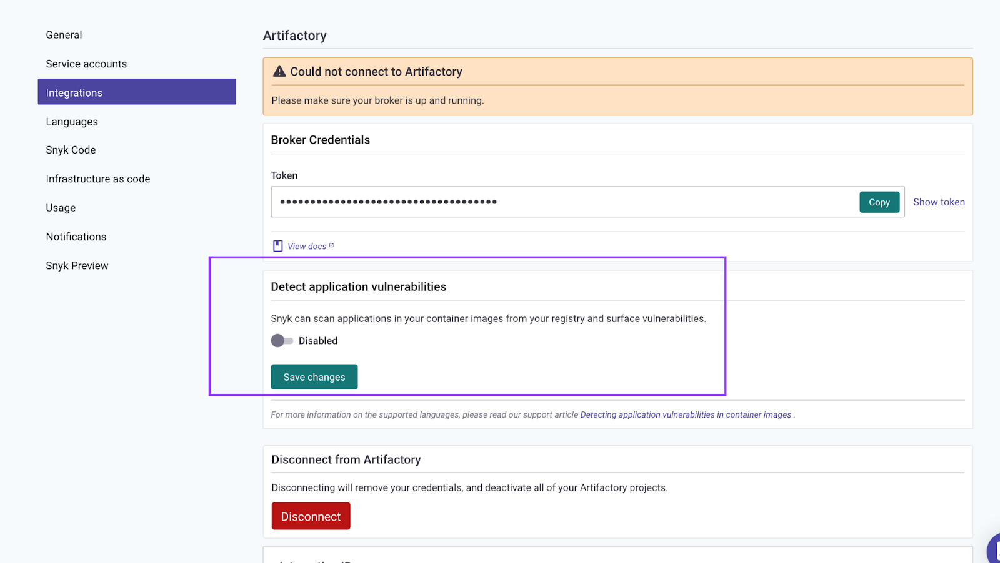

# Detecting application vulnerabilities in container images


The feature is currently supported for Node, Ruby, PHP, Python, Go binaries and Java.


Snyk allows detection of vulnerabilities in your application dependencies from container images, as well as from the operating system, all in one single scan.

After you integrate with a container registry and import your projects, we scan your image and test for vulnerabilities.

### Enable application vulnerabilities scan from container images

1. Navigate to your container registry integration settings
2. Enable the _**Detect application vulnerabilities**_ capability and save the changes:

.png>)

### Using CLI to detect vulnerabilities

#### App vulns flag

`--app-vulns` allows detection of vulnerabilities in your application dependencies from container images, as well as from the operating system. Currently, in the CLI (and k8s integration), we detect only for Node, Golang, and Java applications. (In container registries, if the manifest file exists in the image, we also detect for Python, Ruby and PHP applications).&#x20;

#### CLI&#x20;

When specifying the flag, we scan one level of nested jars by default.&#x20;

#### CR, K8S, docker scan command&#x20;

When scanning an image using a container registry, Kubernetes integration, or through Docker scan--the scan also uses the `--app-vulns` flag by default with a default of 1 level of nested jars scanning. You are able to opt out of the flag in the container registry only. Do so by disabling the ‘_detect application vulnerabilities_’ toggle in the integration settings.

### Nested-jars-depth flag&#x20;

For Java applications, when using `--app-vulns` (CLI) you can also use the `--nested-jars-depth=n` flag to set how many levels of nested jars Snyk will unpack. The implicit default is 1 (so that's what CR/k8s/`docker scan` users get), but 2 means we unzip jars in jars, 3 means we unzip jars in jars in jars, etc. Higher value = deeper but slower scanning.

CLI users can use --nested-jar-depth=0 to opt out of any scans that they feel are unnecessary.&#x20;

#### Troubleshooting when a jar is not detected&#x20;

If a jar or a dependency are not detected try the following:&#x20;

* Update to latest CLI version&#x20;
* Public jar: Check jar's hash against search.maven.org and check `--nested-jars-depth` is high enough to detect the jar&#x20;
* Shaded jar: Check if pom.properties is present (if not, cant detect) and check `--nested-jars-depth` is high enough to detect the jar&#x20;
* Custom jar: Check if pom.properties is present (if not, cant detect)

### View vulnerabilities and licensing issues

After the feature is enabled, you can see:

* Dependency vulnerabilities and licensing issues of manifest files detected in your container image.
* Vulnerabilities detected in operating system packages.

When an image is imported to Snyk, it appears under its registry record in the **Projects** view, showing the operating system vulnerabilities found in your image.

With this feature enabled, you can also see nested manifest files detected in the image and their vulnerabilities and licensing issues.

 (1) (1) (3) (3) (4) (6) (1) (23).png>)

### Automated scanning

Snyk scans the image regularly based on your project’s settings, and updates you via email or Slack - based on your configuration - when any new vulnerabilities are identified in both the operating system and application dependencies.

For each project, you can choose the test frequency under its settings (the default is daily testing).

.png>)

**Supported registries**

This is supported across the following container registries:

* [ACR](https://docs.snyk.io/snyk-container/image-scanning-library/acr-image-scanning)
* [Amazon ECR](https://docs.snyk.io/snyk-container/image-scanning-library/ecr-image-scanning)&#x20;
* [JFrog Artifactory](https://docs.snyk.io/snyk-container/image-scanning-library/jfrog-artifactory-image-scanning)
* [Docker Hub](https://docs.snyk.io/snyk-container/image-scanning-library/docker-hub-image-scanning)&#x20;
* [GCR](https://docs.snyk.io/snyk-container/image-scanning-library/gcr-image-scanning)

**Supported Integrations**

The supported languages work on the following integrations:

| **Language** | **Container Registry** | **CLI** | **Kubernetes** |
| ------------ | ---------------------- | ------- | -------------- |
| Node         | Yes                    | Yes     | Yes            |
| Ruby         | Yes                    |         |                |
| PHP          | Yes                    |         |                |
| Python       | Yes                    |         |                |
| Go Binaries  | Yes                    | Yes     | Yes            |
| Java         | Yes                    | Yes     | Yes            |

****
