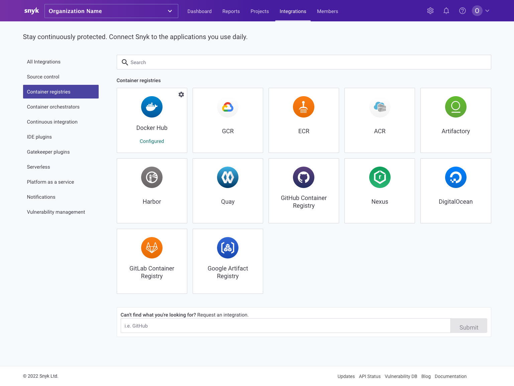
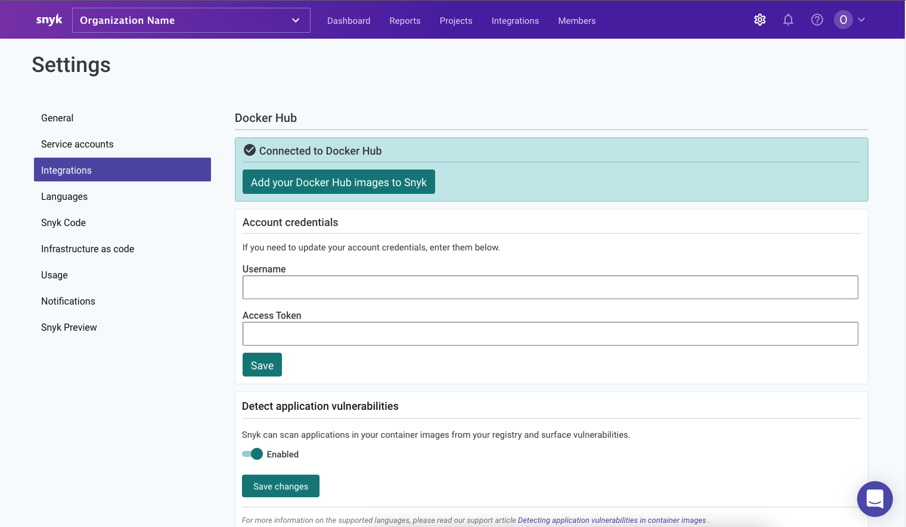

# Getting started with Snyk Container

Get started with Snyk Container to help you find and fix vulnerabilities in container images.


This process uses the Snyk Web UI. For details of Snyk Container using the Snyk CLI (Command-Line Interface) tool, see [snyk-cli-for-container-security](snyk-cli-for-container-security/ "mention").


### Prerequisites

Ensure you have:

* Access to a relevant container registry to use with Snyk. Snyk supports multiple registries--see [image-scanning-library](image-scanning-library/ "mention") for details.
* A Snyk account (go to [https://snyk.io/](https://snyk.io) and sign up - see [getting-started](../../getting-started/ "mention").

### Stage 1: Add container registry integration

Choose a container registry integration, to connect the registry with Snyk.

First, log in to the Snyk Web UI, and select **Integrations > Container registries**

Next, click the entry you want to integrate with Snyk, and enter details as prompted, then save the changes, to integrate this entry with Snyk.

### Stage 2: Add projects

Add projects for your selected container, to start scanning with Snyk.

1. Click **Add Project**, and select the integration registry entry to add from:
2. Select the container repository and tags to import, then click **Add selected repositories** to import them into your projects. Importing also sets Snyk to run a daily check on repositories for vulnerabilities.
3. A progress bar appears: click **View log** to see log results.


If you encounter any errors during import, see the [Importing projects](https://support.snyk.io/hc/en-us/sections/360000923478-Importing-projects) information.


### Stage 3: View vulnerabilities

You can now see vulnerability results for imported projects.

Select **Projects**, then click on the imported project entry under its registry record, to see vulnerability information for that project.

 (1) (1) (3) (3) (4) (6) (1) (1) (1) (1) (1) (1) (1) (1) (1) (1) (1) (1) (1) (1) (1) (1) (1) (1) (1) (1) (1) (1) (1) (26).png>)

Here you can see a summary of the severity of the detected vulnerabilities.

Click on an entry to see details of vulnerabilities found:

See [analysis-and-remediation-for-your-images-from-the-snyk-app.md](getting-around-the-snyk-container-ui/analysis-and-remediation-for-your-images-from-the-snyk-app.md "mention") for more details.

### Stage 4: Fix and review

1. Fix issues found, based on Snyk recommendations
2. Rebuild your image
3. Snyk will automatically rescan your new image after it is pushed
