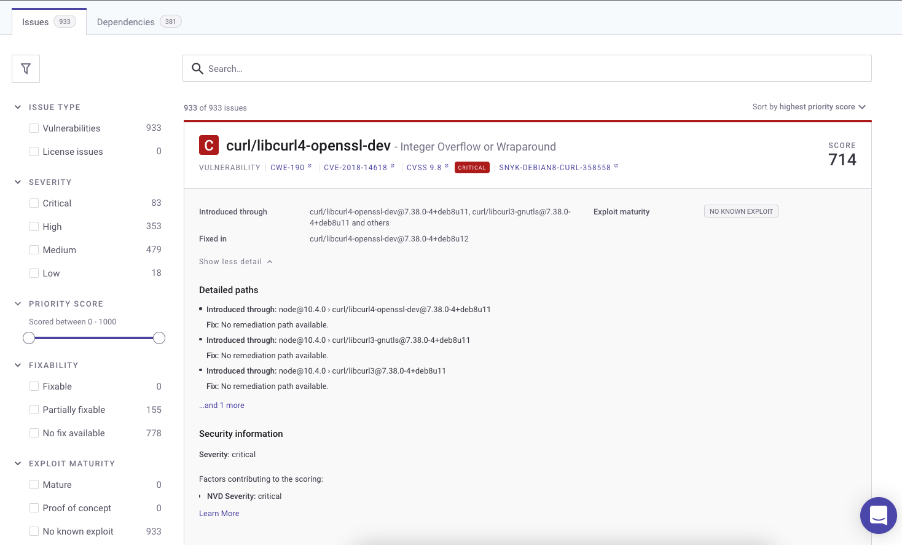

# Getting started with Snyk Container

Get started with Snyk Container to help you find and fix vulnerabilities in container images, based on scans of a container registry.


This process uses the Snyk Web UI. For details of Snyk Container using the Snyk CLI (Command-Line Interface) tool, see [snyk-cli-for-container-security](../snyk-cli-for-container-security/ "mention").


### **Prerequisites**

Ensure you have:

* [Created a Snyk account](../../../getting-started/create-a-snyk-account.md).
* [Set up integration](../../../getting-started/set-up-an-integration.md) for your container registry, for example Docker Hub. Snyk supports multiple registries**;** see [image-scanning-library](../image-scanning-library/ "mention") for details
* [Imported a Snyk Project for scanning](../../../getting-started/import-a-project.md) (your container registry)

See the [Getting started](../../../getting-started/) section for more details.

### View vulnerabilities

You can see vulnerability results for imported projects.

Select **Projects**, then click on the imported project entry under its registry record, to see vulnerability information for that project.

 (1) (1) (3) (3) (4) (6) (1) (1) (1) (1) (1) (1) (1) (1) (1) (1) (1) (1) (1) (1) (1) (1) (1) (1) (1) (1) (1) (1) (1) (1) (1) (25).png>)

Here you can see a summary of the severity of the detected vulnerabilities.

Click on an entry to see details of vulnerabilities found:

### Fix and review

1. Fix issues found, based on Snyk recommendations
2. Rebuild your image
3. Snyk will automatically rescan your new image after it is pushed.

See [analysis-and-remediation-for-your-images-from-the-snyk-app.md](../getting-around-the-snyk-container-ui/analysis-and-remediation-for-your-images-from-the-snyk-app.md "mention") for more details.
