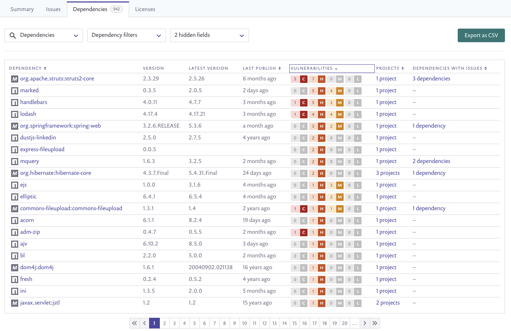
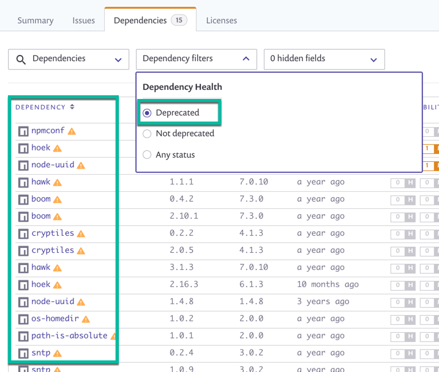
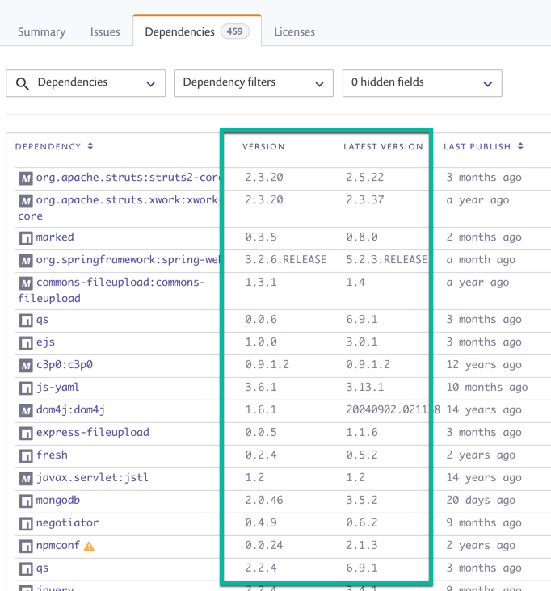
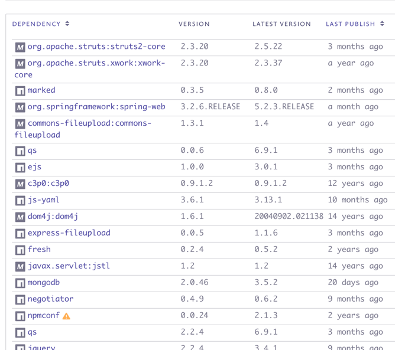

# Dependencies tab

The **Dependencies** area of **Reports** acts as a bill of materials for all the direct dependencies in all of the projects in the selected organization, similar to the following:

This area assists in determining dependency health—or in other words, the health of your packages, by displaying important details per package.

Details displayed include:

* General details about the packages included in your projects, such as their full names, the version of the package currently used in your projects, the projects in which they are used, as well as a summary of the vulnerability and license issues they contain, if any
* Transitive dependencies and the vulnerabilities they contain, when relevant
* For supported packages, dependency health details about the package are displayed, not only for the version used in your projects but also for the overall health of the package, as follows:
  * A warning icon is displayed for packages that are deprecated, meaning the maintainers are no longer updating it.

* The Latest Version and Latest Publish dates. With these dates, you can more easily determine maturity of the package, as well as activity frequency.

* The version used in your project \(Version\) and the Latest Version available are both listed, enabling you understand the delta between your current package version and the most recent package version available, and evaluate outdatedness.

These and more details are fully described in [Elements](dependencies-tab.md).


**Note**  
Data in each of the four tabs is displayed based on the filters you've applied from the top of the Reports area, as well as the group or organization that you're viewing from.


## Dependencies tab elements

Following is a close-up of the first four columns of the Reports area:

The following table describes the different parts of the Dependencies area as displayed when viewing issues either grouped or ungrouped:

<table>
  <thead>
    <tr>
      <th style="text-align:left"><b>Element</b>
      </th>
      <th style="text-align:left"><b>Possible values</b>
      </th>
      <th style="text-align:left"><b>Description</b>
      </th>
    </tr>
  </thead>
  <tbody>
    <tr>
      <td style="text-align:left">Dependency</td>
      <td style="text-align:left"></td>
      <td style="text-align:left">
        
The full package names of the dependencies contained in at least one of
          your projects. Click the link to view the detailed Package page.

        
<em>For example: boom</em>
        

      </td>
    </tr>
    <tr>
      <td style="text-align:left">Warning icon</td>
      <td style="text-align:left"></td>
      <td style="text-align:left">
        
If a package is deprecated, a warning icon appears next to the package
          name.
           
        

        
<b>Note:</b>
           This field currently only provides data for JavaScript projects.

      </td>
    </tr>
    <tr>
      <td style="text-align:left">Version</td>
      <td style="text-align:left"></td>
      <td style="text-align:left">
        
The version of this package as is used in your projects.

        
<em>For example: 0.4.2</em>
        

      </td>
    </tr>
    <tr>
      <td style="text-align:left">Latest version</td>
      <td style="text-align:left"></td>
      <td style="text-align:left">
        
The most recent version updated by a maintainer for this package in its
          repository.

        
<em>For example: 7.3.0</em>
        

        

           <b>Note: </b>This field currently only provides data for JavaScript,
          Maven and PIP projects.

      </td>
    </tr>
    <tr>
      <td style="text-align:left">Last publish</td>
      <td style="text-align:left"></td>
      <td style="text-align:left">
        
The last time a new version of the package was published by a maintainer.

        
<em>For example: 7 months ago </em>
        

        
<b>Note: </b>This field currently only provides data for JavaScript,
          Maven and PIP projects.

      </td>
    </tr>
    <tr>
      <td style="text-align:left">Vulnerabilities</td>
      <td style="text-align:left">
        

          
        

        

          
        

        

          
        

        

          
        

      </td>
      <td style="text-align:left">The icon of the associated severity (critical/high/medium/low) for this
        issue.</td>
    </tr>
    <tr>
      <td style="text-align:left">License</td>
      <td style="text-align:left"></td>
      <td style="text-align:left">The license or licenses used by this package.</td>
    </tr>
    <tr>
      <td style="text-align:left">Projects</td>
      <td style="text-align:left"></td>
      <td style="text-align:left">The projects in which you use this package.</td>
    </tr>
    <tr>
      <td style="text-align:left">Dependencies with issues</td>
      <td style="text-align:left"></td>
      <td style="text-align:left">A link to the dependencies in the package that have issues, with details
        about those issues.</td>
    </tr>
  </tbody>
</table>

## Dependencies tab actions

These controls appear at the top of the window:

* **Search for Dependencies**—start typing to search for a package. To view the results of multiple packages, select them from the dropdown list that opens when you click in the field. In addition, you can also click the Select All or Deselect All links in the upper right-hand corner of the dropdown list.
* **Dependency filters**—mark the packages to be displayed by selecting specific project types as well as by dependency health status. Only issues matching all selected criteria are displayed.

  When Deprecated is selected, only packages that are marked as deprecated will be displayed.

* **Hidden fields**—remove any of the default columns from the display in order to focus on details that are important to your current tasks.
* **Export as CSV**—export issue data in CSV file format.

