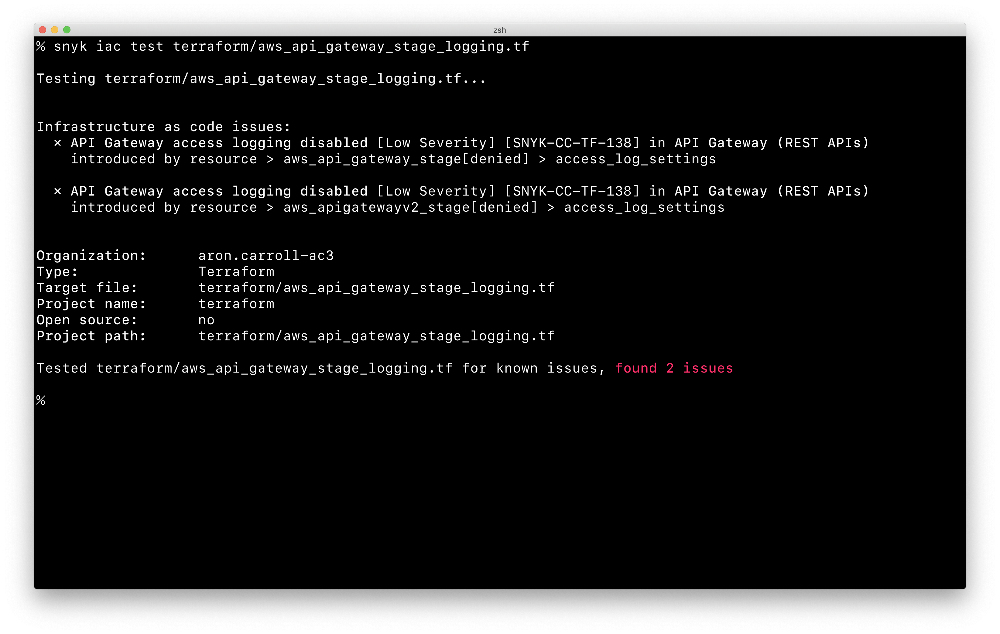

# Snyk IaC CLI test results (v. 1.938.0 and earlier)

**Note:** The instructions in this section apply to any supported file format of Snyk Infrastructure as Code, including Terraform, Kubernetes, CloudFormation, and ARM.

Snyk analyzes your configuration file for issues, and provides additional information on the discovered issues that can help you resolve them.

For example, when scanning a Terraform file, we enter the following command:

```
snyk iac test aws_api_gateway_stage_logging.tf
```

Once the command run, the following results are received:



The results include a list of issues sorted by severity, where each issue consists of the following details:

* **Heading** - the issue that was detected, the severity of that issue, and the Snyk Policy ID for that particular issue.
* **Location** - the property path within the configuration file, where the issue was identified. See the example below for more details.

Example:


The path of this issue is specified as:

```
resource > aws_api_gateway_stage[denied] > access_log_settings
```

In the following code, line 1 represents the content of the `aws_api_gateway_stage` block, called "**denied**", which is missing the `access_log_settings` field.


```
resource "aws_api_gateway_stage" "denied" {
  xray_tracing_enabled = true
}
```

