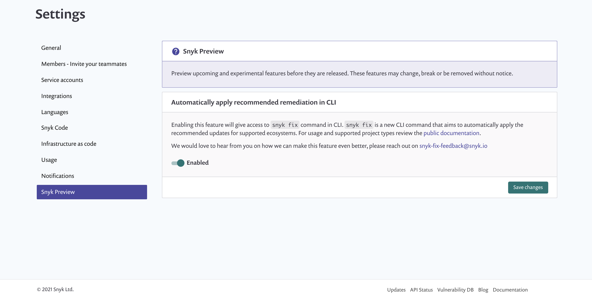

# Automatic remediation with snyk fix


This feature is currently in beta. We would appreciate any feedback you might have - contact us at [snyk-fix-feedback@snyk.io](mailto:snyk-fix-feedback@snyk.io).


While using the **snyk test** command, actionable remediation for supported ecosystems is shown in the scan results.

**snyk fix** is a new CLI command that aims to automatically apply the recommended updates for supported ecosystems.


Please ensure you use the latest version of CLI \([v1.652.0](https://github.com/snyk/snyk/releases/tag/v1.652.0/) or later\) to use **snyk fix**.


```text
Tested 78 dependencies for known issues, found 34 issues, 145 vulnerable paths.Issues to fix by upgrading dependencies:  Upgrade django@2.2.13 to django@2.2.22 to fix
  ✗ HTTP Header Injection [High Severity][https://app.snyk.io/vuln/SNYK-PYTHON-DJANGO-1290072] in django@2.2.13
    introduced by django@2.2.13 and 13 other path(s/)
  ✗ Directory Traversal (new/) [High Severity][https://app.snyk.io/vuln/SNYK-PYTHON-DJANGO-1298665] in django@2.2.13
    introduced by django@2.2.13 and 13 other path(s/)
  ✗ Insecure Permissions [High Severity][https://app.snyk.io/vuln/SNYK-PYTHON-DJANGO-609368] in django@2.2.13
    introduced by django@2.2.13 and 13 other path(s/)
  ✗ Insecure Permissions [High Severity][https://app.snyk.io/vuln/SNYK-PYTHON-DJANGO-609369] in django@2.2.13
    introduced by django@2.2.13 and 13 other path(s)Organization:           libs
Package manager:        poetry
Target file:            lib/poetry.lock
Project name:           libs-develop
Open source:            no
Project path:           lib
Licenses:               enabled
```

Here is the example output of running **snyk fix**:

```text
► Running `snyk test` for /Users/lili/www/snyk/python-fix/packages/poetry/test/system/workspaces/with-pins✔ Looking for supported Python items
✔ Processed 1 pyproject.toml items
✔ DoneSuccessful fixes:  ../python-fix/packages/poetry/test/system/workspaces/with-pins/poetry.lock
  ✔ Upgraded django from 2.2.13 to 2.2.18
  ✔ Upgraded jinja2 from 2.11.2 to 2.11.3Summary:
  1 items were successfully fixed
  10 issues: 4 High | 3 Medium | 3 Low
  10 issues are fixable
  10 issues were successfully fixed
```

* Only successful test results are forwarded into **snyk fix**
* All unsupported ecosystem test results will be skipped

## Enabling snyk fix

To enable snyk fix during the beta period, click on settings  &gt; **Snyk Preview**, then enable the snyk fix feature and click **Save changes**.



**snyk fix** supports all the **snyk test** CLI parameters.

Additional parameters:

* **--quiet -** suppresses all output to the command line
* **--dry-run** - runs almost all the logic and displays output, but does not make the final changes to relevant files. This shows preview of changes.

Support is available for the following.

## Python

* **Pip** projects with **requirements.txt** files \(or custom named files, for example **prod.txt**\/)
* **Pipenv** projects with **Pipfile & Pipfile.lock** files
* **Poetry** projects with **pyproject.toml & Poetry.lock** files

## Usage examples

* **snyk fix --file=requirements.txt**
* **snyk fix --file=base.txt --package-manager=pip**
* **snyk fix --all-projects**

## Remediation notes

## Python \(pip\/)

## Requirements with \`-r\` directives

Where the **requirements.txt** looks like this, both **base.txt** and **requirements.txt** will be updated if needed:

```text
-r base.txt # this means grab all the dependencies from here
django===1.6.1
```

**Direct dependency upgrades \(dependencies stated in the manifest\)**

Applied in the relevant files. All files referenced are found and updated

**Pins \(transitive dependencies that are pulled in via direct dependencies\)**

Pins are applied in **the manifest file that was tested**.

If multiple files are tested but are related \(for example one requires the other\), we start to apply changes to the files higher up in the directory structure.

We detect previously fixed files and skip applying fixes to them again.

## Projects which use constraints.txt

Constraints files are requirements files that only control which version of a dependency is installed, not whether it is installed or not. Their syntax and contents are nearly identical to Requirements Files. There is one key difference: Including a package in a constraints file does not trigger installation of the package. More info at: [User Guide - pip documentation v21.0.1](https://pip.pypa.io/en/stable/user_guide/#constraints-files/)

**Direct dependency upgrades \(dependencies stated in the manifest\)**

Applied in the relevant files. All files referenced are found and updated

**Pins \(transitive dependencies that are pulled in via direct dependencies\)**

All transitive dependencies are pinned in **constraints.txt** file if referenced via **-c** directive in requirements manifest file.

## Python \(pipenv\/)

Snyk delegates to \`pipenv\` directly to update dependencies to the specified recommended versions. All \`pipenv\` environment variables and behaviours are preserved as much as possible.

## Python \(poetry\/)

Snyk delegates to \`poetry\` directly to update dependencies to the specified recommended versions. All \`poetry\` environment variables and behaviours are preserved as much as possible.

## Troubleshooting

Run in debug mode to get more information on any errors.

```text
DEBUG=*snyk* snyk fix
```

This provides a very verbose output that can help diagnose issues or can be sent to Snyk for debugging.


Ready to get started with Snyk? [Sign up for free!](https://snyk.io/login?cta=sign-up&loc=footer&page=support_docs_page)


